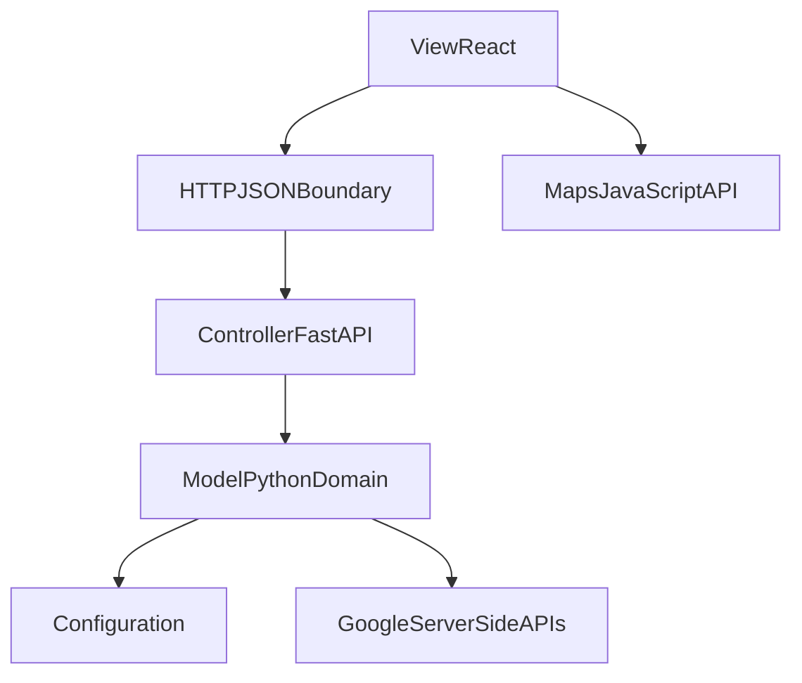

# SRS Context — TrafficScope PROJECT2

This directory splits the PROJECT2 software requirements specification into MVC-oriented context files.
Each file is self-contained so an implementer can work on one layer without reading the whole set.

**Authority:** [../README.md](../README.md) holds the locked contracts. Where any context file appears to
disagree with it, the README wins and the context file is a defect.

**Status:** Future-state design. Nothing here describes shipped behavior. The legacy set at
`docs/srs-context/` is preserved unchanged for historical comparison and is not authoritative.

---

## Project Summary

TrafficScope is a browser application for rideshare-style trip planning in Austin, Texas. A user enters
an origin and a destination, chooses Simulated or Real-Time mode, and receives route alternatives with
traffic-aware ETAs, per-segment road statistics, a traffic-colored map, and an illustrative fare
estimate.

| Layer | Location | Technology |
|-------|----------|-----------|
| View | `TrafficSImulation/src/` | React 19, TypeScript, Vite, `@vis.gl/react-google-maps` |
| Controller | `TrafficSImulation/main.py`, `TrafficSImulation/app/api/` | FastAPI |
| Model | `TrafficSImulation/app/map/`, `simulation/`, `pricing/`, `weather/`, `heatmap/`, `config/` | Python domain packages |

Run every command from `TrafficSImulation/`. See repo-root `AGENTS.md` for build, test, and style
conventions.

**Out of scope for PROJECT2:** user accounts and login, driver profiles, payment processing, saved trip
history, official rideshare fare quotation, live weather APIs, demand modeling, transit and multimodal
routing, native mobile applications, offline operation.

---

## MVC Mapping

| Layer | Owns | Never does |
|-------|------|-----------|
| View | Presentation, input capture, map rendering, request lifecycle | Domain formulas, coefficients, direct Google Places or Routes calls |
| Controller | Validation, orchestration, mode policy, response normalization, error mapping | Domain formulas, coefficient values |
| Model | Domain rules, Google adapters, geometry, configuration | HTTP concerns, importing the Controller or FastAPI |

The browser reaches Google in exactly one way: it loads the Maps JavaScript API with a
referrer-restricted browser credential obtained from `GET /api/map/config`. All Places and Routes
traffic is server-side.

---

## Context File Index

### Requirements (`requirements/`)

| File | Purpose |
|------|---------|
| [requirements/functional-requirements.md](requirements/functional-requirements.md) | FR-1 through FR-8 with status, phase, owner, and acceptance criteria |
| [requirements/non-functional-requirements.md](requirements/non-functional-requirements.md) | NFR-1 through NFR-7 with measurable thresholds |
| [requirements/traceability.md](requirements/traceability.md) | Every requirement mapped to its owning context, planned test, and phase |

### Architecture (`architecture/`)

| File | Purpose |
|------|---------|
| [architecture/architecture-overview.md](architecture/architecture-overview.md) | System context, containers, components, dependency rules, request flow, credentials, deployment |
| [architecture/class-diagram.md](architecture/class-diagram.md) | Target classes, interfaces, hooks, and collaborations |
| [architecture/state-diagrams.md](architecture/state-diagrams.md) | Plan lifecycle, client request states, mode transitions, selection, map loading |

### Model (`model/`)

| File | Purpose | Target modules |
|------|---------|----------------|
| [model/domain-contracts.md](model/domain-contracts.md) | Domain entities and value objects | `app/api/models.py`, `app/map/types.py`, `src/types.ts` |
| [model/route-planning.md](model/route-planning.md) | Place resolution, alternative construction, ranking, bounds | `app/map/places.py`, `app/map/routing.py`, `app/map/bounds.py`, `app/simulation/scoring.py` |
| [model/traffic-simulation.md](model/traffic-simulation.md) | BPR link performance, time-of-day factor, segment derivation | `app/simulation/traffic.py`, `app/simulation/segments.py` |
| [model/pricing.md](model/pricing.md) | Fare estimation and factor breakdown | `app/pricing/model.py` |
| [model/weather-scenarios.md](model/weather-scenarios.md) | Weather severity, multipliers, scenario semantics | `app/weather/service.py` |
| [model/heatmaps.md](model/heatmaps.md) | Congestion heatmap design, phase P3 only | `app/heatmap/grid.py`, `app/heatmap/builder.py` |
| [model/google-integrations.md](model/google-integrations.md) | Places and Routes adapters, polyline decoding, reachability probe | `app/map/places.py`, `app/map/routing.py`, `app/map/polyline.py`, `app/map/health.py` |
| [model/configuration.md](model/configuration.md) | `Settings`, coefficients, environment contract | `app/config/__init__.py` |

### Controller (`controller/`)

| File | Purpose | Target modules |
|------|---------|----------------|
| [controller/api-contracts.md](controller/api-contracts.md) | Endpoint schemas, status codes, response guarantees | `app/api/routes.py`, `app/api/models.py` |
| [controller/orchestration.md](controller/orchestration.md) | The plan workflow | `app/api/planning.py` |
| [controller/mode-policies.md](controller/mode-policies.md) | Simulated and Real-Time policy rules | `app/api/mode_policy.py` |
| [controller/validation-error-handling.md](controller/validation-error-handling.md) | Validation layers, error codes, handlers | `app/api/errors.py`, `app/api/models.py` |
| [controller/external-service-boundaries.md](controller/external-service-boundaries.md) | Credential trust boundary, timeouts, failure policy | `app/api/dependencies.py`, `app/config/__init__.py` |

### View (`view/`)

| File | Purpose | Target modules |
|------|---------|----------------|
| [view/app-composition.md](view/app-composition.md) | Layout, component tree, state ownership, data flow | `src/App.tsx`, `src/hooks/useRoutePlan.ts` |
| [view/route-scenario-forms.md](view/route-scenario-forms.md) | Trip form, geolocation assist, scenario controls | `src/components/RoutePlannerForm.tsx`, `src/components/ScenarioControls.tsx` |
| [view/map-rendering.md](view/map-rendering.md) | The single Maps JavaScript API rendering path | `src/components/MapConfigProvider.tsx`, `RouteMap.tsx`, `RoutePolylineLayer.tsx`, `MapBoundsController.tsx` |
| [view/results-analysis.md](view/results-analysis.md) | Route cards, analysis panel, pricing, segment table | `src/components/RouteOptionList.tsx`, `AnalysisPanel.tsx`, `PriceSummary.tsx`, `SegmentTable.tsx` |
| [view/loading-error-states.md](view/loading-error-states.md) | Loading, empty, error, and degraded presentation | `src/components/StatusBanner.tsx`, `src/components/Toast.tsx` |
| [view/accessibility.md](view/accessibility.md) | Keyboard, semantics, live regions, contrast, non-visual parity | All View components |

---

## Requirement Groups (Quick Reference)

| Group | Subject | Phase of the core requirements |
|-------|---------|-------------------------------|
| FR-1 | Location entry and resolution | P1 |
| FR-2 | Route planning, ETA, and comparison | P1 |
| FR-3 | Map rendering and traffic visualization | P1 |
| FR-4 | Planning mode selection | P1 |
| FR-5 | Scenario controls | P1 |
| FR-6 | Price estimation | P1 |
| FR-7 | Error handling and degraded operation | P1 |
| FR-8 | Congestion heatmap | P3 |
| NFR-1 | Responsiveness and performance | P1 |
| NFR-2 | Reliability and external API failure handling | P1 |
| NFR-3 | Security and API-key trust boundaries | P1 |
| NFR-4 | Accessibility | P1 |
| NFR-5 | Maintainability and architecture | P1 |
| NFR-6 | Testability and contract consistency | P1 |
| NFR-7 | Transparency and usability | P1 |

---

## Cross-Layer Dependencies

| Direction | Contract |
|-----------|----------|
| View to Controller | `POST /api/plan` with `origin`, `destination`, `mode`, `hour`, `weather`, `congestion`; `GET /api/map/config`; `GET /api/health` |
| Controller to Model | `PlanningService` calls the Places gateway, the Routes gateway, `WeatherService`, `SegmentBuilder`, `PricingModel`, `RouteScorer`, and the bounds helpers in that order |
| Model to Controller | Domain values and `DomainError` subclasses carrying a `code` and a `status` |
| Controller to View | The locked `PlanResponse`; arrays are always present, never null |
| Shared contract | `app/api/models.py` and `src/types.ts` mirror each other; a contract test fails when they diverge |

---

## Reading Guidance

| If you are… | Read |
|-------------|------|
| Orienting for the first time | [../README.md](../README.md), then [../agent-quickstart.md](../agent-quickstart.md) |
| Implementing a behavior | The FR entry, then the owning layer context, then the class diagram |
| Adding or changing a response field | [controller/api-contracts.md](controller/api-contracts.md) and [model/domain-contracts.md](model/domain-contracts.md) |
| Working on the map | [view/map-rendering.md](view/map-rendering.md) and [architecture/state-diagrams.md](architecture/state-diagrams.md) |
| Working on failure handling | [controller/validation-error-handling.md](controller/validation-error-handling.md) and [view/loading-error-states.md](view/loading-error-states.md) |
| Wondering why something is missing | [../migration-from-current-implementation.md](../migration-from-current-implementation.md) |
| Planning a release | [requirements/traceability.md](requirements/traceability.md) |

---

## Related Documents

- Source SRS: `Distributed_Traffic_Simulation_Formatted_SRS.pdf`, Rev. 1.0, July 12, 2026. The legacy
  requirement groups are mapped forward in
  [requirements/functional-requirements.md](requirements/functional-requirements.md).
- Repo-root `AGENTS.md`: build, test, style, and commit conventions.
- Legacy documentation under `docs/srs-context/`, `docs/agent-quickstart.md`, and
  `docs/jordan-context-files/`: historical reference only.
