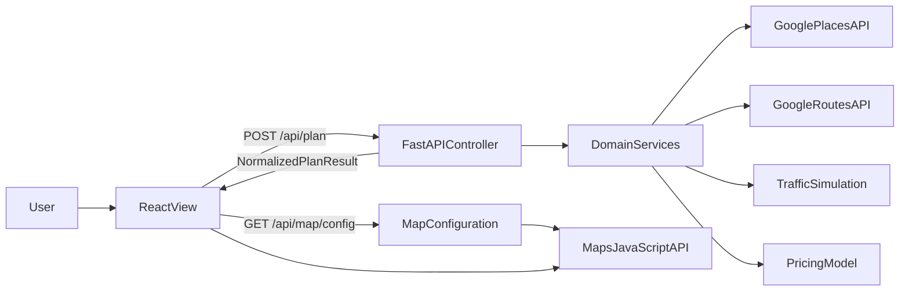
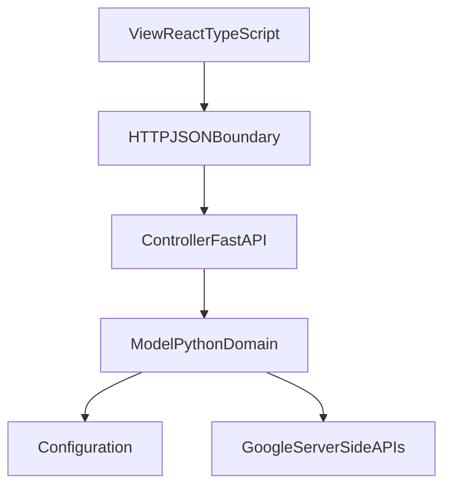
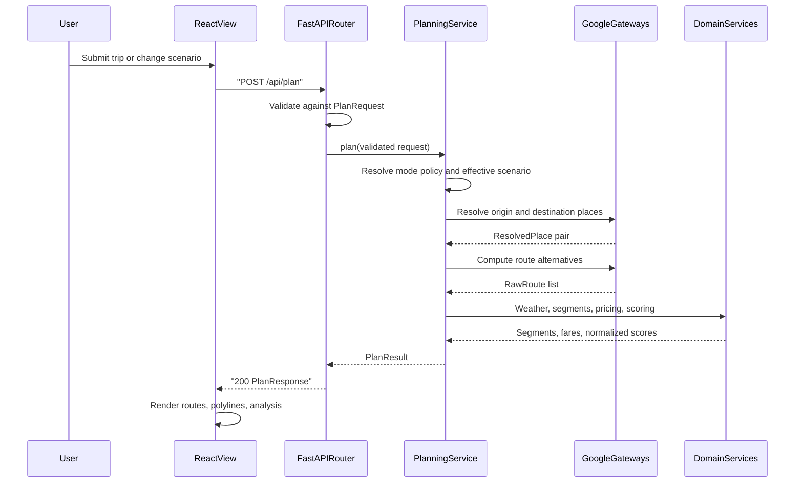
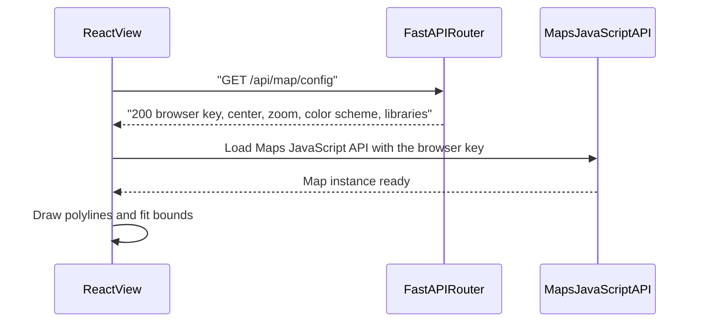
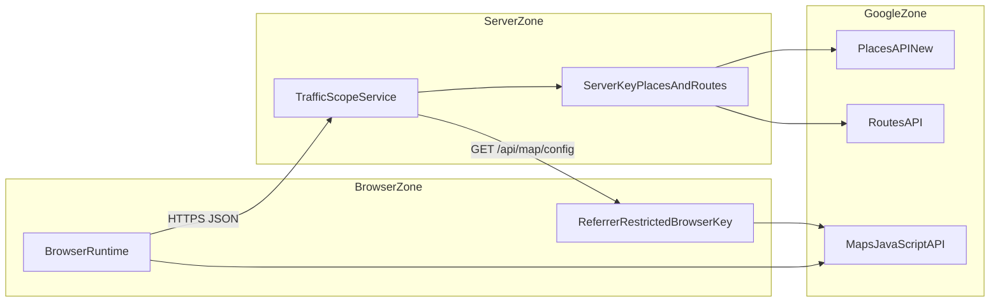

# Architecture Overview — PROJECT2

**Authority:** [../../README.md](../../README.md) holds the locked contracts. This document explains the
structure that delivers them.
**Related:** [class-diagram.md](class-diagram.md), [state-diagrams.md](state-diagrams.md), [../requirements/functional-requirements.md](../requirements/functional-requirements.md), [../requirements/non-functional-requirements.md](../requirements/non-functional-requirements.md)

## Purpose

Define the system context, the containers and components, the dependency rules that keep the MVC
split honest, the request and data flow, the deployment assumptions, and the credential trust
boundaries.

## Governed Requirements

| ID | Requirement | Status | Phase |
|----|-------------|--------|-------|
| FR-3.1, FR-3.2 | One Google Maps JavaScript API rendering path for both modes | Target | P1 |
| NFR-3.1, NFR-3.2 | Server credential never reaches the browser; browser credential is referrer-restricted | Target | P1 |
| NFR-5.1 | Dependencies flow View to Controller to Model only | Target | P1 |
| NFR-5.2 | Orchestration coordinates without containing formulas | Target | P1 |
| NFR-5.4 | Fixed backend package set | Target | P1 |
| NFR-5.7 | Exactly one map rendering path | Target | P1 |

---

## System Context

| Actor or system | Role |
|-----------------|------|
| User | A driver or operations analyst planning an Austin trip in a desktop browser |
| React View | Renders the interface and the map; holds no domain rules |
| FastAPI Controller | Validates requests, orchestrates the plan, normalizes the response, maps errors |
| Domain services | Traffic simulation, pricing, weather, scoring, geospatial helpers |
| Google Places API (New) | Resolves free-text locations to coordinates; called server-side only |
| Google Routes API | Computes traffic-aware driving alternatives; called server-side only |
| Google Maps JavaScript API | Renders the interactive map; called from the browser only |

The browser talks to exactly two Google-related things: the Maps JavaScript API it loads directly, and
the TrafficScope Controller. It never calls Places or Routes.

---

## Containers

| Container | Technology | Runs on | Responsibility |
|-----------|-----------|---------|----------------|
| Web client | React 19, TypeScript, Vite | User's browser | Presentation, map rendering, request lifecycle |
| Application service | FastAPI on Uvicorn, Python 3.13 | `127.0.0.1:8000` in development | HTTP surface, orchestration, domain execution, static hosting in production |
| Development frontend server | Vite | `127.0.0.1:5173` | Hot reload; proxies `/api` to the application service |

In production the application service serves the built single-page application from `dist/` and there
is no separate frontend process.

---

## Components

### View components

| Component | File | Responsibility |
|-----------|------|----------------|
| App shell | `src/App.tsx` | Layout composition only; performs no fetching |
| Plan lifecycle hook | `src/hooks/useRoutePlan.ts` | Trip inputs, mode, scenario, request lifecycle, route selection |
| Map configuration hook | `src/hooks/useMapConfig.ts` | Retrieves and caches `GET /api/map/config` |
| API client | `src/api/client.ts` | Typed fetch, abort handling, error-envelope parsing |
| Map configuration provider | `src/components/MapConfigProvider.tsx` | Supplies the browser credential to `APIProvider` |
| Map surface | `src/components/RouteMap.tsx` | The single `google.maps.Map` instance |
| Polyline layer | `src/components/RoutePolylineLayer.tsx` | Creates and disposes native polylines per traffic interval |
| Bounds controller | `src/components/MapBoundsController.tsx` | `fitBounds` policy |
| Presentation panels | `src/components/AppHeader.tsx`, `RoutePlannerForm.tsx`, `RouteOptionList.tsx`, `AnalysisPanel.tsx`, `ScenarioControls.tsx`, `PriceSummary.tsx`, `SegmentTable.tsx`, `StatusBanner.tsx`, `Toast.tsx` | Render response data and capture input |

### Controller components

| Component | File | Responsibility |
|-----------|------|----------------|
| Application assembly | `main.py` | Router mounting, exception handlers, lifespan probe, static hosting |
| HTTP router | `app/api/routes.py` | Endpoint declarations and dependency wiring |
| Schemas | `app/api/models.py` | Pydantic request and response models |
| Planning orchestration | `app/api/planning.py` | The plan workflow |
| Mode policy | `app/api/mode_policy.py` | The only place the mode string is interpreted |
| Error mapping | `app/api/errors.py` | Domain exceptions to codes and statuses |
| Dependency providers | `app/api/dependencies.py` | Gateway and service construction |

### Model components

| Component | File | Responsibility |
|-----------|------|----------------|
| Places gateway | `app/map/places.py` | Google Places text search adapter |
| Routes gateway | `app/map/routing.py` | Google Routes `computeRoutes` adapter |
| Polyline codec | `app/map/polyline.py` | Encoded polyline decoding |
| Bounds helpers | `app/map/bounds.py` | `bounds_for_points`, `union_bounds` |
| Reachability probe | `app/map/health.py` | Startup and health check against both Google APIs |
| Geospatial types | `app/map/types.py` | `ResolvedPlace`, `RawRoute`, `LatLngPoint`, `RouteBounds`, `TrafficInterval` |
| Traffic physics | `app/simulation/traffic.py` | BPR link performance, time-of-day factor |
| Segment builder | `app/simulation/segments.py` | Road segment derivation and statistics |
| Route scorer | `app/simulation/scoring.py` | Weighted normalization and recommendation |
| Pricing | `app/pricing/model.py` | Fare estimate and factor breakdown |
| Weather | `app/weather/service.py` | Severity to multipliers and labels |
| Heatmap (P3) | `app/heatmap/grid.py`, `app/heatmap/builder.py` | Congestion grid construction |
| Configuration | `app/config/__init__.py` | `Settings` and every coefficient |

---

## Dependency Rules

| Rule | Statement | Enforced by |
|------|-----------|-------------|
| R1 | The Model never imports the Controller, FastAPI, `main`, or any HTTP type | NFR-5.1 |
| R2 | The Controller never contains a coefficient or a formula | NFR-5.2 |
| R3 | The View never contains a coefficient; it renders server-computed numbers | NFR-5.3 |
| R4 | Only `app/api/mode_policy.py` compares the mode string | NFR-5.5 |
| R5 | Only `app/config/__init__.py` reads environment variables | NFR-3.3 |
| R6 | Only `app/map/places.py`, `app/map/routing.py`, and `app/map/health.py` make outbound Google HTTP calls | NFR-2.1 |
| R7 | Only `src/components/MapConfigProvider.tsx` and the components beneath it touch the Maps JavaScript API | NFR-5.7 |
| R8 | The Model raises domain exceptions; only `app/api/errors.py` converts them to HTTP | FR-7.2 |

A violation of R1, R2, or R6 is a design defect, not a style preference. Each is directly checkable by
inspecting the import graph.

---

## Request And Data Flow

### Plan request

### Map configuration request

The map surface is configured independently of planning so that a planning failure and a map failure
degrade separately.

### Data shape at each hop

| Hop | Payload |
|-----|---------|
| View to Controller | `{ origin, destination, mode, hour, weather, congestion }` |
| Controller to Model | Validated request plus the resolved `ModePolicy` and effective `Scenario` |
| Model to Controller | `ResolvedPlace`, `RawRoute`, `RoadSegment`, `PriceFactors`, `RouteBounds`, `WeatherState` |
| Controller to View | The locked `PlanResponse`; every array present, never null |

---

## Trust Boundaries And Credentials

| Credential | Environment variable | Reaches the browser | Google restriction | Used for |
|------------|---------------------|---------------------|--------------------|----------|
| Server key | `GOOGLE_MAPS_API_KEY` | Never | API restriction: Places API (New) and Routes API. No referrer restriction; IP restriction where the deployment allows | Server-side place resolution and routing |
| Browser key | `GOOGLE_MAPS_BROWSER_API_KEY` | Yes, through `GET /api/map/config` | API restriction: Maps JavaScript API only. HTTP referrer restriction: the deployed origins plus `http://127.0.0.1:5173` for development | Loading and rendering the map |
| Optional map style | `GOOGLE_MAPS_MAP_ID` | Yes, as `map_id` | Not a credential | Cloud-based map styling |

Boundary rules:

- The browser key is a distinct Google credential. Returning the server key to the browser is a
  security defect, not a shortcut (NFR-3.1).
- `GET /api/map/config` returns `503` with `maps_not_configured` when the browser credential is absent,
  and the View renders a contained map-unavailable state (FR-7.5).
- The browser never receives the server key, upstream response bodies, or upstream error details beyond
  a sanitized message (NFR-3.6).
- No user location, coordinate, or plan is persisted anywhere (NFR-3.4).

---

## Deployment Assumptions

| Concern | Assumption |
|---------|------------|
| Runtime | A single stateless Uvicorn process; no shared session state |
| Frontend delivery | Production serves `dist/` from the application service; development uses the Vite proxy |
| TLS | Terminated by a reverse proxy in front of the service; the application assumes HTTPS origins for referrer restriction |
| Configuration | Environment variables only, loaded once in `app/config/__init__.py` |
| Persistence | None. There is no database, cache server, or file store in P1 |
| Caching | In-process only, and only for place resolution in P2 |
| Observability | Structured application logs; no external telemetry pipeline |
| Scaling | Vertical only. Horizontal scaling is out of scope (see the excluded attributes table in [../requirements/non-functional-requirements.md](../requirements/non-functional-requirements.md)) |

Startup behavior: the lifespan handler runs `GoogleApiProbe` once and records the outcome for
`GET /api/health`. A failed probe logs a warning and does not prevent startup (NFR-2.4). A missing
frontend build logs a warning and does not prevent startup.

---

## Acceptance Criteria

- [ ] The import graph contains no edge from any module under `app/map/`, `app/simulation/`, `app/pricing/`, `app/weather/`, or `app/heatmap/` into `app/api/` or `main`.
- [ ] `app/api/planning.py` contains no numeric coefficient.
- [ ] `GOOGLE_MAPS_API_KEY` does not appear in any response body produced by the test suite.
- [ ] `GET /api/map/config` returns `maps_browser_api_key` and never a field named `maps_api_key`.
- [ ] A grep for `google.maps` outside `src/components/MapConfigProvider.tsx`, `RouteMap.tsx`, `RoutePolylineLayer.tsx`, and `MapBoundsController.tsx` returns nothing.
- [ ] Only `app/api/mode_policy.py` contains a comparison against the literal `realtime` or `simulated`.

## Planned Tests

| Test ID | Level | Target file | Assertion |
|---------|-------|-------------|-----------|
| T-11 | api | `tests/test_api.py` | `GET /api/map/config` exposes `maps_browser_api_key` and no server credential |
| T-10 | api | `tests/test_api.py` | `GET /api/health` reports probe status without failing when Google is unreachable |
| T-42 | api | `tests/test_static.py` | The single-page-application fallback refuses paths that resolve outside `dist/` |
| T-45 | unit | `tests/test_architecture.py` | Model packages import no Controller or FastAPI module |
| T-46 | unit | `tests/test_architecture.py` | Only `app/api/mode_policy.py` references the mode literals |

## Agent Implementation Notes

- Add new endpoints to `app/api/routes.py` and new schemas to `app/api/models.py`; never put logic in `main.py`.
- A new external dependency needs a gateway in `app/map/` or a sibling package, a timeout in `Settings`, an error code in `app/api/errors.py`, and a mocked-transport test.
- When a response field is added, update `app/api/models.py`, `src/types.ts`, the contract test, and [../controller/api-contracts.md](../controller/api-contracts.md) in the same change.
- Do not introduce a second map library, a server-rendered map image, or a non-JavaScript-API map surface for any state. The map-unavailable state is a text banner, not an alternative map.
