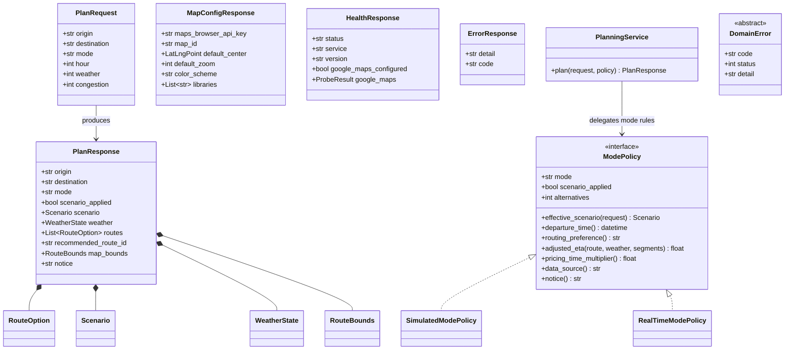
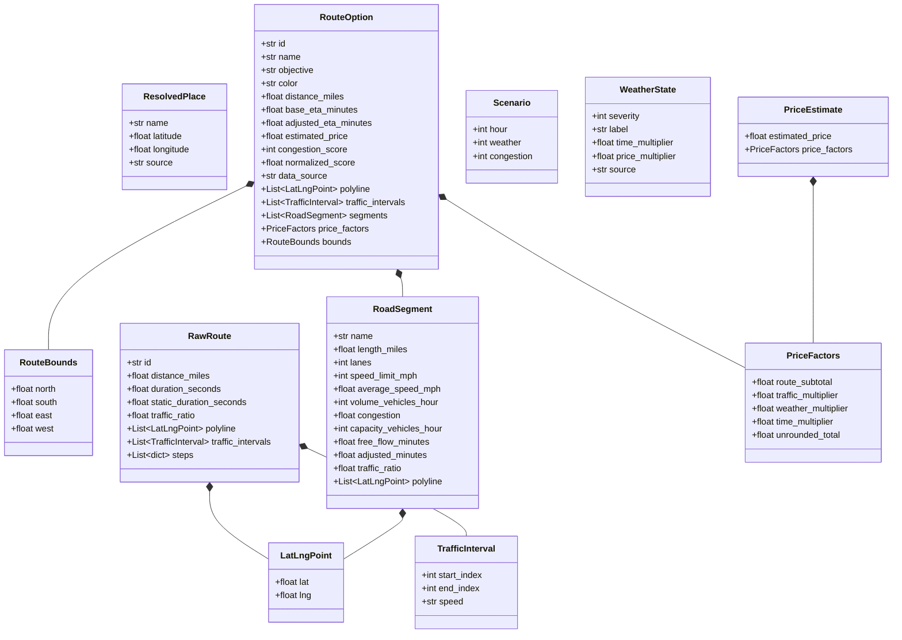
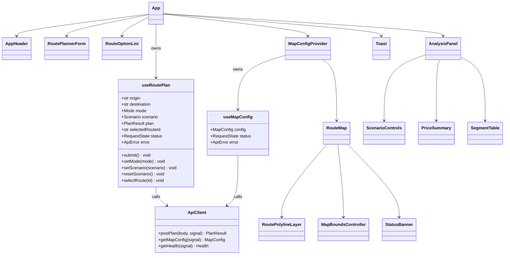

# Class Diagram — PROJECT2

**Authority:** [../../README.md](../../README.md) holds the locked field names. Every attribute below matches it.
**Related:** [architecture-overview.md](architecture-overview.md), [state-diagrams.md](state-diagrams.md), [../model/domain-contracts.md](../model/domain-contracts.md), [../controller/api-contracts.md](../controller/api-contracts.md), [../view/map-rendering.md](../view/map-rendering.md)

## Purpose

Name the concrete target classes, interfaces, and hooks of the rewrite, state one responsibility per
type, and show the collaborations. This is the design an implementer builds from; it is not a
description of the current code.

## Governed Requirements

| ID | Requirement | Status | Phase |
|----|-------------|--------|-------|
| FR-2.1, FR-2.8 | Server-side routing and weighted route ranking | Target | P1 |
| FR-3.3, FR-3.4 | Native polyline rendering colored by traffic interval | Target | P1 |
| FR-4.3 | Mode policy determines whether the scenario applies | Target | P1 |
| FR-7.2 | Domain exceptions map to a fixed code and status set | Target | P1 |
| NSR reference | See [../requirements/non-functional-requirements.md](../requirements/non-functional-requirements.md) for NFR-5.1 through NFR-5.7 | Target | P1 |

---

## Controller Types

| Type | File | Single responsibility |
|------|------|----------------------|
| `PlanRequest` | `app/api/models.py` | Validate and normalize the inbound plan body |
| `PlanResponse` | `app/api/models.py` | Declare the outbound plan contract |
| `MapConfigResponse` | `app/api/models.py` | Declare the browser map configuration contract |
| `HealthResponse` | `app/api/models.py` | Declare the health contract |
| `ErrorResponse` | `app/api/models.py` | Declare the single error envelope |
| `PlanningService` | `app/api/planning.py` | Run the plan workflow; hold no formulas |
| `ModePolicy` | `app/api/mode_policy.py` | Encapsulate every mode-dependent decision |
| `SimulatedModePolicy` | `app/api/mode_policy.py` | Scenario-driven planning at a chosen departure hour |
| `RealTimeModePolicy` | `app/api/mode_policy.py` | Live traffic-aware planning at the current time |
| `DomainError` | `app/api/errors.py` | Base for exceptions that carry a code and a status |

`resolve_mode_policy(mode: str) -> ModePolicy` in `app/api/mode_policy.py` is the only function in the
system that inspects the mode string.

### Domain error hierarchy

| Class | `code` | `status` | Raised by |
|-------|--------|----------|-----------|
| `InvalidLocationError` | `invalid_location` | 400 | `GooglePlacesGateway` |
| `SameOriginDestinationError` | `same_origin_destination` | 400 | `PlanningService` |
| `NoRouteFoundError` | `no_route_found` | 400 | `GoogleRoutesGateway` |
| `MapsNotConfiguredError` | `maps_not_configured` | 503 | `Settings` consumers |
| `UpstreamUnavailableError` | `upstream_unavailable` | 502 | Either Google gateway |
| `UpstreamTimeoutError` | `upstream_timeout` | 504 | Either Google gateway |

`app/api/errors.py` registers one handler for `DomainError` and one for `RequestValidationError`. The
second flattens the framework's list-shaped body into the locked envelope plus a `fields` array with
code `validation_error`.

---

## Model Types

```mermaid
classDiagram
  class GooglePlacesGateway {
    +resolve(query) ResolvedPlace
  }
  class GoogleRoutesGateway {
    +compute(origin, destination, options) List~RawRoute~
  }
  class GoogleApiProbe {
    +check() ProbeResult
  }
  class SegmentBuilder {
    +build(route, congestion_score, route_index) List~RoadSegment~
  }
  class RouteScorer {
    +score(routes) List~RouteOption~
    +recommend(routes) str
  }
  class PricingModel {
    +estimate(distance_miles, minutes, congestion_score, weather_price_multiplier, time_multiplier) PriceEstimate
  }
  class WeatherService {
    +adjustment(severity) WeatherState
  }
  class HeatmapBuilder {
    +build(scenario, metric) HeatmapGrid
  }
  class Settings {
    +str google_maps_api_key
    +str google_maps_browser_api_key
    +str google_maps_map_id
    +float places_timeout_seconds
    +float routes_timeout_seconds
  }
  GoogleRoutesGateway --> RawRoute : returns
  GooglePlacesGateway --> ResolvedPlace : returns
  SegmentBuilder --> RoadSegment : returns
  PricingModel --> PriceEstimate : returns
  WeatherService --> WeatherState : returns
  GooglePlacesGateway --> Settings : reads
  GoogleRoutesGateway --> Settings : reads
```

| Type | File | Single responsibility |
|------|------|----------------------|
| `GooglePlacesGateway` | `app/map/places.py` | Translate a text query into a `ResolvedPlace` through Places text search |
| `GoogleRoutesGateway` | `app/map/routing.py` | Translate a place pair and options into `RawRoute` values through `computeRoutes` |
| `GoogleApiProbe` | `app/map/health.py` | Report Places and Routes reachability |
| `SegmentBuilder` | `app/simulation/segments.py` | Derive `RoadSegment` statistics for one route |
| `RouteScorer` | `app/simulation/scoring.py` | Normalize, rank, and recommend |
| `PricingModel` | `app/pricing/model.py` | Produce a fare and its factor breakdown |
| `WeatherService` | `app/weather/service.py` | Map a severity index to labels and multipliers |
| `HeatmapBuilder` | `app/heatmap/builder.py` | Build a congestion grid. P3 only; not constructed in P1 |
| `Settings` | `app/config/__init__.py` | Own every environment value, coefficient, URL, and timeout |

Free functions, deliberately not classes because they are pure:

| Function | File | Signature |
|----------|------|-----------|
| `bpr_adjusted_time` | `app/simulation/traffic.py` | `(free_flow_minutes: float, flow: float, capacity: float) -> float` |
| `time_of_day_factor` | `app/simulation/traffic.py` | `(hour: int) -> float` |
| `decode_polyline` | `app/map/polyline.py` | `(encoded: str) -> list[LatLngPoint]` |
| `bounds_for_points` | `app/map/bounds.py` | `(points: list[LatLngPoint]) -> RouteBounds` |
| `union_bounds` | `app/map/bounds.py` | `(bounds: list[RouteBounds]) -> RouteBounds` |
| `resolve_mode_policy` | `app/api/mode_policy.py` | `(mode: str) -> ModePolicy` |

---

## Domain Value Objects

`RawRoute` is internal to the Model and never serialized. `RouteOption` is the serialized shape. The
boundary between them is `PlanningService`.

---

## View Types

| Type | File | Single responsibility |
|------|------|----------------------|
| `useRoutePlan` | `src/hooks/useRoutePlan.ts` | Own trip inputs, mode, scenario, request lifecycle, and selection |
| `useMapConfig` | `src/hooks/useMapConfig.ts` | Fetch and cache map configuration |
| `ApiClient` | `src/api/client.ts` | Typed transport with abort support and error-envelope parsing |
| `App` | `src/App.tsx` | Compose layout; no fetching, no domain rules |
| `AppHeader` | `src/components/AppHeader.tsx` | Brand, mode switch, request status |
| `RoutePlannerForm` | `src/components/RoutePlannerForm.tsx` | Origin, destination, geolocation assist, submit |
| `RouteOptionList` | `src/components/RouteOptionList.tsx` | Route cards and selection |
| `MapConfigProvider` | `src/components/MapConfigProvider.tsx` | Supply the browser credential to `APIProvider` |
| `RouteMap` | `src/components/RouteMap.tsx` | The single `google.maps.Map` surface for both modes |
| `RoutePolylineLayer` | `src/components/RoutePolylineLayer.tsx` | Create and dispose `google.maps.Polyline` per interval slice |
| `MapBoundsController` | `src/components/MapBoundsController.tsx` | `fitBounds` for the selection or for all routes |
| `AnalysisPanel` | `src/components/AnalysisPanel.tsx` | Selected-route container |
| `ScenarioControls` | `src/components/ScenarioControls.tsx` | The three scenario controls and reset |
| `PriceSummary` | `src/components/PriceSummary.tsx` | Fare, `price_factors`, disclaimer |
| `SegmentTable` | `src/components/SegmentTable.tsx` | Per-segment statistics |
| `StatusBanner` | `src/components/StatusBanner.tsx` | Loading, empty, error, and map-unavailable states |
| `Toast` | `src/components/Toast.tsx` | Transient dismissible notices |

### Frontend type aliases

`src/types.ts` mirrors `app/api/models.py` one to one:

| TypeScript | Mirrors |
|------------|---------|
| `Mode` | `"simulated" \| "realtime"` |
| `TrafficSpeed` | `"NORMAL" \| "SLOW" \| "TRAFFIC_JAM" \| "SPEED_UNSPECIFIED"` |
| `RequestState` | `"idle" \| "loading" \| "success" \| "error"` |
| `LatLngPoint`, `RouteBounds`, `TrafficInterval`, `Scenario`, `WeatherState`, `PriceFactors`, `RoadSegment`, `RouteOption`, `PlanResult`, `MapConfig`, `ApiError` | The corresponding Pydantic models |

`PlanResult` is the TypeScript name for the `PlanResponse` body. `ApiError` is `{ detail: string; code: string; fields?: string[] }`.

---

## Key Collaborations

| Scenario | Collaboration |
|----------|---------------|
| Plan a trip | `routes.py` validates, `dependencies.py` supplies gateways, `PlanningService` calls `resolve_mode_policy`, then `GooglePlacesGateway`, `GoogleRoutesGateway`, `WeatherService`, `SegmentBuilder`, `PricingModel`, `RouteScorer`, then `bounds_for_points` and `union_bounds` |
| Render the map | `MapConfigProvider` resolves configuration, `RouteMap` creates the map, `RoutePolylineLayer` draws interval slices, `MapBoundsController` fits the camera |
| Report a failure | A Model gateway raises a `DomainError` subclass, `app/api/errors.py` converts it to the envelope, `ApiClient` parses it into `ApiError`, `StatusBanner` or `Toast` presents it |
| Change the mode | `AppHeader` calls `setMode`, `useRoutePlan` re-plans, the response's `scenario_applied` decides whether `ScenarioControls` renders |

## Acceptance Criteria

- [ ] Every class listed above exists at the stated path with the stated public surface.
- [ ] `PlanningService` has no arithmetic beyond assembling values returned by Model services.
- [ ] Every `DomainError` subclass declares both `code` and `status` as class attributes.
- [ ] `RawRoute` never appears in any Pydantic response model.
- [ ] `src/types.ts` declares every type in the mirror table and no extra API type.
- [ ] `App.tsx` contains no `fetch` call and imports no coefficient.

## Planned Tests

| Test ID | Level | Target file | Assertion |
|---------|-------|-------------|-----------|
| T-17 | unit | `tests/test_scoring.py` | `RouteScorer.recommend` returns the lowest-scoring route id |
| T-22 | unit | `tests/test_mode_policy.py` | Each policy reports the documented alternatives count, scenario handling, routing preference, and notice |
| T-23 | unit | `tests/test_planning.py` | The adjusted-ETA fallback chain prefers the traffic-aware duration, then the static duration, then the segment sum |
| T-24 | api | `tests/test_contracts.py` | The `PlanResponse` field set matches the documented contract exactly |
| T-32 | component | `src/components/RoutePolylineLayer.test.tsx` | One polyline is created per interval and all are disposed on unmount |

## Agent Implementation Notes

- Prefer a free function over a class when the operation is pure. `bpr_adjusted_time` and `decode_polyline` stay functions.
- Construct gateways in `app/api/dependencies.py` so tests can substitute mocked transports without patching module globals.
- Add a mode-dependent behavior by adding a method to `ModePolicy`, never by adding a mode comparison elsewhere.
- Keep `RawRoute` free of presentation concerns such as `color`, `name`, and `objective`; those are assigned by `PlanningService` from index position.
