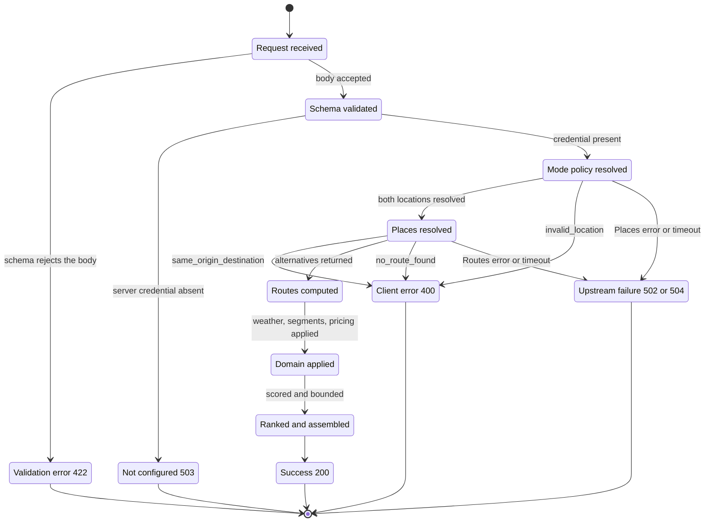
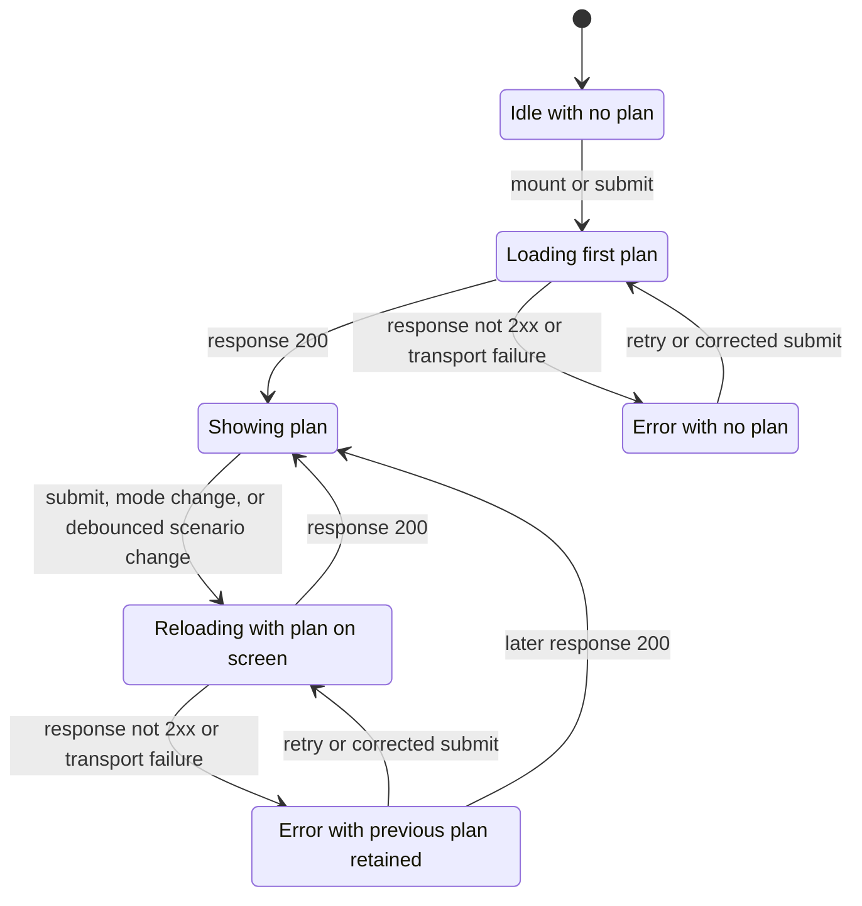
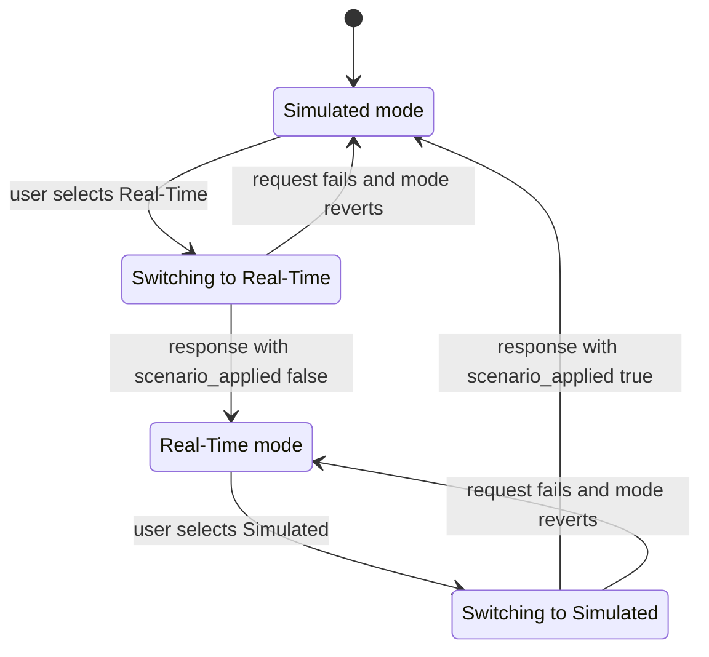
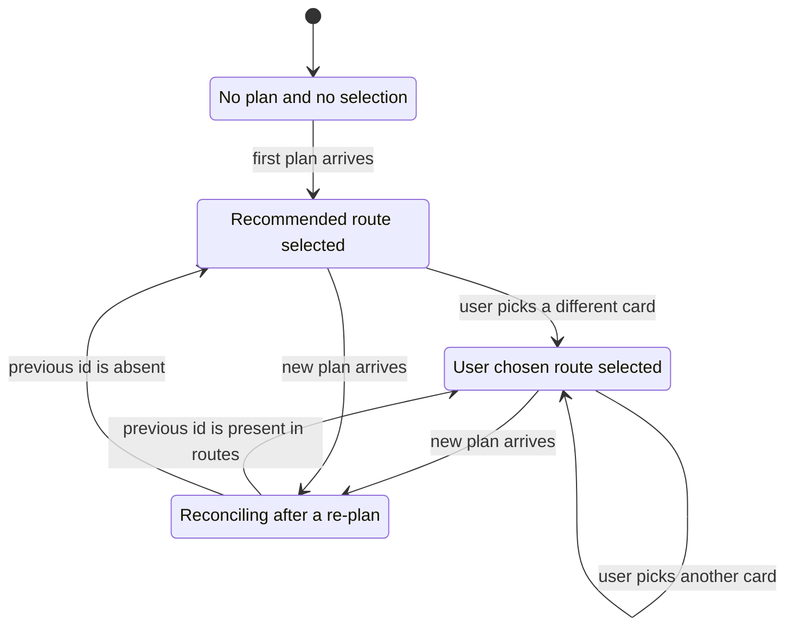
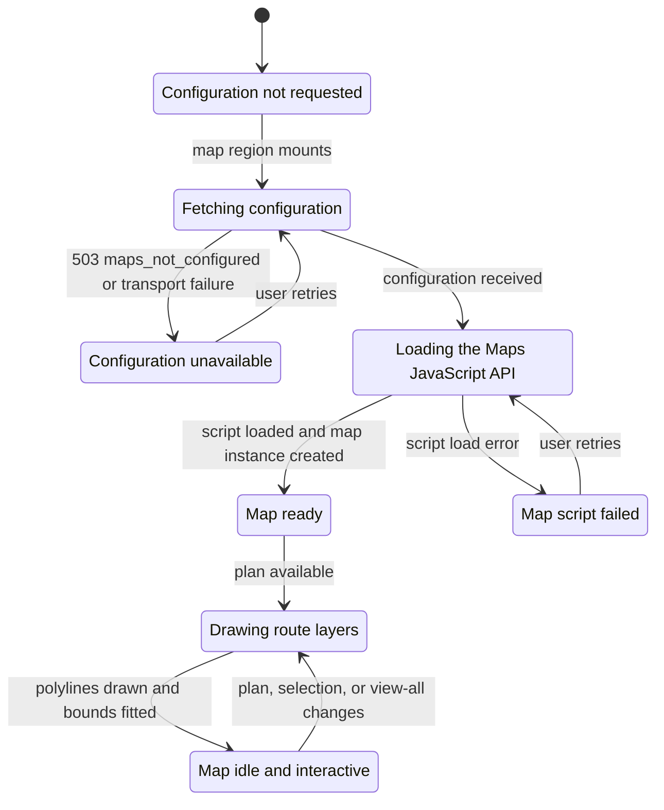

# State Diagrams — PROJECT2

**Authority:** [../../README.md](../../README.md) holds the locked contracts, modes, and error codes.
**Related:** [architecture-overview.md](architecture-overview.md), [class-diagram.md](class-diagram.md), [../controller/orchestration.md](../controller/orchestration.md), [../controller/mode-policies.md](../controller/mode-policies.md), [../view/loading-error-states.md](../view/loading-error-states.md), [../view/map-rendering.md](../view/map-rendering.md)

## Purpose

Define the lifecycles that the rewrite must implement: the server-side plan request, the client-side
request state machine, mode transitions, route selection, and Maps JavaScript API loading. Each
diagram is followed by the transition rules that a test can assert.

## Governed Requirements

| ID | Requirement | Status | Phase |
|----|-------------|--------|-------|
| FR-2.10 | Selection survives a re-plan when the route still exists | Target | P1 |
| FR-4.2, FR-4.4 | A mode change re-plans and reshapes the control surface | Target | P1 |
| FR-5.5 | Scenario changes debounce to a single re-plan | Target | P1 |
| FR-7.4 | A failed plan preserves inputs and the previous plan | Target | P1 |
| FR-7.5 | Map failure is contained to the map region | Target | P1 |
| NFR-1.5 | Superseded requests are aborted | Target | P1 |

---

## 1. Plan Request Lifecycle (Server)

One `POST /api/plan` call, from validation to response. Every terminal state is either a `200` or one
documented error code.

| Transition | Trigger | Result |
|------------|---------|--------|
| Received to ValidationError | Pydantic rejects a field | `422`, `validation_error`, `fields` array |
| Validated to NotConfigured | `Settings.google_maps_api_key` is empty | `503`, `maps_not_configured` |
| PolicyResolved to ClientError | Places returns no usable result | `400`, `invalid_location` |
| PlacesResolved to ClientError | Both places resolve to the same name and coordinates | `400`, `same_origin_destination` |
| PlacesResolved to ClientError | Routes returns an empty alternatives list | `400`, `no_route_found` |
| Any to UpstreamFailure | Google returns an error status | `502`, `upstream_unavailable` |
| Any to UpstreamFailure | Google exceeds its configured timeout | `504`, `upstream_timeout` |
| Assembled to Success | Response model validates | `200`, `PlanResponse` |

Invariant: no state produces a partial `200`. If any step fails, the whole request fails with one code.

---

## 2. Client Request State Machine

Owned by `useRoutePlan`. The previous successful plan is retained across a failure so the interface
never blanks out.

| Rule | Statement |
|------|-----------|
| Abort | Entering `LoadingInitial` or `Reloading` aborts any in-flight request through its `AbortSignal`; an aborted response never updates state |
| Debounce | Mode and scenario changes coalesce for 180 ms and then produce one request |
| Explicit submit | Origin and destination changes never auto-request; they require form submission |
| Input preservation | `ErrorEmpty` and `ErrorWithPlan` leave origin, destination, mode, and scenario untouched |
| Plan preservation | `ErrorWithPlan` keeps the last successful `routes`, selection, and map camera |
| Presentation | `ErrorEmpty` renders `StatusBanner`; `ErrorWithPlan` renders `Toast` over the retained plan |
| Announcement | Entering a loading or error state updates the polite live region |

---

## 3. Mode Transitions

Mode is the only branch that changes the shape of the interface.

| Aspect | Simulated | Real-Time |
|--------|-----------|-----------|
| Alternatives shown | Up to 3 | Exactly 1 |
| Scenario controls | Rendered | Not rendered |
| Route comparison affordances | Active | Replaced by an explanation |
| Polyline tint | Applied from `scenario.congestion` and `scenario.weather` | Not applied; pure Google traffic colors |
| `scenario_applied` | `true` | `false` |
| Departure time | Next occurrence of `scenario.hour` | Now |

Transition rules:

- The requested mode is optimistic in the switch control but authoritative only after the response
  arrives. The interface reads `response.mode` and `response.scenario_applied`, never its own request
  intent, when deciding what to render.
- A failed mode change reverts the switch to the mode of the retained plan so the control never
  disagrees with the data on screen.
- Scenario values are retained in client state while in Real-Time mode so that returning to Simulated
  restores the user's prior settings without a reset.

---

## 4. Route Selection

| Rule | Statement |
|------|-----------|
| Default | The first plan selects `recommended_route_id` |
| Persistence | A re-plan keeps the user's selection when that `id` appears in the new `routes` |
| Fallback | Otherwise the selection resets to `recommended_route_id` |
| Real-Time | With one route returned, that route is both the selection and the recommendation |
| Downstream effects | A selection change updates `AnalysisPanel`, `PriceSummary`, `SegmentTable`, polyline emphasis, and the camera |
| View all | Activating "View all" does not change the selection; it only widens the camera to `map_bounds` |

---

## 5. Maps JavaScript API Loading

The map is configured and loaded independently of planning so that either can fail alone.

| State | What the user sees | Rest of the application |
|-------|--------------------|-------------------------|
| ConfigLoading, ApiLoading | A loading placeholder in the map region | Fully usable |
| ConfigFailed | `StatusBanner` with the error `detail` and retry guidance | Fully usable; form, route list, and analysis respond normally |
| ApiFailed | `StatusBanner` explaining that the map script could not load, with retry | Fully usable |
| MapReady, Drawing, MapIdle | The single interactive map with route polylines | Fully usable |

Drawing rules:

- Entering `Drawing` disposes every existing `google.maps.Polyline` before creating the new set, so
  polyline count never grows across re-plans.
- One polyline is created per `TrafficInterval` slice of each route's `polyline`. A route with an empty
  `traffic_intervals` array is drawn as one `NORMAL` slice.
- `fitBounds` runs on entry to `Drawing` only when the selection, the plan payload, or the view-all
  toggle changed. Plain user panning and zooming never trigger a refit.
- Unmounting the map region disposes all polylines and detaches all listeners.

---

## Acceptance Criteria

- [ ] Every server terminal state maps to exactly one documented HTTP status and `code`.
- [ ] A superseded plan request is aborted and its response is discarded.
- [ ] Dragging a scenario control through many values produces exactly one request.
- [ ] After a failed re-plan the previous routes, selection, and camera are still on screen.
- [ ] A failed mode change leaves the mode switch showing the mode of the plan that is displayed.
- [ ] With map configuration unavailable, route selection and the segment table still work.
- [ ] Re-planning twice does not increase the number of live polyline instances.

## Planned Tests

| Test ID | Level | Target file | Assertion |
|---------|-------|-------------|-----------|
| T-03 | api | `tests/test_api.py` | An out-of-range scenario terminates in the `422` state with a `fields` array |
| T-09 | api | `tests/test_api.py` | A simulated Routes timeout terminates in `504` with `upstream_timeout` |
| T-27 | component | `src/hooks/useRoutePlan.test.ts` | Rapid scenario changes issue one request after the debounce |
| T-28 | component | `src/App.test.tsx` | Switching to Real-Time removes the scenario controls and renders one route |
| T-29 | component | `src/App.test.tsx` | Selecting a route card updates the analysis panel and requests a camera refit |
| T-30 | component | `src/components/StatusBanner.test.tsx` | A failed re-plan retains the previous plan and shows the error `detail` |
| T-31 | component | `src/components/RouteMap.test.tsx` | Map configuration failure renders a banner while the rest of the interface stays interactive |
| T-34 | component | `src/components/MapBoundsController.test.tsx` | `fitBounds` uses the selected route bounds, and view-all uses `map_bounds` |

## Agent Implementation Notes

- Model the client machine explicitly. A `RequestState` union plus a retained `plan` value is enough; avoid deriving state from a tangle of booleans.
- Keep abort handling in `src/api/client.ts` so every caller inherits it.
- Treat `response.mode` and `response.scenario_applied` as the source of truth for rendering decisions; the request body is intent, not state.
- The map region owns its own loading and error states. Do not merge them into the plan request state machine.
