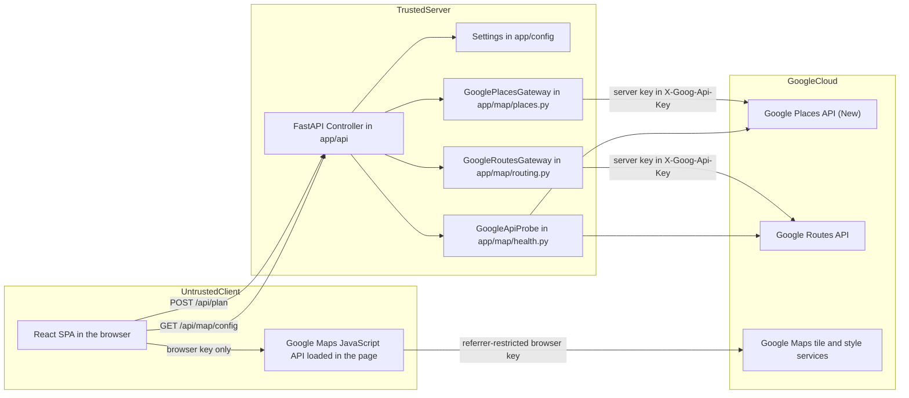

# Controller Context — External Service Boundaries

**Layer:** Controller  
**Target modules:** `TrafficSImulation/app/api/dependencies.py`, `TrafficSImulation/app/api/routes.py`, `TrafficSImulation/app/config/__init__.py`, `TrafficSImulation/main.py`  
**Related:** [api-contracts.md](api-contracts.md), [orchestration.md](orchestration.md), [validation-error-handling.md](validation-error-handling.md), [mode-policies.md](mode-policies.md), [../model/google-integrations.md](../model/google-integrations.md), [../model/configuration.md](../model/configuration.md), [../view/map-rendering.md](../view/map-rendering.md), [../architecture/architecture-overview.md](../architecture/architecture-overview.md)

## Purpose

Define where TrafficScope stops trusting its environment. Every call to Google that carries a secret is
made by the server. The browser receives exactly one credential, and it is a different credential with
a narrower grant.

## Requirements

| ID | Requirement | Status | Phase |
|----|-------------|--------|-------|
| FR-1.4 | Place resolution is performed server-side through the Places API (New) text search | Target | P1 |
| FR-2.1 | Route alternatives are computed server-side through the Routes `computeRoutes` method | Target | P1 |
| FR-3.1 | All map output is rendered by the Maps JavaScript API loaded through `@vis.gl/react-google-maps` | Target | P1 |
| FR-7.2 | An absent server credential maps to 503 `maps_not_configured` | Target | P1 |
| NFR-2.1 | Places calls time out at 8 s and Routes calls at 10 s, both configurable through `Settings` | Target | P1 |
| NFR-2.2 | An upstream failure never crashes the service or leaks upstream internals | Target | P1 |
| NFR-2.4 | A startup probe reports reachability through `GET /api/health` without preventing startup | Target | P1 |
| NFR-3.1 | The server credential never appears in a response body, log line, or client bundle | Target | P1 |
| NFR-3.2 | The browser receives only a referrer-restricted credential scoped to the Maps JavaScript API | Target | P1 |
| NFR-3.3 | Credentials are supplied only through environment variables and are never committed | Target | P1 |
| NFR-5.3 | Timeouts and upstream URLs are defined once in `app/config/__init__.py` | Target | P1 |
| NFR-6.3 | The default test suite makes no live Google calls; gateways use mocked transports | Target | P1 |
| NFR-6.9 | Any live-credential test is opt-in and excluded from the default run | Target | P1 |
| NFR-3.8 | Browser and server credentials are independently rotatable without a code change | Target | P2 |
| NFR-2.6 | Transient upstream failures are retried once with jittered backoff | Target | P2 |
| FR-3.10 | Server-computed map camera state such as a center point and zoom level | Out of scope | — |
| FR-7.12 | Any place-resolution or routing substitute that answers when Google is unavailable | Out of scope | — |
| — | Any Google API beyond Places, Routes, and Maps JavaScript | Out of scope | — |

## The Boundary

Everything inside `TrustedServer` may hold the server key. Nothing inside `UntrustedClient` ever sees
it. Exactly one arrow crosses from the client to Google, it carries the browser key, and it terminates
at tile and style services rather than at Places or Routes. Every arrow into Places or Routes starts
inside the trusted server.

## Two Credentials

They are separate Google API keys in the same or different Google Cloud projects. They are never the
same string, and a deployment that sets them to the same value has misconfigured its security model
even though the application will run.

| Property | Server key | Browser key |
|----------|-----------|-------------|
| Environment variable | `GOOGLE_MAPS_API_KEY` | `GOOGLE_MAPS_BROWSER_API_KEY` |
| Reaches the browser | Never | Yes, through `GET /api/map/config` |
| Enabled APIs | Places API (New), Routes API | Maps JavaScript API |
| Application restriction | IP addresses of the server, or none when the network is closed | HTTP referrers matching the deployed origins |
| Used by | `app/map/places.py`, `app/map/routing.py`, `app/map/health.py` | `src/components/MapConfigProvider.tsx` through `@vis.gl/react-google-maps` |
| Read from | `Settings.google_maps_api_key` | `Settings.google_maps_browser_api_key` |
| Absent behavior | 503 `maps_not_configured` from any planning call | 503 `maps_not_configured` from `GET /api/map/config` |
| Blast radius if leaked | Unmetered Places and Routes billing against the project | Map loads from unauthorized origins, blocked by the referrer list |

Both are loaded once at import time in `app/config/__init__.py` from the process environment, with
`.env` support for local development. `.env` is never committed. Neither key has a default value and
neither is ever written into `src/`, into `dist/`, into a test fixture, or into a Vite `VITE_`
variable — a `VITE_`-prefixed value is compiled into the bundle, which would make rotation a rebuild
and put the key in every archived artifact.

`GOOGLE_MAPS_MAP_ID` is an optional third setting. It is an identifier rather than a secret, and it is
returned as `map_id` by `GET /api/map/config`, or `null` when unset.

### Why the browser key is safe to publish

The Maps JavaScript API cannot be loaded without a key visible to the page, so the browser key is
public by design. Its safety comes from restriction rather than secrecy: HTTP-referrer restrictions
limit which origins may use it, and the API restriction limits it to the Maps JavaScript API so it
cannot be replayed against Places or Routes. Serving it from `GET /api/map/config` rather than from the
bundle means the referrer list and the key itself can change at any time without a frontend release.

Referrer restrictions must list every origin that serves the app, including the development origin
`http://127.0.0.1:5173`, and must not include a wildcard that matches arbitrary hosts. A quota alert on
the browser key is the intended detection mechanism for an origin that was missed or an unauthorized
one that was added.

## Gateways

Each gateway owns one upstream API. Nothing else in the codebase constructs an HTTP request to Google.

| Gateway | Module | Upstream | Method and path |
|---------|--------|----------|-----------------|
| `GooglePlacesGateway` | `app/map/places.py` | Places API (New) | `POST places:searchText` |
| `GoogleRoutesGateway` | `app/map/routing.py` | Routes API | `POST directions/v2:computeRoutes` |
| `GoogleApiProbe` | `app/map/health.py` | Both | Minimal reachability calls |

Gateways are constructed in `app/api/dependencies.py` and injected into `PlanningService`. They receive
their timeout and their credential from `Settings`; they never read the environment themselves. That is
what makes a test able to build a gateway with a fake key and a stub transport, and what keeps every
call's timeout visible in one configuration table.

### Timeout and failure policy

| Concern | `GooglePlacesGateway` | `GoogleRoutesGateway` |
|---------|----------------------|----------------------|
| Timeout | 8 s | 10 s |
| Setting | `Settings.places_timeout_seconds` | `Settings.routes_timeout_seconds` |
| Calls per plan | 2, issued concurrently | 1 |
| Credential absent | `MapsNotConfiguredError` before any request is built | Same |
| Non-2xx status | `PlacesUnavailableError` to 502 `upstream_unavailable` | `RoutesUnavailableError` to 502 `upstream_unavailable` |
| Timeout or connection error | `PlacesTimeoutError` to 504 `upstream_timeout` | `RoutesTimeoutError` to 504 `upstream_timeout` |
| Empty useful result | `PlaceNotFoundError` to 400 `invalid_location` | `NoRouteFoundError` to 400 `no_route_found` |
| Retry in P1 | None | None |
| Response size control | Field mask limited to display name, formatted address, and location | Field mask limited to the fields the response contract needs |

The 10-second Routes timeout is the larger of the two because alternatives with traffic-aware routing
is the slower call, and the two Places calls run concurrently rather than in series. In the worst
success case the upstream budget is therefore about 18 s of wall clock rather than 26 s, but the
NFR-1.1 target of a 3 s p95 is set well below both: timeouts bound the tail, they do not describe the
expected case. A plan whose upstream work approaches these limits should be visible in the
`duration_ms` log field long before a user reports it.

Field masks are a boundary control as well as a cost control. Requesting only the fields the response
contract needs means an upstream schema addition cannot expand what the server holds, and it keeps
per-call billing tied to the data actually rendered.

### Startup probe

`main.py` runs a lifespan hook that calls `GoogleApiProbe` once and caches the result. `GET /api/health`
reads that cache and never performs a live Google call, so health checks cost no upstream quota and
cannot themselves fail on a Google outage. The cached record carries `ok`, a sanitized `message`, and
`checked_at`. A probe that finds the credential present but the APIs unreachable logs a warning at
startup and still allows the service to boot, because the correct response to a Google outage is a
typed 502 per request rather than a refusal to start.

## What the Browser Never Receives

| Item | Reason |
|------|--------|
| `GOOGLE_MAPS_API_KEY` in any form, whole or partial | It grants billable Places and Routes access |
| Google endpoint URLs used by the server | Discloses call structure and invites direct replay |
| Field mask strings | Same |
| Raw Google response bodies or error payloads | May carry project, quota, and account identifiers |
| Upstream HTTP statuses or timing | Operational detail with no user value |
| `Settings` values other than the documented `GET /api/map/config` fields | The config endpoint is an allowlist, not a dump of settings |
| Any credential in a log the browser can read, such as a response header | Headers are as visible as bodies |

`GET /api/map/config` is written as an explicit allowlist of six fields for this reason. It must never
be implemented by serializing a settings object, because the next setting added would ship with it.

### The browser makes no direct Places or Routes calls

The browser has no code path to Places or Routes, and adding one would be a boundary violation even if
it worked. Doing so would require a browser-visible key with those APIs enabled, which is exactly the
credential separation this document exists to maintain; it would also move place resolution and routing
out of the Controller, so the Austin location bias, the field masks, the timeouts, the error mapping,
and the future response caches would all be bypassed.

| Concern | Where it is done | Where it is not done |
|---------|------------------|---------------------|
| Text to place resolution | `app/map/places.py` | Places Autocomplete or Geocoding in the browser |
| Route computation, distance, duration | `app/map/routing.py` | Directions service in the browser |
| Traffic categories along a route | `traffic_intervals` from the Routes response | Traffic layer queried by the browser |
| Bounds and viewport fitting | `app/map/bounds.py`, applied by `MapBoundsController.tsx` from `map_bounds` | Browser-side route geometry lookup |
| Map tiles, base styling, gestures | Maps JavaScript API with the browser key | — |

The browser's only Google interaction is rendering. It draws `polyline` arrays it received from
`POST /api/plan` onto a map surface the Maps JavaScript API provides, colors them from
`traffic_intervals`, and fits the viewport to `map_bounds`. There is one map rendering path and it is
the same in both planning modes.

## Key Rotation

Both credentials are read from the environment at process start, so rotation is a configuration change
plus a restart. No frontend rebuild is involved for either key, which is the practical payoff of
serving the browser key from `GET /api/map/config`. NFR-3.8 raises that to independent rotation with no
code change at all and is P2 work; the runbook below is the P1 procedure it will build on.

| Step | Server key | Browser key |
|------|-----------|-------------|
| 1 | Create the replacement key with the same API restrictions | Create the replacement with the same referrer and API restrictions |
| 2 | Update `GOOGLE_MAPS_API_KEY` in the deployment secret store | Update `GOOGLE_MAPS_BROWSER_API_KEY` |
| 3 | Restart the service | Restart the service |
| 4 | Confirm `GET /api/health` reports `google_maps.ok` true | Confirm a fresh page load renders the map |
| 5 | Confirm a live `POST /api/plan` returns 200 | Confirm no console authorization failure appears |
| 6 | Delete the previous key after the traffic on it reaches zero | Delete the previous key; open tabs hold it until reload |

Rotate immediately on any suspected exposure, including a key appearing in a commit, a log export, a
screenshot, or a support ticket. Reverting the commit is not sufficient, because the value remains in
history and in any clone. Because open browser tabs continue using a browser key they already fetched,
allow a grace period before deleting the previous browser key, or accept that those tabs must reload.

## Acceptance Criteria

- [ ] No response body, header, or built asset contains the value of `GOOGLE_MAPS_API_KEY`.
- [ ] `GET /api/map/config` returns `maps_browser_api_key` from `Settings.google_maps_browser_api_key` and never from `Settings.google_maps_api_key`.
- [ ] `GET /api/map/config` returns exactly the six documented fields and nothing else.
- [ ] `GET /api/map/config` returns 503 `maps_not_configured` when the browser key is absent.
- [ ] A planning call with an absent server key returns 503 `maps_not_configured` and issues zero upstream requests.
- [ ] Places calls use an 8 s timeout and Routes calls a 10 s timeout, both sourced from `Settings`.
- [ ] Both timeouts are overridable through configuration without editing gateway source.
- [ ] Only `app/map/places.py`, `app/map/routing.py`, and `app/map/health.py` construct Google requests, and only they import the transport library.
- [ ] No file under `src/` references a Google Places, Geocoding, Directions, or Routes URL.
- [ ] No credential value appears in any log record, error body, or committed fixture.
- [ ] The startup probe result is cached and `GET /api/health` performs no live Google call.
- [ ] Rotating either key requires only an environment change and a restart, with no frontend rebuild.

## Planned Tests

| Test ID | Level | Target file | Assertion |
|---------|-------|-------------|-----------|
| T-11 | api | `tests/test_api.py` | With two distinct fake keys configured, `maps_browser_api_key` equals the browser key and no success or error response body or header anywhere contains the server key |
| T-20 | unit | `tests/test_google_places.py` | The Places gateway reads its timeout from `Settings`, a stub transport confirms the server key is sent in `X-Goog-Api-Key`, and the Places field mask matches the contract |
| T-21 | unit | `tests/test_google_routes.py` | The Routes gateway reads its timeout from `Settings`, an overridden value reaches the transport call, and the Routes field mask matches the contract |
| T-07 | api | `tests/test_api.py` | An absent server key returns 503 `maps_not_configured` before any upstream request is constructed |
| T-45 | unit | `tests/test_architecture.py` | Only the three gateway modules import the transport library or reference a Google host |
| T-56 | unit | `tests/test_architecture.py` | No file under `src/` references a Google Places, Geocoding, Directions, or Routes URL |
| T-10 | api | `tests/test_api.py` | The startup probe runs once and the health handler makes no upstream call |

## Agent Implementation Notes

- Construct one shared `httpx.AsyncClient` in the lifespan hook and inject it into both gateways through `app/api/dependencies.py`. Creating a client per call discards connection reuse and is a measurable share of the latency budget.
- Pass timeouts explicitly on every request. A gateway that omits a timeout inherits an unbounded default and turns a Google slowdown into an exhausted worker pool.
- Keep the `GET /api/map/config` handler an explicit literal construction of the six fields. Never serialize `Settings`.
- Read credentials only through `Settings`. A module that calls `os.environ` directly cannot be tested and cannot be reasoned about from the configuration catalog.
- Use distinct obviously-fake values for the two keys in tests, such as `test-server-key` and `test-browser-key`, so a test that returns the wrong one fails on the value rather than passing by coincidence.
- Sanitize and truncate upstream error text at the gateway boundary before it reaches the exception. The handler must never receive a response object it could accidentally serialize.
- Treat the field masks as part of the response contract: narrowing one silently removes data the View renders, and widening one increases per-call cost.
- When P2 adds server-side retry, add it inside the gateways so the timeout budget and the retry policy stay in one place, and cap the total so NFR-1.1 still holds.
