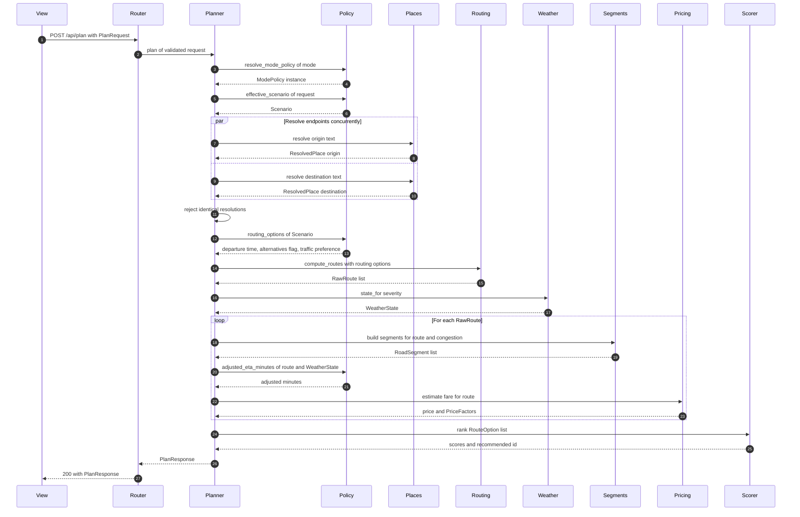

# Controller Context — Orchestration

**Layer:** Controller  
**Target modules:** `TrafficSImulation/app/api/planning.py`, `TrafficSImulation/app/api/dependencies.py`, `TrafficSImulation/app/api/routes.py`  
**Related:** [api-contracts.md](api-contracts.md), [mode-policies.md](mode-policies.md), [validation-error-handling.md](validation-error-handling.md), [external-service-boundaries.md](external-service-boundaries.md), [../model/route-planning.md](../model/route-planning.md), [../model/traffic-simulation.md](../model/traffic-simulation.md), [../model/pricing.md](../model/pricing.md), [../architecture/architecture-overview.md](../architecture/architecture-overview.md)

## Purpose

Define `PlanningService`, the single coordinator that turns a validated `PlanRequest` into a
`PlanResponse`. Orchestration decides call order, mode branching, and error propagation. It never
performs arithmetic that belongs to the Model.

## Requirements

| ID | Requirement | Status | Phase |
|----|-------------|--------|-------|
| FR-1.4 | Origin and destination are resolved server-side through Google Places | Target | P1 |
| FR-1.6 | Identical origin and destination resolutions are rejected before routing | Target | P1 |
| FR-2.1 | Route alternatives are computed server-side through the Routes `computeRoutes` method | Target | P1 |
| FR-2.6 | Each route reports `adjusted_eta_minutes` computed by the active mode policy | Target | P1 |
| FR-2.7 | Each route carries at least one `RoadSegment` built from route geometry | Target | P1 |
| FR-2.8 | Routes are ranked and the best is exposed as `recommended_route_id` | Target | P1 |
| FR-3.7 | Per-route `bounds` are unioned into plan-level `map_bounds` | Target | P1 |
| FR-5.7 | The effective `Scenario` is built once, reused, and echoed in the response | Target | P1 |
| FR-6.1 | Each route receives a fare estimate and a factor breakdown | Target | P1 |
| NFR-1.1 | `POST /api/plan` p95 latency under 3 s with Google reachable | Target | P1 |
| NFR-5.2 | Orchestration coordinates services without holding domain formulas | Target | P1 |
| NFR-5.6 | No flat legacy module path is imported | Target | P1 |
| NFR-6.3 | The default suite makes no live Google calls; gateways are stubbed | Target | P1 |
| FR-1.8 | Place resolution results are cached by normalized query | Target | P2 |
| NFR-1.6 | Scenario-only re-plans issue no additional Places requests | Target | P2 |
| — | Streaming or incremental plan responses | Out of scope | — |

## Responsibilities

| `PlanningService` does | `PlanningService` does not |
|-----------------------|---------------------------|
| Resolve the mode policy and ask it for effective inputs | Test the `mode` string anywhere outside that one call |
| Call gateways in the right order with the right concurrency | Build HTTP requests or parse Google JSON |
| Pass Model outputs between Model collaborators | Compute BPR times, weather multipliers, fares, or scores |
| Raise typed domain errors and let handlers map them | Construct `HTTPException` or choose status codes |
| Assemble the `PlanResponse` model | Round or format values for display |
| Guarantee response invariants such as a matching `recommended_route_id` | Persist anything |

`PlanningService` has one public method.

```python
class PlanningService:
    def __init__(
        self,
        places: GooglePlacesGateway,
        routing: GoogleRoutesGateway,
        weather: WeatherService,
        segments: SegmentBuilder,
        pricing: PricingModel,
        scorer: RouteScorer,
        settings: Settings,
    ) -> None:
        ...

    async def plan(self, request: PlanRequest) -> PlanResponse:
        ...
```

Every collaborator arrives through the constructor and is provided by
`app/api/dependencies.py`, so tests substitute stubs without patching module globals. The route
handler in `app/api/routes.py` does nothing but receive the validated request, receive the injected
service, and await `plan()`.

## Workflow

1. **Resolve the mode policy.** `resolve_mode_policy(request.mode)` returns a `SimulatedModePolicy` or
   a `RealTimeModePolicy`. This is the only place the mode string is examined.
2. **Build the effective `Scenario`.** The policy produces it. Simulated passes the request values
   through. Real-Time sets `hour` to the current local Austin hour, `weather` to 0, and `congestion`
   to 0.
3. **Resolve origin and destination concurrently.** Two `GooglePlacesGateway` calls are awaited
   together. If either yields no usable result the plan fails with `invalid_location`. If both resolve
   to the same place the plan fails with `same_origin_destination`, before any Routes call is made.
4. **Compute route alternatives.** `GoogleRoutesGateway` is called once with the policy's departure
   time, alternatives flag, and traffic preference. Zero alternatives fails with `no_route_found`.
5. **Resolve the weather state.** `WeatherService` maps the effective `scenario.weather` severity to a
   `WeatherState` with its label and multipliers.
6. **Derive each route.** For every raw route, in order:
   - derive `congestion_score` from the effective `scenario.congestion` and the route index;
   - build `segments` with `SegmentBuilder`;
   - compute `adjusted_eta_minutes` through the policy;
   - estimate the fare and `price_factors` with `PricingModel`;
   - compute `bounds` with `bounds_for_points` over the route polyline.
7. **Score and rank.** `RouteScorer` assigns every route its `normalized_score`, and the lowest score
   becomes `recommended_route_id`.
8. **Assemble the response.** `union_bounds` combines route bounds into `map_bounds`, the policy's
   `notice` and `scenario_applied` are attached, and the `PlanResponse` model is returned.

Steps run strictly in this order. Step 3 precedes step 4 because a same-place trip must not consume
Routes quota. Step 5 precedes step 6 because the weather multipliers are inputs to both the adjusted
ETA and the fare. Step 7 follows step 6 because scoring normalizes across the whole set and cannot be
computed per route in isolation.

## Sequence



| Participant | Module |
|-------------|--------|
| View | `src/hooks/useRoutePlan.ts` through `src/api/client.ts` |
| Router | `app/api/routes.py` |
| Planner | `app/api/planning.py` |
| Policy | `app/api/mode_policy.py` |
| Places | `app/map/places.py` |
| Routing | `app/map/routing.py` |
| Weather | `app/weather/service.py` |
| Segments | `app/simulation/segments.py` |
| Pricing | `app/pricing/model.py` |
| Scorer | `app/simulation/scoring.py` |

## Module Dependencies

`app/api/planning.py` imports exactly these, and nothing else from the Model:

| Module | Imported names |
|--------|----------------|
| `app/api/models.py` | `PlanRequest`, `PlanResponse`, `RouteOption`, `Scenario` |
| `app/api/mode_policy.py` | `ModePolicy`, `resolve_mode_policy` |
| `app/map/places.py` | `GooglePlacesGateway` |
| `app/map/routing.py` | `GoogleRoutesGateway` |
| `app/map/bounds.py` | `bounds_for_points`, `union_bounds` |
| `app/simulation/segments.py` | `SegmentBuilder` |
| `app/simulation/scoring.py` | `RouteScorer` |
| `app/pricing/model.py` | `PricingModel` |
| `app/weather/service.py` | `WeatherService` |
| `app/config/__init__.py` | `Settings` |

Three imports are deliberately absent. `app/simulation/traffic.py` is not imported directly:
`bpr_adjusted_time` is reached through `SegmentBuilder`, and `time_of_day_factor` is reached through
`PricingModel` and the Real-Time policy. `app/map/polyline.py` is not imported because decoding happens
inside `GoogleRoutesGateway`. `httpx` is not imported at all, because orchestration owns no transport.

Flat legacy paths such as `app/routes.py`, `app/models.py`, `app/map_service.py`,
`app/traffic_simulator.py`, `app/pricing_model.py`, and `app/weather_service.py` do not exist in the
target layout and must never appear in an import.

## Coordination Without Formulas

The rule is mechanical: if a line of `app/api/planning.py` contains an arithmetic operator applied to
domain quantities, it is in the wrong file.

| Quantity | Owner | Orchestration's role |
|----------|-------|----------------------|
| Segment adjusted minutes | `app/simulation/traffic.py` through `SegmentBuilder` | Pass route geometry and congestion in, take segments out |
| Adjusted ETA | `app/api/mode_policy.py` | Ask the policy, store the result |
| Weather multipliers | `app/weather/service.py` | Pass severity in, hand `WeatherState` to the policy and to pricing |
| Time-of-day factor | `app/simulation/traffic.py` | Never called from orchestration |
| Fare and factors | `app/pricing/model.py` | Pass inputs in, attach `price_factors` out |
| Normalized score | `app/simulation/scoring.py` | Hand it the full route set, read back scores |
| Bounds | `app/map/bounds.py` | Call `bounds_for_points` per route and `union_bounds` once |
| Coefficients | `app/config/__init__.py` | Never redefine a coefficient locally |

The one calculation that stays in orchestration is `congestion_score` derivation from the effective
scenario and route index, because it is an index-based assignment across the returned set rather than
a physical model. If it grows past a single expression it moves to `app/simulation/scoring.py`.

## Adjusted ETA Resolution

The policy computes the value; orchestration supplies the inputs. The duration source is chosen by the
same fallback chain in both modes.

| Priority | Source | Used when |
|----------|--------|-----------|
| 1 | `google_duration_seconds` | Traffic-aware duration present on the raw route |
| 2 | `google_static_duration_seconds` | Traffic-aware duration missing |
| 3 | Sum of `RoadSegment.adjusted_minutes` plus a 2-minute buffer | Both Google durations missing |

| Mode | Formula applied to the chosen source |
|------|--------------------------------------|
| Simulated | `seconds / 60 * weather.time_multiplier` |
| Real-Time | `seconds / 60`, with no weather factor and no time-of-day factor |

Fallback level 3 is a degradation, not a normal path. When it is used the plan still returns 200,
because geometry and distance are intact; the event is logged so the frequency is measurable.

## Failure Propagation

Orchestration does not catch gateway failures to soften them. It lets typed domain errors escape to
the handlers registered in `app/api/errors.py`, which own the code and status mapping described in
[validation-error-handling.md](validation-error-handling.md).

| Step | Failure | Escaping error |
|------|---------|----------------|
| 3 | No usable Places result | `invalid_location` |
| 3 | Both endpoints resolve to the same place | `same_origin_destination` |
| 4 | Zero route alternatives | `no_route_found` |
| 3 or 4 | Server credential absent | `maps_not_configured` |
| 3 or 4 | Upstream error status | `upstream_unavailable` |
| 3 or 4 | Upstream timeout | `upstream_timeout` |

Steps 5 through 8 are local computation over already-fetched data. A failure there is a defect, not an
expected condition, and surfaces as an unhandled exception mapped to a generic 500 with no internals
in the body.

## Idempotency and Caching

`plan()` is a pure function of its inputs in Simulated mode: the same `PlanRequest` yields the same
`PlanResponse` as long as Google returns the same geometry, because the departure time is derived from
`scenario.hour` rather than from the clock. Real-Time is not idempotent by design, since the departure
time is "now" and live traffic moves.

Caching is P2 work and is not implemented in P1.

| Planned cache | Key | Scope | Rationale |
|---------------|-----|-------|-----------|
| Place resolution | Normalized query text | Both modes | A scenario-only re-plan must not trigger a new Places call (FR-1.8, NFR-1.6) |
| Route alternatives | Origin coordinates, destination coordinates, departure hour, alternatives flag, traffic preference | Simulated only | Repeated scenario sweeps at one hour reuse geometry |
| Plan response | Origin text, destination text, mode, effective scenario | Simulated only | Full-response reuse for identical resubmissions |

Design constraints for that future work: Real-Time responses are never cached; `mode` is part of every
plan-level key; the effective `Scenario` rather than the raw request participates in the key, so a
Real-Time request cannot collide with a Simulated one; and cache misses must never change the response
shape. Because place resolution is the only cache that affects P1 performance targets,
`GooglePlacesGateway` is the intended seam for it, which keeps `PlanningService` unchanged when the
cache lands.

## Acceptance Criteria

- [ ] `PlanningService.plan()` performs the eight workflow steps in the documented order.
- [ ] Origin and destination Places calls are issued concurrently, not sequentially.
- [ ] A same-place trip fails with `same_origin_destination` and issues zero Routes calls.
- [ ] Simulated mode returns up to 3 routes; Real-Time mode returns exactly 1.
- [ ] `recommended_route_id` is the id of the route with the lowest `normalized_score`.
- [ ] `map_bounds` contains every returned route's `bounds`.
- [ ] `app/api/planning.py` contains no arithmetic on domain quantities and no coefficient literals.
- [ ] `app/api/planning.py` imports no transport library and no flat legacy module path.
- [ ] The adjusted-ETA fallback chain selects the static duration when the traffic-aware duration is missing, and the BPR sum plus 2 minutes when both are missing.
- [ ] Every collaborator is constructor-injected, so a full plan can be exercised with stub gateways and no network.

## Planned Tests

| Test ID | Level | Target file | Assertion |
|---------|-------|-------------|-----------|
| T-23 | unit | `tests/test_planning.py` | The adjusted-ETA fallback chain prefers the traffic-aware duration, then the static duration, then the segment sum plus 2 minutes; stub collaborators record a call order matching the eight workflow steps; and both Places resolutions are in flight before either completes |
| T-05 | api | `tests/test_api.py` | Identical resolutions return 400 `same_origin_destination` and the routing stub is never called |
| T-06 | api | `tests/test_api.py` | Zero alternatives from the routing stub returns 400 `no_route_found` |
| T-17 | unit | `tests/test_scoring.py` | `recommended_route_id` equals the id of the lowest-scoring route |
| T-19 | unit | `tests/test_bounds.py` | `map_bounds` equals `union_bounds` over the per-route bounds |
| T-45 | unit | `tests/test_architecture.py` | `app/api/planning.py` imports only the documented modules, no transport library, and no flat legacy path |
| T-01 | api | `tests/test_api.py` | Identical Simulated requests produce identical responses against a fixed gateway fixture |

## Agent Implementation Notes

- Keep `plan()` short enough to read in one screen. Extract private helpers such as `_resolve_endpoints`, `_build_route_option`, and `_assemble_response` rather than growing one long body.
- Use `asyncio.gather` for the two Places calls and let the first exception propagate. Do not swallow one side to plan with a partially resolved trip.
- Derive `route-N` ids from enumeration position after the alternatives list is truncated, so ids stay dense.
- Build `RouteOption` objects as Pydantic models directly. Do not assemble dicts and patch keys afterward; that is how the retired `factors` naming survived past its rename.
- When you add a Model collaborator, add it to the constructor, to `app/api/dependencies.py`, and to the dependency table above in the same commit.
- Log one structured line per plan with mode, effective scenario, alternative count, and upstream latency. Latency data is what will justify the P2 caches.
- If a new workflow appears later, such as heatmap-only planning, give it its own service class in `app/api/` rather than adding a branch to `plan()`.
