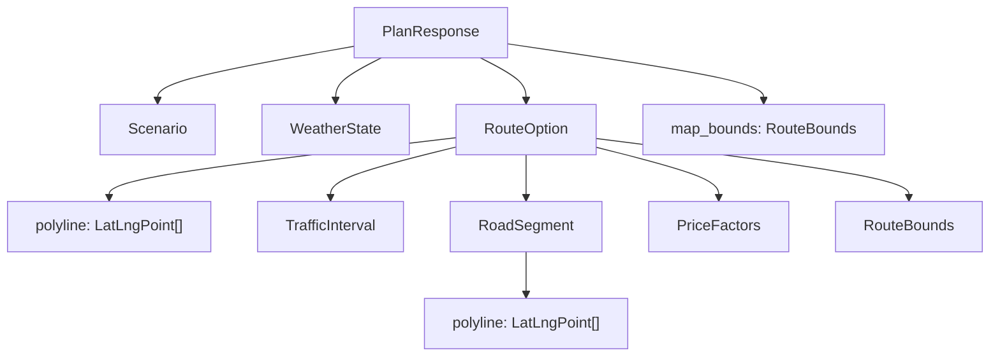

# Model Context — Domain Contracts

**Layer:** Model  
**Target modules:** `app/api/models.py`, `app/map/types.py`, mirrored by `src/types.ts`  
**Related:** [README.md](../../README.md), [route-planning.md](route-planning.md), [traffic-simulation.md](traffic-simulation.md), [pricing.md](pricing.md), [weather-scenarios.md](weather-scenarios.md), [google-integrations.md](google-integrations.md), [configuration.md](configuration.md)

## Purpose

Define every domain entity and value object that crosses the Model boundary, the exact wire field names,
and the serialization rules that make the Python contract and the TypeScript contract interchangeable.
Every other PROJECT2 document refers to these shapes; none of them may introduce a new field name.

Field names are locked by [README.md](../../README.md). This file adds type, unit, range, and requirement
ownership for each field.

## Requirements

| ID | Requirement | Status | Phase |
|----|-------------|--------|-------|
| FR-2.4 | Every route carries a total distance in miles | Target | P1 |
| FR-2.5 | Every route carries an unadjusted baseline ETA | Target | P1 |
| FR-2.6 | Every route carries a mode-adjusted ETA | Target | P1 |
| FR-2.7 | Every route carries at least one road segment with lane, speed, volume, and congestion statistics | Target | P1 |
| FR-2.8 | Every route carries a congestion score and a normalized comparison score, and the response names one recommendation | Target | P1 |
| FR-2.9 | Every route declares its data provenance in `data_source` | Target | P1 |
| FR-3.7 | Every route carries its own bounds and the response carries the union, so the map can fit the selected route or every route | Target | P1 |
| FR-5.7 | The response echoes the effective scenario actually used | Target | P1 |
| FR-6.2 | Every route carries a five-field fare breakdown | Target | P1 |
| FR-7.1 | Every non-2xx response uses one error envelope shape | Target | P1 |
| NFR-5.1 | Model modules never import the Controller or the View | Target | P1 |
| NFR-6.4 | The Python response models and `src/types.ts` stay field-for-field aligned | Target | P1 |
| NFR-7.4 | `weather.source` discloses that weather is a simulated planning input rather than an observation | Target | P1 |

## Contract Layout

| Concern | Module | Kind |
|---------|--------|------|
| Request and response schemas | `app/api/models.py` | Pydantic `BaseModel` |
| Geospatial and adapter output | `app/map/types.py` | Frozen dataclasses |
| Browser mirror | `src/types.ts` | TypeScript `interface` and union types |

`app/map/types.py` holds the types produced by the Google adapters (`ResolvedPlace`, `RawRoute`) plus the
three geometry value objects reused by the wire contract (`LatLngPoint`, `RouteBounds`, `TrafficInterval`).
`app/api/models.py` imports from `app/map/types.py`; the dependency never runs the other way.



## Request Entity

### `PlanRequest`

Inbound body of `POST /api/plan`. Validated at the Controller boundary before any Model call.

| Field | Type | Unit | Range | Default | Serves |
|-------|------|------|-------|---------|--------|
| `origin` | string | — | 1–120 characters after trimming | required | FR-1.1 |
| `destination` | string | — | 1–120 characters after trimming | required | FR-1.2 |
| `mode` | string | — | `simulated` or `realtime` | `simulated` | FR-4.1 |
| `hour` | int | hour of day, local Austin time | 0–23 | 17 | FR-5.1 |
| `weather` | int | severity index | 0–3 | 1 | FR-5.2 |
| `congestion` | int | percent | 0–100 | 56 | FR-5.3 |

There are exactly six request fields. A field outside its range produces `validation_error` with HTTP 422
and a `fields` array naming each rejected field.

In Real-Time mode `hour`, `weather`, and `congestion` are accepted and then ignored; the request is not
rejected for supplying them.

## Response Entities

### `PlanResponse`

| Field | Type | Unit | Range | Serves |
|-------|------|------|-------|--------|
| `origin` | string | — | non-empty | FR-1.7 |
| `destination` | string | — | non-empty | FR-1.7 |
| `mode` | string | — | `simulated` or `realtime` | FR-4.1 |
| `scenario_applied` | bool | — | `true` in Simulated, `false` in Real-Time | FR-4.3 |
| `scenario` | `Scenario` | — | effective values | FR-5.7 |
| `weather` | `WeatherState` | — | — | FR-5.2 |
| `routes` | `RouteOption[]` | — | 3 in Simulated, 1 in Real-Time | FR-2.2, FR-2.3 |
| `recommended_route_id` | string | — | equals the `id` of one element of `routes` | FR-2.8 |
| `map_bounds` | `RouteBounds` | degrees | union of every route's bounds | FR-3.7 |
| `notice` | string | — | non-empty, mode-specific, verbatim | FR-4.5, NFR-7.1 |

`origin` and `destination` are the resolved Google Places display names, never the raw user text.

`notice` takes exactly one of two values.

| Mode | `notice` |
|------|----------|
| `simulated` | `Simulated mode: Google Maps supplies route geometry and departure-hour traffic; scenario controls adjust planning estimates.` |
| `realtime` | `Real-Time mode: route, distance, and travel time come from Google Maps traffic-aware routing for the current departure time.` |

### `RouteOption`

| Field | Type | Unit | Range | Serves |
|-------|------|------|-------|--------|
| `id` | string | — | `route-1`, `route-2`, `route-3` | FR-2.2 |
| `name` | string | — | `Fastest`, `Balanced`, `Low traffic` | FR-2.2 |
| `objective` | string | — | non-empty prose | FR-2.2 |
| `color` | string | hex RGB | one of `ROUTE_COLORS` | FR-2.2, FR-3.3 |
| `distance_miles` | float | miles | > 0, one decimal | FR-2.4 |
| `base_eta_minutes` | float | minutes | > 0, one decimal | FR-2.5 |
| `adjusted_eta_minutes` | float | minutes | > 0, one decimal | FR-2.6 |
| `estimated_price` | float | US dollars | >= `MINIMUM_FARE`, two decimals | FR-6.1, FR-6.3 |
| `congestion_score` | int | percent | 0–100 | FR-2.8 |
| `normalized_score` | float | dimensionless | >= 0, four decimals, lower is better | FR-2.8 |
| `data_source` | string | — | one of two locked strings | FR-2.9 |
| `polyline` | `LatLngPoint[]` | degrees | at least two points | FR-3.3 |
| `traffic_intervals` | `TrafficInterval[]` | — | possibly empty | FR-3.4 |
| `segments` | `RoadSegment[]` | — | at least one element | FR-2.7 |
| `price_factors` | `PriceFactors` | — | all five fields present | FR-6.2 |
| `bounds` | `RouteBounds` | degrees | encloses every point of `polyline` | FR-3.7 |

The fare breakdown field is named `price_factors`. It is not named `factors`.

`data_source` values:

| Mode | `data_source` |
|------|---------------|
| `simulated` | `Google Routes with departure-hour traffic` |
| `realtime` | `Google Routes with live traffic` |

Index-to-identity assignment is positional and total; see [route-planning.md](route-planning.md).

| Index | `id` | `name` | `color` |
|-------|------|--------|---------|
| 0 | `route-1` | `Fastest` | `#55d6be` |
| 1 | `route-2` | `Balanced` | `#ffb35c` |
| 2 | `route-3` | `Low traffic` | `#4d72e8` |

## Value Objects

### `LatLngPoint`

| Field | Type | Unit | Range | Serves |
|-------|------|------|-------|--------|
| `lat` | float | degrees north | -90 to 90, five decimals | FR-3.3 |
| `lng` | float | degrees east | -180 to 180, five decimals | FR-3.3 |

The wire names are `lat` and `lng`. Google's own payloads use `latitude` and `longitude`; the adapters in
`app/map/` translate at the boundary so no `latitude` key ever reaches the View.

### `RouteBounds`

| Field | Type | Unit | Range | Serves |
|-------|------|------|-------|--------|
| `north` | float | degrees | >= `south` | FR-3.7 |
| `south` | float | degrees | <= `north` | FR-3.7 |
| `east` | float | degrees | >= `west` | FR-3.7 |
| `west` | float | degrees | <= `east` | FR-3.7 |

Produced by `bounds_for_points` in `app/map/bounds.py`; `map_bounds` is produced by `union_bounds` over
the per-route bounds.

### `TrafficInterval`

| Field | Type | Unit | Range | Serves |
|-------|------|------|-------|--------|
| `start_index` | int | index into `RouteOption.polyline` | 0 to `len(polyline) - 1` | FR-3.4 |
| `end_index` | int | index into `RouteOption.polyline` | > `start_index`, <= `len(polyline) - 1` | FR-3.4 |
| `speed` | enum | — | `NORMAL`, `SLOW`, `TRAFFIC_JAM`, `SPEED_UNSPECIFIED` | FR-3.4 |

Indices address the decoded route polyline of the same `RouteOption`, never a segment polyline. Intervals
come from Google Routes speed reading intervals and are pass-through data, not simulated values.

`TrafficSpeed` is the closed enum backing `speed`. An unrecognized Google value is normalized to
`SPEED_UNSPECIFIED` rather than passed through, so the View's color map is total.

### `Scenario`

| Field | Type | Unit | Range | Serves |
|-------|------|------|-------|--------|
| `hour` | int | hour of day, local Austin time | 0–23 | FR-5.1 |
| `weather` | int | severity index | 0–3 | FR-5.2 |
| `congestion` | int | percent | 0–100 | FR-5.3 |

`PlanResponse.scenario` reports effective values, not the submitted values.

| Mode | `hour` | `weather` | `congestion` |
|------|--------|-----------|--------------|
| `simulated` | requested `hour` | requested `weather` | requested `congestion` |
| `realtime` | local departure hour at the moment of the request | 0 | 0 |

### `WeatherState`

| Field | Type | Unit | Range | Serves |
|-------|------|------|-------|--------|
| `severity` | int | severity index | 0–3 | FR-5.2 |
| `label` | string | — | one of `WEATHER_LABELS` | FR-5.2 |
| `time_multiplier` | float | dimensionless | 1.0–1.32 | FR-2.6 |
| `price_multiplier` | float | dimensionless | 1.0–1.12 | FR-6.2 |
| `source` | string | — | non-empty provenance label | NFR-7.4 |

Multiplier tables and `source` semantics are in [weather-scenarios.md](weather-scenarios.md).

### `PriceFactors`

| Field | Type | Unit | Range | Serves |
|-------|------|------|-------|--------|
| `route_subtotal` | float | US dollars | > 0, unrounded | FR-6.2, FR-6.4 |
| `traffic_multiplier` | float | dimensionless | 1.0–1.2 | FR-6.2 |
| `weather_multiplier` | float | dimensionless | 1.0–1.12 | FR-6.2 |
| `time_multiplier` | float | dimensionless | 0.92, 1.0, or 1.22 | FR-6.2 |
| `unrounded_total` | float | US dollars | >= `MINIMUM_FARE` | FR-6.4 |

All five fields are always present. `time_multiplier` is `1.0` when no time-of-day factor applies; it is
never absent and never null. This is the one contract change that the rewrite makes to the fare breakdown,
alongside renaming the field to `price_factors`.

### `RoadSegment`

| Field | Type | Unit | Range | Serves |
|-------|------|------|-------|--------|
| `name` | string | — | 1–80 characters | FR-2.7 |
| `length_miles` | float | miles | > 0, one decimal | FR-2.7 |
| `lanes` | int | lanes | 3 or 4 | FR-2.7 |
| `speed_limit_mph` | int | mph | 45 or 55 | FR-2.7 |
| `average_speed_mph` | float | mph | >= `MINIMUM_CRAWL_SPEED_MPH`, one decimal | FR-2.7 |
| `volume_vehicles_hour` | int | vehicles per hour | 0 to `capacity_vehicles_hour` | FR-2.7 |
| `congestion` | float | fraction | 0.05–0.98, two decimals | FR-2.7 |
| `capacity_vehicles_hour` | int | vehicles per hour | `lanes * BASE_LANE_CAPACITY` | FR-2.7 |
| `free_flow_minutes` | float | minutes | > 0, four decimals | FR-2.7 |
| `adjusted_minutes` | float | minutes | >= `free_flow_minutes`, four decimals | FR-2.7 |
| `traffic_ratio` | float | dimensionless | >= 0.5, four decimals | FR-2.7 |
| `polyline` | `LatLngPoint[]` | degrees | at least two points | FR-3.3 |

`congestion` is a 0.0–1.0 fraction. `Scenario.congestion` and `RouteOption.congestion_score` are 0–100
integers. The three are related but not interchangeable, and the unit difference is deliberate.

## Adapter Types

These never reach the wire. They exist so the Google payload shape stops at the `app/map/` boundary.

### `ResolvedPlace` (`app/map/types.py`)

| Field | Type | Unit | Notes |
|-------|------|------|-------|
| `name` | string | — | Google display name, falling back to the formatted address |
| `latitude` | float | degrees | from `places.location` |
| `longitude` | float | degrees | from `places.location` |
| `source` | string | — | always `google` in the target design |

### `RawRoute` (`app/map/types.py`)

| Field | Type | Unit | Notes |
|-------|------|------|-------|
| `distance_meters` | int | meters | from `routes.distanceMeters` |
| `duration_seconds` | float or None | seconds | traffic-aware `routes.duration` |
| `static_duration_seconds` | float or None | seconds | `routes.staticDuration` |
| `polyline` | `LatLngPoint[]` | degrees | decoded from `routes.polyline.encodedPolyline` |
| `traffic_intervals` | `TrafficInterval[]` | — | leg-level intervals, route-level fallback |
| `steps` | `RawStep[]` | — | leg step distance, static duration, polyline, instruction |
| `traffic_ratio` | float | dimensionless | `duration_seconds / static_duration_seconds`, else 1.0 |

`RawRoute` is the only thing `app/simulation/` and `app/pricing/` are allowed to see from Google. Neither
package parses `httpx` responses or Google JSON keys.

## Error Envelope

Every non-2xx response from every endpoint uses one body shape.

```json
{ "detail": "Could not resolve \"Mars Colony\" to an Austin-area location.", "code": "invalid_location" }
```

| `code` | HTTP | Extra fields | Raised by |
|--------|------|--------------|-----------|
| `validation_error` | 422 | `fields` array of field names | Controller schema validation |
| `invalid_location` | 400 | — | `GooglePlacesGateway` returned no usable result |
| `same_origin_destination` | 400 | — | Both inputs resolved to the same place |
| `no_route_found` | 400 | — | `GoogleRoutesGateway` returned zero alternatives |
| `maps_not_configured` | 503 | — | Server Google credential absent on a planning call, browser credential absent on `GET /api/map/config` |
| `upstream_unavailable` | 502 | — | Places or Routes returned an error status |
| `upstream_timeout` | 504 | — | Places or Routes exceeded its timeout |

Model modules raise domain exceptions; they never construct HTTP responses. The mapping from domain
exception to `code` and status belongs to `app/api/errors.py`.

## Serialization Rules

| Rule | Detail |
|------|--------|
| Rounding is applied once, at model construction | The value stored in the response model is already rounded; the Controller does not round again |
| Rounding precision by field | `distance_miles`, `base_eta_minutes`, `adjusted_eta_minutes`, `average_speed_mph` one decimal; `estimated_price` two decimals; `congestion` two decimals; `normalized_score`, `free_flow_minutes`, `adjusted_minutes`, `traffic_ratio` four decimals; `lat` and `lng` five decimals |
| `PriceFactors` stays unrounded | `route_subtotal`, the three multipliers, and `unrounded_total` are full-precision floats so the breakdown reproduces `estimated_price` |
| Empty collections serialize as `[]` | `traffic_intervals`, `polyline`, `segments`, and `fields` are never null |
| Optional scalars are absent, never null-as-empty-string | Only `map_id` in `GET /api/map/config` is nullable, and it is `null` when unset |
| Enum values serialize as their string name | `speed` emits `NORMAL`, not an integer |
| No extra keys | Response models set `extra="forbid"` so an accidental field fails a test rather than reaching the View |
| Field order is not part of the contract | Tests assert on key sets and values, never on ordering |

Rounding happens once because a value rounded twice at different precisions produces a fare breakdown
that no longer reproduces the displayed price, which is exactly what FR-6.4 forbids.

## Python-to-TypeScript Mirror Rule

`app/api/models.py` and `src/types.ts` are one contract expressed twice. The Python side is authoritative.

| Python | TypeScript | Notes |
|--------|------------|-------|
| `PlanRequest` | `PlanRequest` | field names identical, `snake_case` on both sides |
| `PlanResponse` | `PlanResult` | the only name that differs, because the View calls it a result |
| `RouteOption` | `RouteOption` | — |
| `RoadSegment` | `RoadSegment` | — |
| `PriceFactors` | `PriceFactors` | — |
| `WeatherState` | `WeatherState` | — |
| `Scenario` | `Scenario` | — |
| `LatLngPoint` | `LatLngPoint` | — |
| `RouteBounds` | `RouteBounds` | — |
| `TrafficInterval` | `TrafficInterval` | — |
| `TrafficSpeed` enum | `TrafficSpeed` string union | `"NORMAL" \| "SLOW" \| "TRAFFIC_JAM" \| "SPEED_UNSPECIFIED"` |
| mode literal | `Mode` string union | `"simulated" \| "realtime"` |

Rules:

1. Wire field names stay `snake_case` in TypeScript. The View does not camel-case the payload, because a
   translation layer is one more place for the two contracts to drift.
2. Adding, renaming, or removing a field is a four-part change: `app/api/models.py`, `src/types.ts`, the
   Python test that asserts the response key set, and the component that reads the field.
3. `src/types.ts` declares no type that has no Python counterpart, except pure View state such as form
   input state and request status unions.
4. The View never widens a type. If Python says `congestion_score` is an int 0–100, TypeScript says
   `number` and the component does not accept `null`.
5. Adapter types (`ResolvedPlace`, `RawRoute`, `RawStep`) have no TypeScript counterpart by design.

```python
class PriceFactors(BaseModel):
    route_subtotal: float
    traffic_multiplier: float
    weather_multiplier: float
    time_multiplier: float
    unrounded_total: float
```

```ts
export interface PriceFactors {
  route_subtotal: number;
  traffic_multiplier: number;
  weather_multiplier: number;
  time_multiplier: number;
  unrounded_total: number;
}
```

## Acceptance Criteria

- [ ] `POST /api/plan` accepts exactly `origin`, `destination`, `mode`, `hour`, `weather`, and `congestion`, and rejects an unknown field with `validation_error` and HTTP 422.
- [ ] A successful response contains every top-level field listed for `PlanResponse` and no others.
- [ ] `recommended_route_id` always matches the `id` of one element of `routes`.
- [ ] Simulated mode returns three routes with ids `route-1`, `route-2`, `route-3`; Real-Time mode returns exactly one route with id `route-1`.
- [ ] Every `RouteOption` carries all five `PriceFactors` fields, including `time_multiplier`, in both modes.
- [ ] No response body contains a key named `factors`.
- [ ] Every `RouteOption.segments` array has at least one element and every segment carries all twelve fields.
- [ ] `traffic_intervals` is `[]` rather than null when Google supplies no speed readings.
- [ ] Every `TrafficInterval.end_index` is greater than its `start_index` and less than `len(polyline)`.
- [ ] `map_bounds` encloses every point of every returned route polyline.
- [ ] `scenario` reports `weather` 0 and `congestion` 0 in Real-Time mode, and `scenario_applied` is `false`.
- [ ] `notice` matches the locked string for the effective mode, character for character.
- [ ] Every error response body has exactly `detail` and `code`, plus `fields` only for `validation_error`.
- [ ] The response key set asserted in Python matches the interface fields declared in `src/types.ts`.
- [ ] `npm run build` type-checks with no `any` in the plan response path.

## Planned Tests

| Test ID | Level | Target file | Assertion |
|---------|-------|-------------|-----------|
| T-01 | api | `tests/test_api.py` | A valid Simulated request returns 200 with the exact `PlanResponse` top-level key set and three routes |
| T-03 | api | `tests/test_api.py` | An unknown request field and an out-of-range `hour` each return 422 with `code` `validation_error` and a `fields` array |
| T-24 | api | `tests/test_contracts.py` | Every serialized `RouteOption` contains the locked field set, contains `price_factors`, and contains no `factors` key; rounding precision matches the serialization table for distance, ETA, price, score, and coordinate fields; and empty `traffic_intervals` serializes as `[]` and never as null |
| T-15 | unit | `tests/test_pricing.py` | `PriceFactors` always exposes five fields and `time_multiplier` is `1.0` when no time-of-day factor applies |
| T-43 | e2e | Continuous integration | `npm run build` type-checks the plan response path, so a fixture typed as `PlanResult` compiles and every documented field is read without a null guard |

## Agent Implementation Notes

- Define the geometry value objects once in `app/map/types.py` and import them into `app/api/models.py`.
  Do not redeclare `LatLngPoint` or `RouteBounds` in a second module.
- Model packages must not import from `app/api/` other than the shared response models, and must never
  import `fastapi`, `httpx` response objects, or anything under `src/`.
- Construct response models with keyword arguments and let Pydantic validate ranges. Do not build response
  dictionaries by hand; a dictionary silently accepts a misspelled key.
- Apply `round` at the point of model construction, never in the Controller and never in the View.
- When a contract change is unavoidable, update [README.md](../../README.md) first, then this file, then the
  code and both test suites.
- Keep the fixture used by contract tests in `tests/google_mocks.py` so the same Google payload drives the
  gateway tests and the contract tests.
