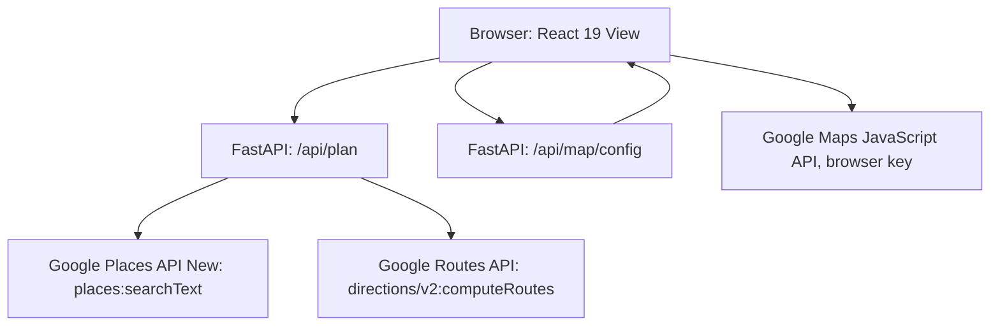

# Model Context — Google Integrations

**Layer:** Model  
**Target modules:** `app/map/places.py`, `app/map/routing.py`, `app/map/polyline.py`, `app/map/health.py`, `app/map/types.py`  
**Related:** [README.md](../../README.md), [domain-contracts.md](domain-contracts.md), [route-planning.md](route-planning.md), [traffic-simulation.md](traffic-simulation.md), [configuration.md](configuration.md)

## Purpose

Own every outbound call to Google and every translation between Google's payload shapes and the domain types.
Four modules do this work: a Places gateway, a Routes gateway, a polyline decoder, and a reachability probe.
Nothing outside `app/map/` sees a Google field name, an HTTP status, or an encoded polyline.

## Requirements

| ID | Requirement | Status | Phase |
|----|-------------|--------|-------|
| FR-1.4 | Resolve places server-side through Google Places with an Austin location bias | Target | P1 |
| FR-1.5 | Report an unresolvable place as `invalid_location` | Target | P1 |
| FR-2.1 | Compute route alternatives server-side through `computeRoutes`, up to three in Simulated mode and one in Real-Time mode | Target | P1 |
| FR-2.4 | Take route distance from the Google route distance | Target | P1 |
| FR-2.5 | Take the baseline duration from the Google static duration | Target | P1 |
| FR-2.6 | Take the traffic-aware duration from Google for the requested departure time | Target | P1 |
| FR-3.3 | Decode Google route geometry into ordered coordinates | Target | P1 |
| FR-3.4 | Extract Google speed reading intervals as polyline index ranges | Target | P1 |
| FR-7.2 | Report an absent server credential as `maps_not_configured`, a Google error status as `upstream_unavailable`, a Google timeout as `upstream_timeout`, and zero alternatives as `no_route_found` | Target | P1 |
| NFR-2.1 | Every outbound call has an explicit timeout | Target | P1 |
| NFR-2.2 | A Google failure produces the error envelope, never a partial plan | Target | P1 |
| NFR-2.4 | Report Google reachability from `GET /api/health` | Target | P1 |
| NFR-3.1 | The server credential never reaches the browser | Target | P1 |
| NFR-3.2 | The browser credential is referrer-restricted and separate from the server credential | Target | P1 |
| NFR-3.6 | Google error text is never forwarded verbatim to the client | Target | P1 |
| NFR-5.1 | Google payload shapes stop at the `app/map/` boundary | Target | P1 |
| NFR-6.3 | Every gateway is testable against recorded payloads with no network access | Target | P1 |
| — | Any Google product other than Places, Routes, and the Maps JavaScript API | Out of scope | — |

## Trust Boundary

Two Google credentials, used from two different places, for two different purposes.

| Credential | Environment variable | Used from | Restriction | Reaches the browser |
|------------|---------------------|-----------|-------------|---------------------|
| Server key | `GOOGLE_MAPS_API_KEY` | FastAPI process only | API-restricted to Places API (New) and Routes API; IP-restricted where the deployment allows | Never |
| Browser key | `GOOGLE_MAPS_BROWSER_API_KEY` | The browser, to load the Maps JavaScript API | HTTP referrer restricted to the application origins; API-restricted to Maps JavaScript API | Yes, by design, through `GET /api/map/config` |

The rule: all Google HTTP traffic is server-side, with exactly one exception. The Maps JavaScript API is
loaded in the browser with the referrer-restricted browser key. Places and Routes are never called from the
browser, and the server key is never serialized into any response, any log line, or any error `detail`.



`GET /api/map/config` is the only path by which a Google credential leaves the server, it carries only the
browser key, and it never carries the server key. Its full response shape is in
[README.md](../../README.md).

## `GooglePlacesGateway`

`app/map/places.py`. Resolves one user string to one `ResolvedPlace`.

| Aspect | Value |
|--------|-------|
| Endpoint | `https://places.googleapis.com/v1/places:searchText` |
| Method | `POST` |
| Timeout | 8 seconds |
| Credential header | `X-Goog-Api-Key` with the server key |
| Field mask header | `X-Goog-FieldMask: places.displayName,places.formattedAddress,places.location` |
| Content type | `application/json` |

### Request payload

```python
payload = {
    "textQuery": text_query,
    "regionCode": GOOGLE_REGION_CODE,
    "locationBias": AUSTIN_LOCATION_BIAS,
    "maxResultCount": 1,
}
```

| Element | Value | Reason |
|---------|-------|--------|
| `textQuery` | The user text, trimmed, lowercased, with internal whitespace collapsed | Normalizing makes `Downtown  Austin` and `downtown austin` the same query |
| `regionCode` | `US` | Biases results and formatting to the United States |
| `locationBias` | Circle centered on 30.2672, -97.7431 with radius 35000 meters | Keeps `airport` resolving to the Austin airport, not to another city's |
| `maxResultCount` | 1 | The product resolves one place per field; asking for more would cost more and add an ambiguity the UI has no way to present |

The field mask is mandatory for Places API (New) and is deliberately minimal. Requesting only the display
name, the formatted address, and the location keeps the response in the cheapest billing tier and avoids
pulling data the product does not use.

### Response handling

| Step | Behavior |
|------|-----------|
| 1 | Take `places[0]`; an empty or absent `places` array raises the unresolvable-location error |
| 2 | Require `location.latitude` and `location.longitude`; either missing raises the unresolvable-location error |
| 3 | `name` is `displayName.text`, falling back to `formattedAddress`, falling back to the normalized query |
| 4 | Return `ResolvedPlace(name, latitude, longitude, source="google")` |

Google returns `latitude` and `longitude`; the gateway keeps those names inside `ResolvedPlace` and the
conversion to the wire names `lat` and `lng` happens only for polyline coordinates, which are the only
coordinates in the response contract.

There is no secondary place-resolution path. A missing server credential raises the configuration error and
the request fails with `maps_not_configured` and HTTP 503.

## `GoogleRoutesGateway`

`app/map/routing.py`. Computes route alternatives and returns `RawRoute` values.

| Aspect | Value |
|--------|-------|
| Endpoint | `https://routes.googleapis.com/directions/v2:computeRoutes` |
| Method | `POST` |
| Timeout | 10 seconds |
| Credential header | `X-Goog-Api-Key` with the server key |
| Field mask header | `X-Goog-FieldMask` with the mask below |
| Content type | `application/json` |

The 10-second budget is longer than the Places budget because computing alternatives with traffic on the
polyline is the heavier call, and a route request that has already resolved two places should be given room to
finish rather than being abandoned.

### Request payload

```python
payload = {
    "origin": waypoint(origin),
    "destination": waypoint(destination),
    "travelMode": "DRIVE",
    "computeAlternativeRoutes": alternatives,
    "routingPreference": "TRAFFIC_AWARE",
    "units": "IMPERIAL",
    "regionCode": GOOGLE_REGION_CODE,
    "departureTime": departure.isoformat().replace("+00:00", "Z"),
    "extraComputations": ["TRAFFIC_ON_POLYLINE"],
}
```

| Element | Value | Reason |
|---------|-------|--------|
| `origin`, `destination` | `{"location": {"latLng": {"latitude": ..., "longitude": ...}}}` | Coordinates from `ResolvedPlace`, so routing never re-resolves text |
| `travelMode` | `DRIVE` | The product plans driving trips only |
| `computeAlternativeRoutes` | `true` in Simulated mode, `false` in Real-Time mode | Simulated mode compares up to three options; Real-Time mode returns exactly one |
| `routingPreference` | `TRAFFIC_AWARE` | Both modes want traffic-aware durations |
| `units` | `IMPERIAL` | Austin users read miles |
| `regionCode` | `US` | Consistent with the Places request |
| `departureTime` | RFC 3339 UTC with a `Z` suffix | Simulated mode sends the next occurrence of `scenario.hour` at minute 0; Real-Time mode sends the current instant |
| `extraComputations` | `["TRAFFIC_ON_POLYLINE"]` | Required to receive speed reading intervals |

`departureTime` and `extraComputations` are valid only with a traffic-aware routing preference. Both modes use
`TRAFFIC_AWARE`, so both send both. This is the single mechanism by which the scenario's departure hour
influences Google's answer.

### Field mask

```
routes.duration,routes.staticDuration,routes.distanceMeters,
routes.polyline.encodedPolyline,
routes.travelAdvisory.speedReadingIntervals,
routes.legs.travelAdvisory.speedReadingIntervals,
routes.legs.steps.distanceMeters,routes.legs.steps.staticDuration,
routes.legs.steps.polyline.encodedPolyline,
routes.legs.steps.navigationInstruction,routes.description,routes.routeLabels
```

The mask lives in `GOOGLE_ROUTES_FIELD_MASK` in `app/config/__init__.py`, not inline in the gateway. Every
entry has a consumer.

| Mask entry | Consumer |
|------------|----------|
| `routes.duration` | Traffic-aware duration for `adjusted_eta_minutes` and the traffic ratio |
| `routes.staticDuration` | `base_eta_minutes` and the traffic ratio |
| `routes.distanceMeters` | `distance_miles` |
| `routes.polyline.encodedPolyline` | `RouteOption.polyline` and `bounds` |
| `routes.legs.travelAdvisory.speedReadingIntervals` | `traffic_intervals`, preferred source |
| `routes.travelAdvisory.speedReadingIntervals` | `traffic_intervals`, fallback source |
| `routes.legs.steps.distanceMeters` | `RoadSegment.length_miles` and the polyline index mapping |
| `routes.legs.steps.staticDuration` | `RoadSegment.free_flow_minutes` |
| `routes.legs.steps.polyline.encodedPolyline` | `RoadSegment.polyline` |
| `routes.legs.steps.navigationInstruction` | `RoadSegment.name` |
| `routes.description`, `routes.routeLabels` | Diagnostics in logs; not serialized to the client |

Adding a field to the mask without a consumer is a defect: it increases the billing tier and the payload for
nothing.

### Response handling

| Step | Behavior |
|------|-----------|
| 1 | An empty or absent `routes` array raises the no-route error |
| 2 | Truncate to 3 alternatives when `computeAlternativeRoutes` was `true`, otherwise to 1 |
| 3 | Parse durations, which Google returns as strings such as `"1284s"`; also accept a numeric value or a `{"seconds": ...}` object |
| 4 | Decode `routes.polyline.encodedPolyline` with `decode_polyline` |
| 5 | Extract speed reading intervals |
| 6 | Compute the traffic ratio as `round(duration_seconds / static_duration_seconds, 4)`, or `1.0` when either value is missing or the static duration is not positive |
| 7 | Collect the first leg's steps, normalized to distance, static duration, encoded polyline, and instruction text |
| 8 | Return `RawRoute` values |

Duration parsing accepts three shapes because Google's protocol JSON mapping for a duration is a string with a
trailing `s`, while some client paths surface a numeric or an object form. A duration that matches none of the
three yields `None`, which is what triggers the fallback chain in
[route-planning.md](route-planning.md) rather than a zero.

### Speed reading interval extraction

Intervals are read from the leg level first and from the route level only as a fallback.

```python
def extract_intervals(route: dict) -> list[TrafficInterval]:
    intervals: list[TrafficInterval] = []
    for leg in route.get("legs") or []:
        advisory = leg.get("travelAdvisory") or {}
        intervals.extend(normalize(advisory.get("speedReadingIntervals") or []))
    if not intervals:
        route_advisory = route.get("travelAdvisory") or {}
        intervals.extend(normalize(route_advisory.get("speedReadingIntervals") or []))
    return intervals
```

| Rule | Detail |
|------|--------|
| Leg level first | Leg intervals index the leg's polyline, which for a single-leg trip is the route polyline. Every trip in this product is single-leg, origin to destination with no waypoints |
| Route level as fallback | Used only when no leg supplied intervals, so a response that carries only route-level advisories still colors the map |
| Never both | Merging the two levels would double-cover the same index ranges |
| Index normalization | `startPolylinePointIndex` defaults to 0 when absent; an interval with no `endPolylinePointIndex` is discarded, because a range with no end cannot be drawn |
| Enum normalization | `speed` maps into `{NORMAL, SLOW, TRAFFIC_JAM, SPEED_UNSPECIFIED}`; an absent value becomes `NORMAL` and an unrecognized value becomes `SPEED_UNSPECIFIED` |
| Empty result | An empty list, never null. The map simply draws the route in its assigned color |

Discarding an interval with no end index rather than inferring one keeps `traffic_intervals` strictly a
pass-through of what Google reported.

## `decode_polyline`

`app/map/polyline.py`. One function, no dependencies, no configuration.

```python
def decode_polyline(encoded: str) -> list[LatLngPoint]:
    ...
```

| Aspect | Behavior |
|--------|-----------|
| Input | A Google encoded polyline string |
| Output | Ordered `LatLngPoint` values, origin first, destination last |
| Algorithm | Standard Google polyline algorithm: five-bit chunks, continuation bit at 0x20, subtract 63 per character, zig-zag decode, accumulate deltas, scale by 1e-5 |
| Precision | Five decimal places, roughly one metre |
| Empty input | An empty list |
| Ordering | Preserved exactly; the decoder never reverses, simplifies, or de-duplicates |

The decoder must not simplify the geometry. `TrafficInterval.start_index` and `end_index` address positions in
this exact list, so dropping a point would shift every interval and mis-color the map.

`decode_polyline` is used for both route polylines and step polylines. It is the only place in the codebase
that understands the encoding.

## `GoogleApiProbe`

`app/map/health.py`. Backs the `google_maps` block of `GET /api/health`.

```python
class GoogleApiProbe:
    def check(self) -> GoogleApiStatus:
        ...
```

| Field | Type | Meaning |
|-------|------|---------|
| `ok` | bool | Both Places and Routes were reachable and authorized |
| `message` | string | A short human-readable summary, safe to display |
| `checked_at` | string | RFC 3339 UTC timestamp of the check |

| Condition | `ok` | `message` |
|-----------|------|-----------|
| Server credential absent | `false` | States that the server Google credential is not configured |
| Both reachable | `true` | `Places and Routes reachable.` |
| One returned an error status | `false` | Names which service failed and its status class, with no Google error text |
| One timed out | `false` | Names which service timed out |

| Rule | Detail |
|------|--------|
| Never fails the endpoint | `GET /api/health` returns 200 even when `ok` is `false`. The endpoint reports status; it does not have a status of its own |
| Cheap and bounded | The probe uses a minimal request per service with a timeout at or below the corresponding gateway timeout |
| Short-lived cache | The result is cached briefly so that polling health does not multiply upstream calls; the timestamp reports when the check actually ran, not when it was served |
| No credential in the payload | `message` never contains a key, a key fragment, or a raw Google error body |

`google_maps_configured` at the top level of the health response reports only whether the server credential is
present. It is a configuration fact and does not require a network call.

## Error Translation

Every gateway raises a domain exception. `app/api/errors.py` maps it to the envelope. No gateway builds an
HTTP response and no gateway lets an `httpx` exception escape.

| Upstream condition | Domain exception | `code` | HTTP |
|--------------------|------------------|--------|------|
| Server credential absent or empty | Configuration error | `maps_not_configured` | 503 |
| Places returned zero results, or a result with no coordinates | Unresolvable location | `invalid_location` | 400 |
| Routes returned zero alternatives | No route | `no_route_found` | 400 |
| Places or Routes returned 4xx or 5xx | Upstream failure | `upstream_unavailable` | 502 |
| Places or Routes exceeded its timeout | Upstream timeout | `upstream_timeout` | 504 |
| Transport error such as DNS or connection reset | Upstream failure | `upstream_unavailable` | 502 |
| Malformed JSON, or a response missing a masked field | Upstream failure | `upstream_unavailable` | 502 |

Rules that make the mapping safe:

1. A Google 4xx is `upstream_unavailable` with HTTP 502, not a pass-through of Google's status. A quota or
   credential problem is a server-side fault from the user's point of view, and forwarding a 403 would suggest
   the user did something wrong.
2. Google error text is never forwarded to the client. The gateway logs the upstream body, truncated, and the
   client receives a fixed `detail` for the code.
3. `detail` never contains a credential, a full upstream URL with a query string, or a stack trace.
4. A timeout is distinguished from an error status, because 504 and 502 lead the user to different actions.
5. A partial success is a failure. If the origin resolves and the destination does not, the request fails with
   `invalid_location`; it does not return a plan for one endpoint.

## Acceptance Criteria

- [ ] Places is called with `maxResultCount` 1, `regionCode` `US`, the Austin circular location bias, and the three-field mask.
- [ ] The Places call uses an 8-second timeout and the Routes call uses a 10-second timeout.
- [ ] Routes is called with `travelMode` `DRIVE`, `routingPreference` `TRAFFIC_AWARE`, `units` `IMPERIAL`, `regionCode` `US`, a `departureTime`, and `extraComputations` `["TRAFFIC_ON_POLYLINE"]`.
- [ ] `computeAlternativeRoutes` is `true` in Simulated mode and `false` in Real-Time mode.
- [ ] Simulated mode sends the next occurrence of `scenario.hour` at minute 0; Real-Time mode sends the current instant.
- [ ] The Routes field mask matches `GOOGLE_ROUTES_FIELD_MASK` and every entry has a documented consumer.
- [ ] Duration strings of the form `"1284s"`, numeric values, and `{"seconds": ...}` objects all parse; anything else yields `None`.
- [ ] Speed reading intervals are taken from legs when present and from the route only when no leg supplied any.
- [ ] An interval with no end index is discarded, and an unrecognized `speed` becomes `SPEED_UNSPECIFIED`.
- [ ] `decode_polyline` reproduces a known coordinate list from a known encoded string, preserves order, and returns `[]` for empty input.
- [ ] `GET /api/health` returns 200 with `ok` `false` when the credential is absent or an upstream check fails.
- [ ] The health `message` contains no credential and no Google error body.
- [ ] `GET /api/map/config` returns the browser key and never the server key.
- [ ] No response body, log line, or error `detail` contains the server credential.
- [ ] Each upstream failure mode maps to its documented code and status.
- [ ] Every gateway test runs with no network access, against recorded payloads.

## Planned Tests

| Test ID | Level | Target file | Assertion |
|---------|-------|-------------|-----------|
| T-20 | unit | `tests/test_google_places.py` | The `searchText` payload and headers carry the documented query, region, bias, result count, field mask, and 8-second timeout, and a zero-result payload or a result without coordinates each raise the unresolvable-location error |
| T-21 | unit | `tests/test_google_routes.py` | The `computeRoutes` payload carries every documented element and `computeAlternativeRoutes` follows the mode; duration parsing handles the string, numeric, and object forms and yields `None` for an unparseable value; leg intervals win over route intervals, route intervals are used when legs supply none, an interval with no end index is dropped, and an unknown speed becomes `SPEED_UNSPECIFIED` |
| T-18 | unit | `tests/test_polyline.py` | A known encoded string decodes to the expected ordered coordinates at five-decimal precision, and an empty string yields `[]` |
| T-08 | api | `tests/test_api.py` | Each simulated upstream failure returns its documented code and status |
| T-49 | unit | `tests/test_errors.py` | No error `detail` and no log line contains Google error text or a credential |
| T-10 | api | `tests/test_api.py` | `GET /api/health` returns 200 with `ok` `false` and no credential in `message` when the server key is absent |
| T-11 | api | `tests/test_api.py` | `GET /api/map/config` returns the browser key, a nullable `map_id`, and never the server key |
| T-31 | component | `src/components/RouteMap.test.tsx` | The map loads the Maps JavaScript API from the fetched browser key, and a failed config request is contained to the map region with a stated error |

## Agent Implementation Notes

- Keep both endpoint URLs, the region code, the location bias, the field mask, and both timeouts in
  `app/config/__init__.py`. No literal URL or timeout in a gateway module.
- Gateways return domain types only. A `dict` from `response.json()` must not escape `app/map/`. Add a field to
  `RawRoute` or `RawStep` in `app/map/types.py` when a new value is needed downstream.
- Catch `httpx.TimeoutException` before `httpx.HTTPError`, otherwise every timeout is reported as
  `upstream_unavailable` and the 504 path becomes unreachable.
- Log the truncated upstream body at warning level and keep it out of the client response.
- Read the clock once per plan request and pass the instant to the gateway, so the `departureTime` sent to
  Google and the echoed Real-Time `hour` cannot disagree.
- Record real payloads once into `tests/google_mocks.py` and drive the gateway, segment, contract, and API
  tests from the same fixtures. No test may reach the network.
- Never add a Google product beyond Places, Routes, and the Maps JavaScript API without changing
  [README.md](../../README.md) first.
