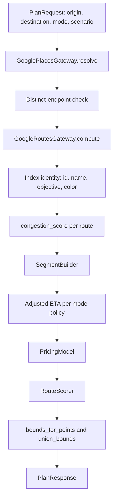

# Model Context — Route Planning

**Layer:** Model  
**Target modules:** `app/map/places.py`, `app/map/routing.py`, `app/map/bounds.py`, `app/map/types.py`, `app/simulation/scoring.py`  
**Related:** [README.md](../../README.md), [domain-contracts.md](domain-contracts.md), [traffic-simulation.md](traffic-simulation.md), [pricing.md](pricing.md), [weather-scenarios.md](weather-scenarios.md), [google-integrations.md](google-integrations.md), [configuration.md](configuration.md)

## Purpose

Turn two strings of user text into scored, comparable route alternatives. This document owns place
resolution, alternative construction from Google Routes, per-route identity assignment, congestion-score
derivation, the adjusted-ETA rules for each mode, normalization and recommendation in `RouteScorer`, and
bounds computation.

Segment statistics are owned by [traffic-simulation.md](traffic-simulation.md). Fare computation is owned
by [pricing.md](pricing.md). The HTTP payload shapes and timeouts are owned by
[google-integrations.md](google-integrations.md).

## Requirements

| ID | Requirement | Status | Phase |
|----|-------------|--------|-------|
| FR-1.4 | Resolve both endpoints through Google Places with an Austin location bias | Target | P1 |
| FR-1.5 | Report an unresolvable location as `invalid_location` with HTTP 400 | Target | P1 |
| FR-1.6 | Reject a trip whose endpoints resolve to the same place as `same_origin_destination` | Target | P1 |
| FR-1.7 | Echo resolved display names rather than raw user text | Target | P1 |
| FR-2.2 | Return up to three alternatives in Simulated mode, each with a name, objective, and color assigned by index | Target | P1 |
| FR-2.3 | Return exactly one alternative in Real-Time mode | Target | P1 |
| FR-2.4 | Report route distance in miles | Target | P1 |
| FR-2.5 | Report a baseline ETA from the Google static duration | Target | P1 |
| FR-2.6 | Report a mode-adjusted ETA | Target | P1 |
| FR-2.8 | Derive an integer congestion score per route, score alternatives on one comparable scale, and name a recommendation | Target | P1 |
| FR-2.9 | Declare the provenance of each route's numbers | Target | P1 |
| FR-3.7 | Report per-route bounds and their union | Target | P1 |
| FR-7.2 | Reject empty or over-long input with `validation_error` and HTTP 422, and report zero alternatives as `no_route_found` with HTTP 400 | Target | P1 |
| NFR-1.1 | A plan request completes within 3 seconds at the 95th percentile under normal upstream latency | Target | P1 |
| NFR-2.1 | Each upstream call has an explicit timeout and a mapped error code | Target | P1 |
| NFR-2.5 | Never return a partial plan; a failed stage fails the request | Target | P1 |
| NFR-5.4 | Routing adapters, scoring, and segment statistics live in separate modules | Target | P1 |
| NFR-6.2 | Scoring is deterministic for a fixed input and is unit-testable without network access | Target | P1 |

## Pipeline



Every stage either produces its output or raises. There is no stage that degrades to a partial result.

## Place Resolution

`app/map/places.py` exposes `GooglePlacesGateway`, whose single public method resolves one string to a
`ResolvedPlace`.

```python
class GooglePlacesGateway:
    def resolve(self, query: str) -> ResolvedPlace:
        ...
```

| Step | Behavior |
|------|-----------|
| 1 | Normalize: strip, lowercase, collapse internal whitespace |
| 2 | Reject empty normalized text with `invalid_location` |
| 3 | Call Places `searchText` with `maxResultCount` 1 and the Austin circular location bias |
| 4 | Take the first result; require a `location` with both coordinates |
| 5 | Build `ResolvedPlace(name, latitude, longitude, source="google")` |

`name` prefers the Google display name text and falls back to the formatted address. It is what
`PlanResponse.origin` and `PlanResponse.destination` report, so a user who types `airport` sees the airport's
full name in the result.

There is no fallback place lookup. A missing server credential is an error (`maps_not_configured`, HTTP 503),
not a reason to substitute a locally derived coordinate. Places is the only place-resolution path in the
target design.

| Condition | Domain outcome | `code` | HTTP |
|-----------|----------------|--------|------|
| Empty or whitespace-only text after trimming | Validation failure at the Controller boundary | `validation_error` | 422 |
| Text over 120 characters | Validation failure at the Controller boundary | `validation_error` | 422 |
| Zero Places results | Unresolvable location | `invalid_location` | 400 |
| Result without coordinates | Unresolvable location | `invalid_location` | 400 |
| Server credential absent | Configuration failure | `maps_not_configured` | 503 |
| Places HTTP error status | Upstream failure | `upstream_unavailable` | 502 |
| Places exceeded its 8-second timeout | Upstream timeout | `upstream_timeout` | 504 |

### Distinct-endpoint check

Two endpoints are the same place when either the resolved names match after normalization, or the resolved
coordinates agree to within 0.0005 degrees on both axes (roughly 55 meters). Either condition raises
`same_origin_destination` with HTTP 400. The check runs on resolved places, not on raw input, so
`airport` and `Austin-Bergstrom International Airport` are correctly caught as the same trip.

## Alternative Construction

`app/map/routing.py` exposes `GoogleRoutesGateway`, which returns a list of `RawRoute` values.

```python
class GoogleRoutesGateway:
    def compute(
        self,
        origin: ResolvedPlace,
        destination: ResolvedPlace,
        departure: datetime,
        alternatives: bool,
    ) -> list[RawRoute]:
        ...
```

| Mode | `alternatives` | Alternatives kept | `departure` |
|------|----------------|-------------------|-------------|
| `simulated` | `true` | first 3 | next occurrence of `scenario.hour` at minute 0 |
| `realtime` | `false` | first 1 | now |

The gateway truncates, so the Model never sees a fourth alternative even if Google returns one. Zero
alternatives raises `no_route_found` with HTTP 400.

Per-alternative values taken directly from Google:

| Wire field | Source | Conversion |
|------------|--------|------------|
| `distance_miles` | `routes.distanceMeters` | `round(meters / 1609.344, 1)` |
| `base_eta_minutes` | `routes.staticDuration`, falling back to `routes.duration` | `round(seconds / 60, 1)` |
| `polyline` | `routes.polyline.encodedPolyline` | `decode_polyline` |
| `traffic_intervals` | leg-level speed reading intervals, route-level as fallback | index and enum normalization |

`base_eta_minutes` prefers the static duration because it is the honest free-flow baseline against which
the adjusted ETA is compared. Using the traffic-aware duration for both would make the two numbers equal in
Real-Time mode and hide the adjustment in Simulated mode.

### Identity assignment by index

Identity is positional. Google's alternatives arrive ordered best-first, and index 0 is therefore named
`Fastest`. The names describe the intended reading of each alternative; they are not a re-sort of Google's
output.

| Index | `id` | `name` | `objective` | `color` |
|-------|------|--------|-------------|---------|
| 0 | `route-1` | `Fastest` | `Minimum adjusted travel time` | `#55d6be` |
| 1 | `route-2` | `Balanced` | `Weighted time, distance, and congestion` | `#ffb35c` |
| 2 | `route-3` | `Low traffic` | `Minimum congestion exposure` | `#4d72e8` |

Colors come from `ROUTE_COLORS` in `app/config/__init__.py` and are indexed, not hard-coded here. Real-Time
mode returns index 0 only, so its single route is always `route-1` / `Fastest`.

### `data_source`

| Mode | `data_source` |
|------|---------------|
| `simulated` | `Google Routes with departure-hour traffic` |
| `realtime` | `Google Routes with live traffic` |

Both strings name Google because in both modes the geometry, distance, and duration are Google's. What
differs is the departure time supplied and whether scenario adjustments are layered on top.

## Congestion Score

`congestion_score` is the route-level congestion figure shown on the route card and consumed by both the
fare formula and the scorer. It is derived, not measured.

```
congestion_score = max(4, scenario.congestion - route_index * 9)
```

| Route index | Scenario congestion 56 | Scenario congestion 0 | Scenario congestion 100 |
|-------------|------------------------|-----------------------|-------------------------|
| 0 | 56 | 4 | 100 |
| 1 | 47 | 4 | 91 |
| 2 | 38 | 4 | 82 |

The 9-point-per-index decrease encodes the alternative ordering: the third alternative is presented as the
lower-traffic option, which is what its `Low traffic` name claims. The floor of 4 keeps the fare's traffic
multiplier above 1.0 so the breakdown never shows a factor that reads as "no traffic at all".

In Real-Time mode the effective `scenario.congestion` is 0, so the single route's `congestion_score` is the
floor value 4. Real-Time route cards therefore present live Google timings with a nominal congestion figure
rather than a scenario-driven one, and the traffic-colored polyline from `traffic_intervals` is the primary
congestion signal in that mode.

## Adjusted ETA

`adjusted_eta_minutes` is the number the View shows as the trip's expected duration. Its derivation depends
on the mode, because Real-Time mode does not apply the scenario.

| Mode | Rule |
|------|------|
| `simulated` | `google_duration_seconds / 60 * weather.time_multiplier` |
| `realtime` | `google_duration_seconds / 60`, with no weather factor and no time-of-day factor |

The Simulated multiplier is the weather time multiplier only. The departure hour has already influenced the
Google traffic-aware duration through `departureTime`, so applying `time_of_day_factor` to the ETA as well
would count rush hour twice. `time_of_day_factor` participates in pricing, not in the Simulated ETA.

Real-Time mode applies nothing at all: the scenario is not applied in that mode, and Google's live
traffic-aware duration is already the answer.

### Duration fallback chain

| Order | Source | Condition |
|-------|--------|-----------|
| 1 | `google_duration_seconds / 60` | Traffic-aware duration present |
| 2 | `google_static_duration_seconds / 60` | Traffic-aware duration missing |
| 3 | Sum of `RoadSegment.adjusted_minutes` plus a 2-minute buffer | Neither Google duration is present |

The mode multiplier from the table above is applied after the fallback chain selects a base. Step 3 is the
only path where the BPR segment model contributes to the route-level ETA; it exists so a Google response
that omits both duration fields still yields a defensible number instead of a zero. The 2-minute buffer
accounts for the first and last block of the trip, which the segment model does not represent.

`adjusted_eta_minutes` is rounded to one decimal for display. The unrounded value is what
[pricing.md](pricing.md) consumes, so the fare is computed from full precision.

## `RouteScorer`

`app/simulation/scoring.py` exposes `RouteScorer`. It is pure: given the candidate list it returns scores
and the recommended id, with no I/O and no clock access.

```python
class RouteScorer:
    def score(self, candidates: list[ScoredCandidate]) -> ScoringResult:
        ...
```

### Weights

Exactly three terms, from `ROUTE_SCORE_WEIGHTS` in `app/config/__init__.py`. They sum to 1.0.

| Term | Weight | Direction |
|------|--------|-----------|
| time | 0.47 | lower is better |
| distance | 0.23 | lower is better |
| congestion | 0.30 | lower is better |

### Formula

```
normalized_score = w_time * (eta / max_eta)
                 + w_distance * (distance / max_distance)
                 + w_congestion * (congestion_score / max_congestion)
```

Each maximum is taken across the returned candidate set. Every term is therefore in the range 0 to 1, every
term is oriented so that smaller is better, and the total is in the range 0 to 1. The result is rounded to
four decimals. The recommended route is the one with the minimum score; ties break toward the lower index,
which favours `Fastest`.

`eta` is the unrounded adjusted ETA, so the score reflects the same value the fare used.

Any maximum that is zero contributes 0 for that term instead of raising. This guard exists because
`max_congestion` can legitimately be small and a division by zero must never surface as a 500.

### Single-alternative case

When the candidate set holds one route, as it always does in Real-Time mode, `normalized_score` is `0.0`
and that route is the recommendation. A one-element comparison has nothing to compare against, and
reporting `0.0` states plainly that no ranking was performed rather than implying a computed rank.

### Worked example

Simulated mode, `congestion` 56, weather severity 1.

| Route | Adjusted ETA | Distance | Congestion score | Score |
|-------|--------------|----------|------------------|-------|
| `route-1` | 24.8 | 12.4 | 56 | `0.47 * 1.0 + 0.23 * 0.9701 + 0.30 * 1.0 = 0.9931` |
| `route-2` | 26.1 | 12.8 | 47 | `0.47 * 1.0524 + 0.23 * 1.0 + 0.30 * 0.8393 = 1.0264` |
| `route-3` | 25.4 | 11.9 | 38 | `0.47 * 1.0242 + 0.23 * 0.9297 + 0.30 * 0.6786 = 0.9995` |

`recommended_route_id` is `route-1`. The example shows the intended behavior: the fastest option usually
wins, but a route that is slightly slower with materially less traffic exposure can overtake it.

## Bounds

`app/map/bounds.py` holds both bounds helpers. Neither imports anything from `app/map/routing.py`, so both
are unit-testable against literal point lists.

```python
def bounds_for_points(points: list[LatLngPoint]) -> RouteBounds:
    ...


def union_bounds(boxes: list[RouteBounds]) -> RouteBounds:
    ...
```

| Function | Behavior |
|----------|-----------|
| `bounds_for_points` | `north` = max lat, `south` = min lat, `east` = max lng, `west` = min lng |
| `union_bounds` | `north` and `east` are the maxima across boxes; `south` and `west` are the minima |

| Input condition | Result |
|-----------------|--------|
| Empty point list | Raises; a route with no geometry is a `no_route_found` condition, not a degenerate box |
| Single point | A zero-area box with `north == south` and `east == west` |
| Empty box list | Raises; `map_bounds` requires at least one route |

`RouteOption.bounds` is `bounds_for_points` over that route's polyline. `PlanResponse.map_bounds` is
`union_bounds` over the per-route boxes, so the View can fit the viewport once and see every alternative.
The Model applies no padding; viewport padding is a View concern.

Austin trips never cross the antimeridian, so `union_bounds` uses plain minima and maxima with no wrap
handling.

## Acceptance Criteria

- [ ] `origin` and `destination` are trimmed before resolution, and empty or over-120-character input returns `validation_error` with HTTP 422.
- [ ] An unresolvable location returns `invalid_location` with HTTP 400 and a `detail` naming the offending text.
- [ ] Endpoints that resolve to the same place return `same_origin_destination` with HTTP 400.
- [ ] The response reports resolved Google display names, not the raw submitted strings.
- [ ] Simulated mode returns exactly three routes when Google supplies three or more alternatives, and never more than three.
- [ ] Real-Time mode returns exactly one route, with `id` `route-1` and `name` `Fastest`.
- [ ] Zero Google alternatives returns `no_route_found` with HTTP 400 and no partial body.
- [ ] `base_eta_minutes` derives from the Google static duration when present.
- [ ] In Simulated mode `adjusted_eta_minutes` equals the Google traffic-aware minutes times the weather time multiplier, to within one decimal.
- [ ] In Real-Time mode `adjusted_eta_minutes` equals the Google traffic-aware minutes with no additional factor.
- [ ] A Google response missing the traffic-aware duration falls back to the static duration; a response missing both falls back to the segment sum plus a 2-minute buffer.
- [ ] `congestion_score` equals `max(4, scenario.congestion - route_index * 9)` for every route.
- [ ] `normalized_score` uses only the time, distance, and congestion terms and is rounded to four decimals.
- [ ] `recommended_route_id` is the id of the minimum-score route, with ties resolved to the lower index.
- [ ] A single-route response reports `normalized_score` `0.0` and recommends that route.
- [ ] `RouteOption.bounds` encloses every point of that route's polyline, and `map_bounds` encloses every route's bounds.
- [ ] `data_source` matches the locked string for the effective mode.

## Planned Tests

| Test ID | Level | Target file | Assertion |
|---------|-------|-------------|-----------|
| T-20 | unit | `tests/test_google_places.py` | `GooglePlacesGateway.resolve` returns a `ResolvedPlace` from a mocked `searchText` payload and raises on a zero-result payload |
| T-05 | api | `tests/test_api.py` | Endpoints resolving to the same place return 400 with `code` `same_origin_destination` |
| T-01 | api | `tests/test_api.py` | Simulated mode returns three routes with ids `route-1` to `route-3`, each carrying the locked name, objective, and color for its index |
| T-02 | api | `tests/test_api.py` | Real-Time mode returns exactly one route |
| T-23 | unit | `tests/test_planning.py` | `congestion_score` matches `max(4, congestion - index * 9)` across scenario congestion 0, 56, and 100, and the duration fallback chain selects static duration, then the segment sum plus a 2-minute buffer |
| T-22 | unit | `tests/test_mode_policy.py` | Simulated adjusted ETA applies the weather time multiplier; Real-Time adjusted ETA applies no factor |
| T-17 | unit | `tests/test_scoring.py` | `RouteScorer` reproduces the worked example scores and recommends the minimum, breaking ties to the lower index; a single candidate scores `0.0` and is recommended, and a zero maximum contributes zero rather than raising |
| T-19 | unit | `tests/test_bounds.py` | `bounds_for_points` encloses all points, a single point yields a zero-area box, and `union_bounds` covers every input box |
| T-06 | api | `tests/test_api.py` | Zero Google alternatives returns 400 with `code` `no_route_found` and no `routes` key in the body |
| T-25 | component | `src/App.test.tsx` | The recommended route is marked in the list and each card shows its name, distance, adjusted ETA, and congestion score |

## Agent Implementation Notes

- Keep `app/map/places.py` and `app/map/routing.py` free of scenario knowledge. They take a departure time
  and an alternatives flag; they do not know what a scenario or a mode is.
- `RouteScorer` must not import `app/map/` or `app/pricing/`. Pass it a small candidate value object with
  eta, distance, congestion score, and index so it stays a pure function of numbers.
- Compute the fare and the score from the unrounded adjusted ETA, and round only when constructing the
  response model.
- The 9-point congestion step, the floor of 4, and the 2-minute fallback buffer belong in
  `app/config/__init__.py`, not inline in the builder.
- Truncate alternatives inside the gateway, not in the orchestration layer, so the three-route ceiling is
  enforced in one place.
- Do not re-sort Google's alternatives before assigning identity. Identity is positional, and re-sorting
  would make `Fastest` mean something Google did not say.
- When a stage fails, raise the domain exception and let `app/api/errors.py` map it. Never return a response
  with fewer routes than the mode promises.
