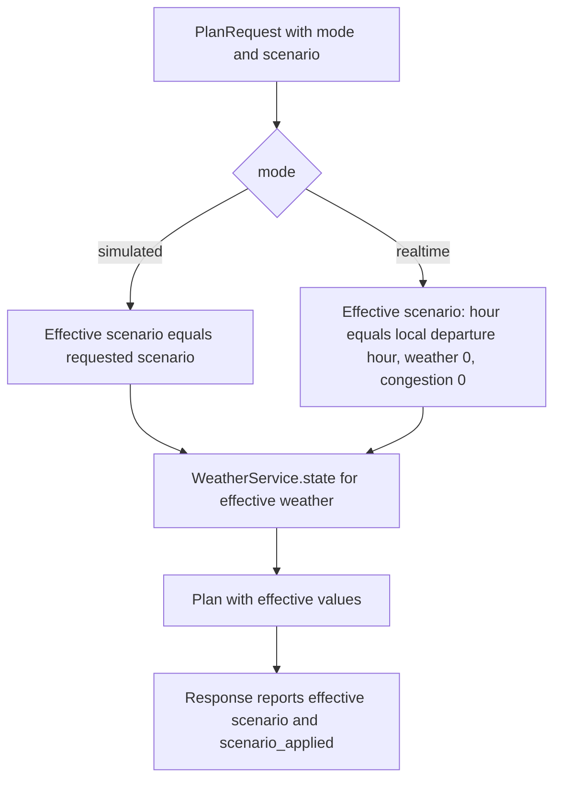

# Model Context — Weather and Scenarios

**Layer:** Model  
**Target modules:** `app/weather/service.py`, `app/config/__init__.py`  
**Related:** [README.md](../../README.md), [domain-contracts.md](domain-contracts.md), [route-planning.md](route-planning.md), [traffic-simulation.md](traffic-simulation.md), [pricing.md](pricing.md), [configuration.md](configuration.md)

## Purpose

Define the scenario: the three user-adjustable planning variables, what each one does, which mode applies
them, and how the response reports the values actually used. Define `WeatherService`, the severity-to-
multiplier lookup that turns the weather control into a time penalty and a price factor.

## Requirements

| ID | Requirement | Status | Phase |
|----|-------------|--------|-------|
| FR-5.1 | Provide a departure-hour control covering 0 to 23 | Target | P1 |
| FR-5.2 | Provide a weather severity control covering 0 to 3 with readable labels | Target | P1 |
| FR-5.3 | Provide a congestion control covering 0 to 100 | Target | P1 |
| FR-5.6 | Reject out-of-range scenario values with `validation_error` and HTTP 422 | Target | P1 |
| FR-2.6 | Apply adverse weather as a travel-time penalty on the mode-adjusted ETA | Target | P1 |
| FR-5.5 | Recompute the plan after a scenario change without a full page reload | Target | P1 |
| FR-5.7 | Report the effective scenario, not the submitted scenario | Target | P1 |
| FR-4.3 | Apply the scenario in Simulated mode, ignore it in Real-Time mode, and state per mode which happened in `scenario_applied` | Target | P1 |
| FR-6.2 | Apply weather severity as a price factor | Target | P1 |
| NFR-1.2 | A scenario change is reflected within about 2 seconds, using input debouncing in the View | Target | P1 |
| NFR-5.3 | Weather multipliers exist in exactly one lookup | Target | P1 |
| NFR-7.4 | The View states that weather is a scenario setting and not an observation | Target | P1 |
| — | Live weather API integration | Out of scope | — |

## The Scenario

Exactly three variables. This is the complete, closed set; no fourth variable exists in any request, in any
response, or in any Model signature.

| Variable | Type | Range | Default | What it drives |
|----------|------|-------|---------|----------------|
| `hour` | int | 0–23 | 17 | The `departureTime` sent to Google Routes, and the time-of-day factor in Real-Time pricing |
| `weather` | int | 0–3 | 1 | `WeatherState`, the Simulated ETA time multiplier, and the fare's weather multiplier |
| `congestion` | int | 0–100 | 56 | `RouteOption.congestion_score`, the BPR segment model, and the fare's traffic multiplier |

Defaults describe a 5 PM departure in light rain with moderate congestion, which is the busiest realistic
Austin planning case and therefore the most useful first screen.

### Downstream reach of each variable

| Variable | Google request | Route ETA | Segments | Fare | Score |
|----------|----------------|-----------|----------|------|-------|
| `hour` | Yes, as `departureTime` in Simulated mode | Indirectly, through Google's traffic-aware duration | No | Real-Time only, through `time_multiplier` | Indirectly, through the ETA |
| `weather` | No | Simulated only, through `time_multiplier` | No | Yes, through `weather_multiplier` | Indirectly, through the ETA |
| `congestion` | No | Only via the segment-sum fallback | Yes, through local congestion | Yes, through `traffic_multiplier` | Yes, through `congestion_score` |

`hour` is the only variable that changes what is asked of Google. `weather` and `congestion` are applied
entirely inside the Model, on top of Google's geometry and timings.

### Validation

| Condition | `code` | HTTP |
|-----------|--------|------|
| `hour` outside 0–23 | `validation_error` | 422 |
| `weather` outside 0–3 | `validation_error` | 422 |
| `congestion` outside 0–100 | `validation_error` | 422 |
| Non-integer value for any of the three | `validation_error` | 422 |

The response body adds a `fields` array naming each rejected field. Rejection happens at the Controller
boundary. Model functions additionally clamp their inputs as defence in depth, but the clamp is never the
validation path, and a clamped value must never reach a response.

## Scenario Semantics Per Mode

| Aspect | Simulated | Real-Time |
|--------|-----------|-----------|
| Scenario applied | Yes | No |
| `scenario_applied` | `true` | `false` |
| Alternatives returned | Up to 3 | Exactly 1 |
| Departure time sent to Google | Next occurrence of `scenario.hour` at minute 0 | Now |
| `weather` used | The requested severity | Forced to 0 |
| `congestion` used | The requested value | Forced to 0 |
| ETA adjustment | Weather time multiplier | None |
| Fare `time_multiplier` | `1.0` | `time_of_day_factor(local departure hour)` |
| Scenario controls in the View | Active | Visibly inert, with the reason stated |

Real-Time mode accepts `hour`, `weather`, and `congestion` in the request and then discards them. It does not
reject a request that supplies them, because the View keeps one form for both modes and toggling the mode
should not invalidate the form.



## Effective-Scenario Echo Rule

`PlanResponse.scenario` reports the values the server actually used, never a copy of the request. The rule
exists so the View can render "this is what you are looking at" from the response alone, without
reconstructing server policy in TypeScript.

| Mode | `scenario.hour` | `scenario.weather` | `scenario.congestion` |
|------|-----------------|--------------------|-----------------------|
| `simulated` | The requested `hour` | The requested `weather` | The requested `congestion` |
| `realtime` | The local Austin hour of the actual departure, which is now | 0 | 0 |

Consequences:

- In Real-Time mode the echoed `hour` is derived from the clock, so it will often differ from the `hour` the
  form submitted. That is correct and is the point of the rule.
- `scenario_applied` is `false` in Real-Time mode, so the View can show the echoed values as "conditions used"
  rather than as "your settings".
- Every value in `scenario` is inside its documented range, so the View never has to guard for a sentinel.
- `PlanResponse.weather.severity` always equals `scenario.weather`. In Real-Time mode both are 0.

## `WeatherService`

`app/weather/service.py` exposes `WeatherService`, a pure severity-to-state lookup with no I/O.

```python
class WeatherService:
    def state(self, severity: int) -> WeatherState:
        severity = max(0, min(3, int(severity)))
        return WeatherState(
            severity=severity,
            label=WEATHER_LABELS[severity],
            time_multiplier=WEATHER_TIME_MULTIPLIERS[severity],
            price_multiplier=WEATHER_PRICE_MULTIPLIERS[severity],
            source=WEATHER_SOURCE_SIMULATED,
        )
```

The severity is clamped to 0–3 so an index error is impossible, and the three configuration tuples are
indexed by the same severity so they can never drift out of alignment for a valid index.

### Severity table

| Severity | `label` | `time_multiplier` | `price_multiplier` | Reading |
|----------|---------|-------------------|--------------------|---------|
| 0 | `Clear` | 1.00 | 1.00 | No penalty |
| 1 | `Light rain` | 1.08 | 1.03 | 8 percent slower, 3 percent dearer |
| 2 | `Heavy rain` | 1.18 | 1.07 | 18 percent slower, 7 percent dearer |
| 3 | `Severe` | 1.32 | 1.12 | 32 percent slower, 12 percent dearer |

Both tables are strictly increasing in severity, and the time penalty always exceeds the price penalty at the
same severity. Bad weather slows a trip more than it raises a fare, because the time cost is physical while
the price effect is a surcharge that carriers hold within a narrow band in practice.

Labels come from `WEATHER_LABELS` in `app/config/__init__.py`. The View reads `label` from the response and
does not keep its own copy of the four strings.

### `WeatherState.source` semantics

`source` is a provenance label. It answers "where did this weather state come from", so the View can be
honest about the value without hard-coding a sentence.

| Aspect | Rule |
|--------|------|
| Value in the target design | `Simulated fallback`, from `WEATHER_SOURCE_SIMULATED` in `app/config/__init__.py` |
| Meaning | The state was derived from the scenario severity index, not from an observation |
| Always present | Yes, non-empty in every response, in both modes |
| Read by | The View, to caption the weather readout |
| Not | A free-text message, an error string, or a place to report a failure |

Because live weather integration is out of scope, `source` carries one value in the target design. The field
still exists for two reasons: the View never hard-codes provenance text, and a change of provenance becomes a
configuration change rather than a component change.

`source` is not an error channel. A failure in any stage produces the error envelope from
[domain-contracts.md](domain-contracts.md); it never produces a successful response with an apology in
`source`.

## Why Live Weather Is Out of Scope

| Reason | Detail |
|--------|--------|
| The scenario is the product | The weather control exists so a user can ask "what if it were pouring at 5 PM". A live reading answers a different question and would make the control read-only |
| Google already carries the observed effect | In Real-Time mode the traffic-aware duration reflects conditions on the road, weather included. Multiplying by an observed weather factor would double-count it, which is why Real-Time mode forces severity 0 |
| One more upstream, one more failure mode | A third external dependency adds a timeout path, a credential, and a degraded state for a factor already covered |
| Determinism | A fixed severity makes a plan reproducible, which is what the acceptance tests rely on |

If live weather were ever taken up, the shape absorbs it without a contract change: map the observation to a
0–3 severity, keep `WeatherService.state` as the single multiplier lookup, and change `source`. Nothing in
the wire contract moves. That is a hypothetical, not a plan.

## Acceptance Criteria

- [ ] The request accepts exactly three scenario fields, and defaults are `hour` 17, `weather` 1, `congestion` 56.
- [ ] Out-of-range values for any of the three return `validation_error` with HTTP 422 and a `fields` array.
- [ ] `WeatherService.state` returns the documented label and both multipliers for severities 0, 1, 2, and 3.
- [ ] Severity inputs below 0 and above 3 are clamped rather than raising.
- [ ] Both multiplier tables increase strictly with severity, and the time multiplier exceeds the price multiplier at every non-zero severity.
- [ ] Raising weather severity raises `adjusted_eta_minutes` in Simulated mode.
- [ ] Raising weather severity raises `estimated_price` in Simulated mode whenever the minimum fare is not binding.
- [ ] Simulated responses report `scenario_applied` `true` and echo the requested `hour`, `weather`, and `congestion`.
- [ ] Real-Time responses report `scenario_applied` `false`, `weather` 0, `congestion` 0, and an `hour` equal to the local departure hour.
- [ ] Real-Time responses are unchanged when the request supplies different `weather` or `congestion` values.
- [ ] `weather.severity` always equals `scenario.weather`.
- [ ] `weather.source` is non-empty in every successful response.
- [ ] Scenario controls are visibly inert in Real-Time mode and the View states why.
- [ ] A scenario change triggers exactly one replan after the input settles, not one per keystroke or slider step.

## Planned Tests

| Test ID | Level | Target file | Assertion |
|---------|-------|-------------|-----------|
| T-16 | unit | `tests/test_weather.py` | Severities 0 to 3 return the documented labels and multipliers, -1 and 9 clamp to 0 and 3, both multiplier tables are strictly increasing, and the time multiplier exceeds the price multiplier above severity 0 |
| T-01 | api | `tests/test_api.py` | Simulated responses echo the requested scenario with `weather.severity` equal to `scenario.weather`, and adjusted ETA and estimated price increase monotonically across weather severities 0 to 3 |
| T-02 | api | `tests/test_api.py` | Real-Time responses report `scenario_applied` `false` with `weather` 0 and `congestion` 0, and are unchanged when the request varies those fields |
| T-03 | api | `tests/test_api.py` | Each of `hour`, `weather`, and `congestion` out of range returns 422 with `code` `validation_error` and its own name in `fields` |
| T-26 | component | `src/components/ScenarioControls.test.tsx` | Controls expose the documented ranges, labels, and readouts, and reset restores the documented defaults |
| T-27 | component | `src/hooks/useRoutePlan.test.ts` | A settled scenario change emits exactly one replan and supersedes any in-flight request |
| T-28 | component | `src/App.test.tsx` | Real-Time mode withholds the scenario controls with a stated reason and renders one route |

## Agent Implementation Notes

- Keep the three multiplier and label tuples in `app/config/__init__.py`, indexed by severity, and never
  duplicate any of the four labels in `src/`.
- `app/weather/service.py` must not import `app/simulation/`, `app/pricing/`, or `app/map/`. It maps an
  integer to a value object.
- Forcing `weather` and `congestion` to 0 in Real-Time mode belongs in `app/api/mode_policy.py`, not in
  `WeatherService`. The Model layer answers questions; the policy layer decides which question to ask.
- Derive the Real-Time echoed `hour` from the same clock reading used to build the Google `departureTime`, so
  the two never disagree across a minute boundary.
- Never reuse `source` to carry a warning or an error message. Failures go through the error envelope.
- If a scenario variable is ever added, it changes [README.md](../../README.md),
  [domain-contracts.md](domain-contracts.md), the request model, `src/types.ts`, and every mode policy in one
  change. The three-variable set is deliberately closed.
