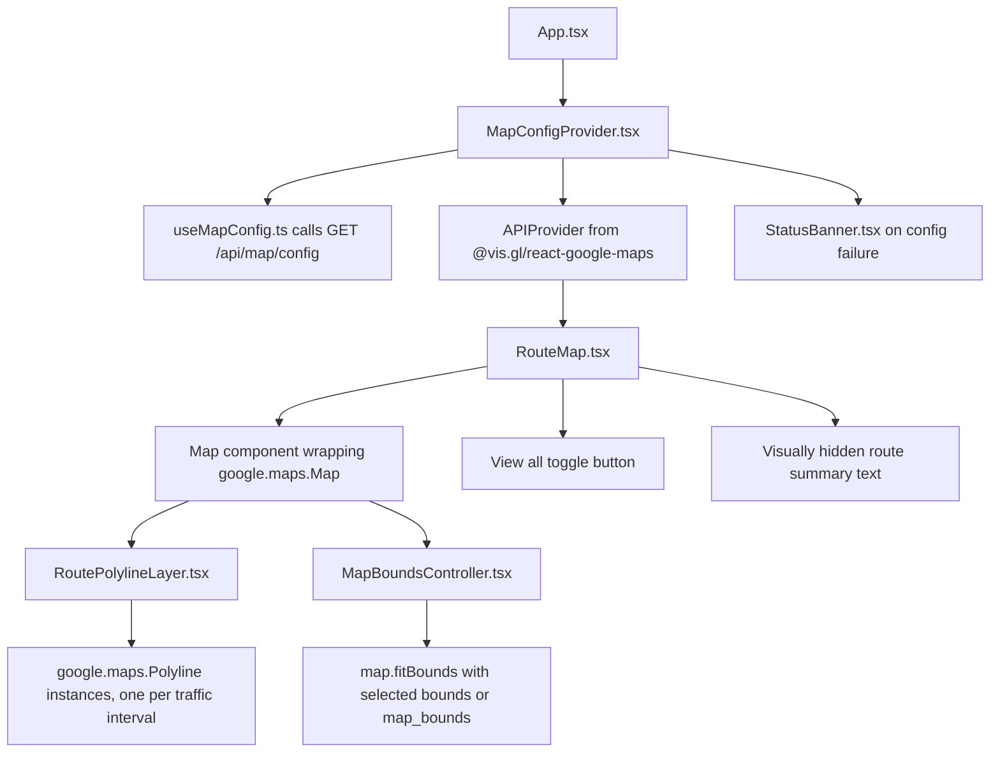

# View Context — Maps JavaScript API Rendering

**Layer:** View
**Target modules:** `src/components/MapConfigProvider.tsx`, `src/components/RouteMap.tsx`, `src/components/RoutePolylineLayer.tsx`, `src/components/MapBoundsController.tsx`, `src/hooks/useMapConfig.ts`, `src/utils/trafficSegmentColor.ts`
**Related:** [app-composition.md](app-composition.md), [results-analysis.md](results-analysis.md), [loading-error-states.md](loading-error-states.md), [accessibility.md](accessibility.md), [../controller/api-contracts.md](../controller/api-contracts.md), [../controller/external-service-boundaries.md](../controller/external-service-boundaries.md), [../model/google-integrations.md](../model/google-integrations.md)

## Purpose

Specify the one map rendering path in TrafficScope: a single `google.maps.Map` created through `@vis.gl/react-google-maps`, with native `google.maps.Polyline` instances drawn per traffic interval on top of it.

**Both planning modes use this identical path.** There is no mode-specific map component, no alternate renderer, and no fallback drawing surface. The only differences between Simulated and Real-Time mode are how many entries `routes` contains and whether scenario-driven color correction is applied. When the map cannot load, the map region shows a status banner and the rest of the application continues to work; it does not switch to a different way of drawing routes.

## Requirements

| ID | Requirement | Status | Phase |
|----|-------------|--------|-------|
| FR-3.1 | Routes render on a single Google Maps JavaScript API surface used identically in both modes | Target | P1 |
| FR-3.4 | Each traffic interval of a route renders as its own stroke, colored by Google speed category | Target | P1 |
| FR-3.6 | The selected route is visually emphasized by stroke weight and opacity | Target | P1 |
| FR-3.7 | The camera fits the selected route's `bounds`, and a `View all` affordance fits the response `map_bounds` | Target | P1 |
| FR-7.5 | A failed `GET /api/map/config` degrades to a status banner in the map region only | Target | P1 |
| FR-3.5 | In Real-Time mode the single route renders with unmodified Google traffic coloring | Target | P1 |
| FR-8.2 | A congestion heatmap layer will be added to this same map surface | Target | P3 |
| NFR-1.4 | Camera fitting does not override user panning or zooming | Target | P1 |
| NFR-2.3 | A map load failure leaves the planner, route list, and analysis column usable | Target | P1 |
| NFR-3.2 | The browser map credential is obtained only from `GET /api/map/config` and is never present in the bundle | Target | P1 |
| NFR-5.1 | The View calls no Google HTTP endpoint directly; it only loads the Maps JavaScript API | Target | P1 |
| NFR-5.7 | Exactly one map rendering path exists in the codebase | Target | P1 |
| NFR-4.3 | The map region is announced with a text summary of the selected route, and every fact the map conveys is also available as text | Target | P1 |

## Component Hierarchy



## Responsibilities

| Module | Owns | Does not own |
|--------|------|--------------|
| `src/hooks/useMapConfig.ts` | One `GET /api/map/config` per session, cached; exposes `{ config, error, status }` | Rendering, route data |
| `src/components/MapConfigProvider.tsx` | Rendering `APIProvider` with the fetched credential, or a `StatusBanner` on failure | Camera, strokes, route data |
| `src/components/RouteMap.tsx` | The single `Map` element, its camera defaults, the `View all` toggle, and the text summary | Creating Maps objects imperatively |
| `src/components/RoutePolylineLayer.tsx` | Building drawable slices and managing `google.maps.Polyline` lifetimes | Camera, configuration |
| `src/components/MapBoundsController.tsx` | Calling `map.fitBounds` under a strict change policy | Strokes, configuration |
| `src/utils/trafficSegmentColor.ts` | Pure mapping from speed category and scenario values to a hex stroke color | Any React or Maps dependency |

## `MapConfigProvider`

`MapConfigProvider` is the only module that touches the browser map credential. It reads `useMapConfig`, and branches on the result.

| `useMapConfig` state | Rendered output |
|----------------------|-----------------|
| `loading` | A quiet placeholder in the map region; the rest of the application is already interactive |
| `success` | `APIProvider` with `apiKey={config.maps_browser_api_key}` and `libraries={config.libraries}`, wrapping `children` |
| `error` | `StatusBanner` carrying `error.detail`, plus a retry action; `children` are not mounted |

```ts
<APIProvider
  apiKey={config.maps_browser_api_key}
  libraries={config.libraries}
>
  {children}
</APIProvider>
```

`config.libraries` is `["core", "maps"]`. `core` supplies `LatLngBounds` for camera fitting; `maps` supplies `Polyline`. Both are loaded through the `APIProvider` rather than requested ad hoc, so the libraries a component may use are declared in one place.

The credential is a browser key, restricted by HTTP referrer at the Google console, and distinct from the server credential used by Places and Routes. It is fetched at runtime and never written into the Vite bundle or an environment file consumed by the client. See [../controller/external-service-boundaries.md](../controller/external-service-boundaries.md).

## `RouteMap`

`RouteMap` renders exactly one `Map` element for both modes.

```ts
<Map
  className="route-map"
  defaultCenter={config.default_center}
  defaultZoom={config.default_zoom}
  colorScheme={config.color_scheme}
  mapId={config.map_id ?? undefined}
  gestureHandling="greedy"
  clickableIcons={false}
  disableDefaultUI={false}
>
  <RoutePolylineLayer
    routes={routes}
    selectedRouteId={selectedRouteId}
    congestion={congestion}
    weatherSeverity={weatherSeverity}
  />
  <MapBoundsController
    routes={routes}
    selectedRouteId={selectedRouteId}
    planBounds={planBounds}
    viewAll={viewAll}
  />
</Map>
```

| `GET /api/map/config` field | Use |
|-----------------------------|-----|
| `maps_browser_api_key` | `APIProvider` `apiKey` |
| `map_id` | `Map` `mapId` when non-null; omitted entirely when null |
| `default_center` | `Map` `defaultCenter`, `{ lat: 30.2672, lng: -97.7431 }` |
| `default_zoom` | `Map` `defaultZoom`, `12` |
| `color_scheme` | `Map` `colorScheme`, `DARK` |
| `libraries` | `APIProvider` `libraries`, `["core", "maps"]` |

`defaultCenter` and `defaultZoom` are uncontrolled initial camera values. They apply before the first plan arrives and are superseded by the first `fitBounds`. The camera is never bound to React state; binding it would make every user pan fight a re-render.

`map_id` is null in the P1 configuration. When a Cloud-styled map id is later supplied by the server, `RouteMap` passes it through unchanged. No View-side style object is defined, so map appearance stays a server and console concern.

### Mode differences

| Aspect | Simulated | Real-Time |
|--------|-----------|-----------|
| Component used | `RouteMap` | `RouteMap` |
| Entries in `routes` | Up to 3 | Exactly 1 |
| `congestion` passed to the color function | `plan.scenario.congestion` | `0` |
| `weatherSeverity` passed to the color function | `plan.weather.severity` | `0` |
| Resulting colors | Google speed colors with scenario correction on non-`NORMAL` intervals | Unmodified Google speed colors |
| `View all` toggle | Rendered when `routes.length > 1` | Absent, because one route has nothing to compare against |

`App.tsx` zeroes `congestion` and `weatherSeverity` whenever `plan.scenario_applied` is false, as specified in [app-composition.md](app-composition.md). `RouteMap` contains no `mode` prop and no mode conditional.

## `RoutePolylineLayer`

`RoutePolylineLayer` renders no DOM. It returns `null` and manages native Maps objects through effects.

```ts
const map = useMap();
const mapsLibrary = useMapsLibrary("maps");
const polylinesRef = useRef<google.maps.Polyline[]>([]);
```

### Interval slicing algorithm

1. Determine the interval list for a route:
   - If `route.traffic_intervals` is non-empty, use it as given.
   - Otherwise, if `route.polyline.length < 2`, produce no intervals; a single point cannot be stroked.
   - Otherwise produce one synthetic interval covering the whole geometry: `{ start_index: 0, end_index: route.polyline.length - 1, speed: "NORMAL" }`.
2. For each interval, clamp its indices against the actual geometry:
   - `start = clamp(interval.start_index, 0, polyline.length - 2)`
   - `end = clamp(interval.end_index, start + 1, polyline.length - 1)`
3. Slice inclusively: `path = route.polyline.slice(start, end + 1)`.
4. Skip any slice with fewer than two points.
5. Emit one drawable record per surviving slice, keyed by `` `${route.id}-${index}-${start}-${end}` ``.

`end_index` names a vertex that belongs to the interval, so the slice is inclusive of it. Consecutive intervals therefore share their boundary vertex and adjacent strokes meet without a visible gap. Clamping is defensive: a well-formed response never exceeds the geometry, but an index that did would otherwise throw or silently draw nothing.

The empty-`traffic_intervals` case is normal, not exceptional. Google does not always return speed readings, and a route with no readings is drawn as one continuous free-flow stroke rather than not drawn at all.

### Color table

`trafficSegmentColor(speed, congestion, weatherSeverity)` in `src/utils/trafficSegmentColor.ts` is a pure function with no React or Maps dependency.

| `speed` | Base color | Scenario correction |
|---------|-----------|---------------------|
| `NORMAL` | `#4285F4` | Never applied; the color is returned as-is |
| `SLOW` | `#FBBC04` | Applied |
| `TRAFFIC_JAM` | `#EA4335` | Applied |
| `SPEED_UNSPECIFIED` | `#4285F4` | Applied, using the same base as `NORMAL` |

Correction is a two-step color mix that warms and slightly darkens a congested stroke:

```ts
const congestionFactor = clamp01(congestion / 100);
const weatherFactor = clamp01(weatherSeverity / 3);
const strength = congestionFactor * 0.55 + weatherFactor * 0.45;
if (strength <= 0) return baseColor;
const warmed = mix(baseColor, "#E8554C", strength * 0.4);
return mix(warmed, "#1A1A1A", weatherFactor * 0.12);
```

Because Real-Time mode passes `0` for both arguments, `strength` is `0`, the early return fires, and the result is the unmodified Google color. That is the whole of the Real-Time coloring rule; no branch on mode is required anywhere.

Correction never changes a stroke's category. A `SLOW` interval stays recognizably amber and a `TRAFFIC_JAM` interval stays recognizably red at every scenario setting, so a user cannot mistake one category for another because a slider moved. Color alone never carries meaning; the textual equivalents are specified in [accessibility.md](accessibility.md).

`route.color` is the per-route identity color assigned by the server and used by the route cards in [results-analysis.md](results-analysis.md). It is not used for strokes on the map; strokes are colored by traffic category so that traffic remains readable across all three alternatives.

### Selection styling

| Route state | `strokeWeight` | `strokeOpacity` | `zIndex` |
|-------------|----------------|-----------------|----------|
| Selected | 6 | 1 | 6 |
| Unselected, while some route is selected | 4 | 0.68 | 4 |
| Unselected, while no route is selected | 4 | 0.85 | 4 |

`zIndex` equals the weight, so the selected route always draws above the alternatives. Every polyline is created with `geodesic: true` and `clickable: false`. Selection happens through the route cards, which are real buttons and therefore keyboard operable; making strokes clickable would add a mouse-only selection path with no keyboard equivalent.

### Polyline lifecycle

One effect owns creation and disposal. Its dependency list is `[map, mapsLibrary, drawable]`, where `drawable` is the memoized slice list.

1. Remove every polyline currently in `polylinesRef` by calling `setMap(null)`, then empty the ref.
2. If `map`, `mapsLibrary`, or a non-empty `drawable` list is missing, stop. A later render with all three present will draw.
3. Construct one `new mapsLibrary.Polyline({ ... })` per drawable record, call `setMap(map)`, and store the instances in the ref.
4. Return a cleanup function that calls `setMap(null)` on each instance and empties the ref.

The cleanup runs on unmount and before every re-run, so no polyline outlives the data that produced it. `drawable` is memoized on `[routes, selectedRouteId, congestion, weatherSeverity]`, so an unrelated re-render, such as a keystroke in the destination field, does not tear down and rebuild the strokes.

The ref, not React state, holds the instances. Maps objects are mutable handles to browser resources; putting them in state would trigger renders that own nothing and would make disposal ordering ambiguous.

Selection changes rebuild the strokes rather than mutating them. Recreating a few dozen polylines is inexpensive next to the camera work that accompanies a selection change, and full recreation keeps a single code path for styling instead of two.

## `MapBoundsController`

`MapBoundsController` renders `null` and calls `map.fitBounds`. Its entire purpose is to fit the right box at the right time and at no other time.

### Target

| `viewAll` | Fit target |
|-----------|------------|
| `false` | The selected route's `bounds`; if no route is selected, the first route's `bounds` |
| `true` | The response `map_bounds`, the union of every returned route's bounds |

A `RouteBounds` value is converted to a `google.maps.LatLngBounds` using the `core` library:

```ts
const bounds = new coreLibrary.LatLngBounds(
  { lat: routeBounds.south, lng: routeBounds.west },
  { lat: routeBounds.north, lng: routeBounds.east },
);
map.fitBounds(bounds, 48);
```

The server-supplied `bounds` and `map_bounds` are used directly. The View does not recompute a bounding box from `polyline`, because two implementations of the same box will eventually disagree.

Padding is 48 pixels on all sides, which keeps the stroke clear of the map controls and the `View all` toggle.

### Refit policy

The controller refits only when one of three things changes:

| Trigger | Reason |
|---------|--------|
| `selectedRouteId` changes | The user asked to look at a different route |
| The plan payload identity changes | A new response arrived, so the old camera framed stale geometry |
| `viewAll` changes | The user explicitly asked for a different framing |

It must not fight the user. Specifically:

- No `idle`, `bounds_changed`, `zoom_changed`, `center_changed`, or `dragend` listener is attached.
- No refit occurs on a scenario change that does not alter geometry, and none on a `congestion` or `weatherSeverity` change, which affect color only.
- No timer or interval re-centers the camera.
- After a refit, a user pan or zoom persists until one of the three triggers above fires again.

Plan identity is tracked by object reference. `useRoutePlan` replaces `plan` wholesale on each successful response, so reference equality is a precise signal that new geometry arrived, and it correctly refits even when the new response happens to contain the same route ids.

## `View all` Affordance

| Property | Value |
|----------|-------|
| Element | `button` `type="button"` |
| Label | `View all` |
| Rendered when | `routes.length > 1` |
| State attribute | `aria-pressed={viewAll}` |
| Effect when pressed | `viewAll` becomes `true` and the camera fits `map_bounds` |
| Effect when pressed again | `viewAll` becomes `false` and the camera fits the selected route's `bounds` |
| Interaction with selection | Selecting a route while `viewAll` is `true` sets `viewAll` to `false`, because the user's newer, more specific request wins |

In Real-Time mode `routes` has exactly one entry, so the toggle is absent. Its absence needs no explanation: there is visibly one route.

## Map Unavailable Behavior

| Condition | Behavior |
|-----------|----------|
| `GET /api/map/config` returns an error envelope | `MapConfigProvider` renders `StatusBanner` with `error.detail` and a retry action; `APIProvider` and `RouteMap` are not mounted |
| `GET /api/map/config` succeeds but the Maps JavaScript API fails to load | `RouteMap` renders `StatusBanner` with a load-failure message and a retry action |
| `maps_not_configured` (503) | The banner shows the server's `detail`, which identifies a missing server credential as an administrator concern |
| Any of the above | The header, planner form, route list, analysis panel, price summary, and segment table stay fully interactive |

Route data comes from `POST /api/plan`, which does not depend on the browser map credential. A user with a broken map can still plan trips, compare alternatives, read every ETA and fare, and inspect every segment. The map is the richest presentation of the route, not the only one; the guaranteed textual equivalents are enumerated in [accessibility.md](accessibility.md).

There is no second rendering path to fall back to. When the Maps JavaScript API is unavailable, the map region shows a banner and nothing is drawn.

## Acceptance Criteria

- [ ] Exactly one component in `src/components/` constructs a `Map`, and exactly one constructs `google.maps.Polyline` instances.
- [ ] The same `RouteMap` element is mounted in Simulated and Real-Time mode, with no `mode` prop and no mode conditional in the map subtree.
- [ ] `APIProvider` receives its `apiKey` from `GET /api/map/config`; no Google credential appears in any source file or built asset.
- [ ] `libraries` is `["core", "maps"]` and is declared only on `APIProvider`.
- [ ] `mapId` is passed only when `map_id` is non-null.
- [ ] A route with three traffic intervals produces three polylines; a route with empty `traffic_intervals` produces one.
- [ ] Adjacent intervals share their boundary vertex, so the drawn line has no gaps.
- [ ] An interval whose indices exceed the geometry is clamped and never throws.
- [ ] `NORMAL` intervals are `#4285F4` at every combination of `congestion` and `weatherSeverity`.
- [ ] With `congestion: 0` and `weatherSeverity: 0`, every category returns its exact Google base color.
- [ ] The selected route draws at weight 6 and opacity 1; unselected routes draw at weight 4 with reduced opacity.
- [ ] Changing selection disposes the previous polylines before creating the new ones, leaving no orphaned instances.
- [ ] Unmounting the map region calls `setMap(null)` on every polyline it created.
- [ ] `fitBounds` is called on selection change, on a new plan payload, and on a `View all` toggle, and on nothing else.
- [ ] After a user pan, no automatic refit occurs until one of those three triggers fires.
- [ ] `View all` fits `map_bounds`; it is absent when `routes` has one entry.
- [ ] A failed `GET /api/map/config` shows the server `detail` in the map region and leaves every other panel interactive.

## Planned Tests

| Test ID | Level | Target file | Assertion |
|---------|-------|-------------|-----------|
| T-33 | unit | `src/utils/trafficSegmentColor.test.ts` | `NORMAL` returns `#4285F4` for congestion 0 and 100 and for every weather severity; `SLOW` returns `#FBBC04` and `TRAFFIC_JAM` returns `#EA4335` when congestion and severity are both 0 |
| T-32 | component | `src/components/RoutePolylineLayer.test.tsx` | Slicing produces one path per interval, includes the vertex at `end_index`, clamps out-of-range indices without throwing, and a route with empty `traffic_intervals` produces exactly one path spanning the whole geometry with speed `NORMAL`; against a stubbed Maps library the selected route's polyline is created with weight 6 and opacity 1, a selection change calls `setMap(null)` on the previous instances before creating new ones, and unmount disposes all of them |
| T-34 | component | `src/components/MapBoundsController.test.tsx` | `fitBounds` is called once per selection change, once per new plan payload, and once per `View all` toggle, and is not called when only `congestion` changes |
| T-31 | component | `src/components/RouteMap.test.tsx` | A successful config response mounts `APIProvider` with the fetched key and `["core", "maps"]`; an error response renders `StatusBanner` with the `detail` and mounts no children, and with a stubbed `maps_not_configured` config response the map region shows the banner while the route cards, price summary, and segment table remain present and interactive |

## Agent Implementation Notes

- Compute the drawable slice list in a module-level pure function and memoize the call. Keeping slicing outside the effect makes it directly unit-testable without a Maps stub.
- Guard the creation effect on `map` and `mapsLibrary` both being present. `useMapsLibrary` returns `null` until the library resolves, and constructing a `Polyline` before then throws.
- Never mutate a polyline's options in place as a shortcut for restyling. Full teardown and recreation keeps one styling path and makes the disposal invariant easy to assert.
- Keep `trafficSegmentColor` free of imports. It is a pure function of three arguments and belongs to `src/utils/`, not to a component.
- Clamp both correction factors before use. A malformed `congestion` of 140 must not produce a color outside the intended range.
- Convert `RouteBounds` to `LatLngBounds` with the southwest and northeast corner constructor rather than extending point by point. The server already computed the box.
- Track plan identity with a ref holding the previous `plan` reference, and compare by identity inside the refit effect. Do not add the whole `plan` object to a dependency array that also drives stroke rebuilds.
- Store the visually hidden route summary text in `RouteMap` and keep it in sync with `selectedRoute`. It is the map region's accessible description and is the reason the map is announced as more than an unlabeled graphic.
- When the P3 heatmap layer is designed, it will mount as an additional child of the same `Map` element and reuse the same `APIProvider`. Do not introduce a second map surface for it.
