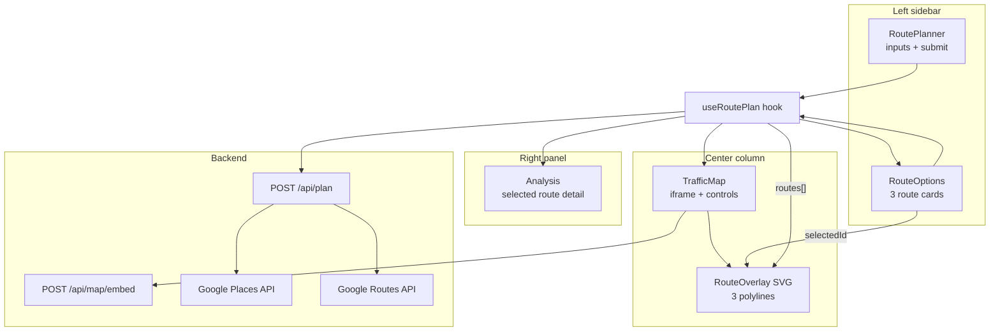

# Map Widget & Route API Integration Plan

This document describes the architecture, design decisions, and implementation plan for integrating the route planner with the map widget in TrafficScope.

## Overview

TrafficScope compares three objective-based route alternatives. The map widget displays a Google Maps embed with an SVG overlay that draws all three route polylines. The route planner sidebar stays separate; the map follows route selection.

**Chosen approach:** Tier 2 — iframe + SVG overlay (no route planner rewrite).

---

## Architecture



---

## Current Component Responsibilities

| Layer | File | Role |
|-------|------|------|
| User input | `TrafficSImulation/src/components/RoutePlanner.tsx` | Starting point / destination text boxes |
| Route selection | `TrafficSImulation/src/components/RouteOptions.tsx` | Three route cards; sets `selectedId` |
| Map widget | `TrafficSImulation/src/components/TrafficMap.tsx` | Iframe basemap, zoom logic, View all button |
| Route overlay | `TrafficSImulation/src/components/RouteOverlay.tsx` | SVG polylines drawn on top of iframe |
| State + fetch | `TrafficSImulation/src/hooks/useRoutePlan.ts` | `POST /api/plan` orchestration |
| Projection | `TrafficSImulation/src/utils/mapProjection.ts` | Lat/lng → SVG coordinates; fit-to-bounds zoom |
| Orchestration | `TrafficSImulation/app/api/routes.py` | Geocode, fetch routes, attach polylines |
| Google routing | `TrafficSImulation/app/map/google_routes.py` | Routes API `computeRoutes` |
| Polyline decode | `TrafficSImulation/app/map/polyline.py` | Decode encoded polylines from Google |
| Embed URL | `TrafficSImulation/app/map/google_embed.py` | Build Maps Embed `view` URLs |
| Embed endpoint | `TrafficSImulation/main.py` | `POST /api/map/embed` keeps API key server-side |

---

## Data Flow

1. User enters origin/destination and clicks **Plan routes**.
2. Frontend calls `POST /api/plan` with `{ origin, destination, mode, scenario }`.
3. Backend geocodes via Places API, fetches three alternatives via Routes API (including encoded polylines).
4. Backend returns `PlanResult` with `routes[]` (each containing `polyline`, `color`, metrics) and top-level `map_view` / `map_embed_url`.
5. `TrafficMap` measures its container, computes the tightest zoom for the selected route, and calls `POST /api/map/embed` to get a fresh iframe URL.
6. `RouteOverlay` projects polylines into SVG space using the same `map_view` so lines align with the basemap.
7. Clicking a route card updates `selectedId` → map recenters/zooms to that route; clicking **View all** fits all three lines.

**Trigger behavior:** Typing new origin/destination does not update the map until **Plan routes** is submitted. Scenario/mode sliders re-fetch automatically using the last submitted locations.

---

## Embed Mode: view vs place vs directions

| Mode | Shows | Used here? |
|------|-------|------------|
| **view** | Centered map at lat/lng + zoom | **Yes** — basemap only; overlay draws routes |
| **place** | Single location marker | No — shows one point, not a route |
| **search** | Search results for a query | No |
| **directions** | Default Google driving route | No — only shows one route, no alternative sync |

Directions embed was considered as a Tier 1 quick fix but rejected because it cannot show all three sidebar alternatives or respond to route selection.

---

## Tier Comparison (Design Options)

| Tier | What changes | 3 routes visible? | Selection syncs map? | Route planner redo? |
|------|--------------|-------------------|----------------------|---------------------|
| **1. Directions embed** | Backend only: `view` → `directions` | No | No | No |
| **2. Iframe + SVG overlay** | Backend polylines + frontend overlay | Yes | Yes | No |
| **3. Maps JavaScript API** | Replace iframe with JS SDK | Yes | Yes (incl. pan/zoom) | No |

**Tier 2 was chosen** because it keeps the sidebar untouched, avoids exposing the API key on the frontend, and supports all three alternatives with selection highlighting.

Tier 3 remains the upgrade path if interactive pan/zoom with perfect overlay sync is needed later.

---

## Implementation Plan (Tier 2)

### 1. Backend — expose polyline geometry

- Extend `GOOGLE_ROUTES_FIELD_MASK` in `TrafficSImulation/app/config/__init__.py` to include `routes.polyline.encodedPolyline`.
- Decode polylines in `TrafficSImulation/app/map/google_routes.py` using `TrafficSImulation/app/map/polyline.py`.
- Add `polyline: [{ lat, lng }, ...]` to each route in the `/api/plan` response.
- Keep **view** embed mode — the overlay draws the lines, not the iframe.

### 2. Frontend — disable map pan/zoom

- Set `pointer-events: none` on the iframe (`.map-shell iframe` in `TrafficSImulation/src/styles.css`).
- Prevents desync between the SVG overlay and Google's internal camera.

### 3. Frontend — RouteOverlay layer

- Absolutely positioned `<svg>` inside `.map-shell`.
- Project lat/lng using Web Mercator math in `mapProjection.ts`.
- Draw all three routes with route colors; selected route gets full opacity and thicker stroke.

Wire from `TrafficSImulation/src/App.tsx`:

```tsx
<TrafficMap data={data} routes={data?.routes} selectedId={selectedId} />
```

### 4. Dynamic zoom on route selection

- `computeMapViewForPolyline()` walks zoom levels 18→1 and picks the **highest zoom** where every polyline point fits the actual container size (with margin).
- Recalculates on route switch and window resize via `ResizeObserver`.
- `POST /api/map/embed` returns a fresh iframe URL for the computed view (API key stays server-side).

### 5. View all button

- Floating **View all** control on the map (`TrafficMap.tsx`).
- `computeMapViewForPolylines()` fits all points from all three route polylines into the viewport.
- Exits when the user selects a route card again.

### 6. Route line visibility

- Unselected routes render at **0.68 opacity** (up from 0.35) so alternate paths remain readable when zoomed in on one route.
- Low-traffic route color darkened to `#4d72e8` for contrast on the dark map background.

### 7. Types + tests

- `RouteOption` includes `polyline`, `map_view`, `map_embed_url`.
- `PlanResult` includes `map_view`, `map_embed_url`.
- Tests in `tests/test_api.py`, `tests/test_backend.py`, `src/App.test.tsx`, `src/utils/mapProjection.test.ts`.

---

## API Endpoints

### `POST /api/plan`

Returns route alternatives with polyline geometry and simulation metrics.

Key response fields:

```json
{
  "routes": [
    {
      "id": "route-1",
      "name": "Fastest",
      "color": "#55d6be",
      "polyline": [{ "lat": 30.27, "lng": -97.74 }, "..."],
      "map_view": { "center_lat": 30.23, "center_lng": -97.70, "zoom": 13 },
      "map_embed_url": "https://www.google.com/maps/embed/v1/view?..."
    }
  ],
  "recommended_route_id": "route-1",
  "map_view": { "..." },
  "map_embed_url": "..."
}
```

### `POST /api/map/embed`

Builds an embed URL from a client-computed view (used when zoom changes on route selection or resize).

Request:

```json
{ "center_lat": 30.23, "center_lng": -97.70, "zoom": 13 }
```

Response:

```json
{ "map_embed_url": "https://www.google.com/maps/embed/v1/view?..." }
```

---

## What Does NOT Need to Change

- `RoutePlanner.tsx` — origin/destination inputs and submit
- `RouteOptions.tsx` — three route cards (except wiring `selectedId` which already exists)
- `useRoutePlan.ts` — API orchestration
- `Analysis.tsx` — pricing and segment detail

---

## Google Cloud Requirements

Enable in Google Cloud Console:

- **Places API (New)** — geocoding
- **Routes API** — route alternatives and polylines
- **Maps Embed API** — iframe basemap (separate from Places/Routes)

Set `GOOGLE_MAPS_API_KEY` in `TrafficSImulation/.env`.

Verify with:

```powershell
Invoke-RestMethod http://127.0.0.1:8000/api/health
```

---

## Known Limitations

- The SVG overlay is aligned to a fixed camera; iframe pan/zoom is disabled to prevent desync.
- Overlay projection assumes Web Mercator matching Google's embed view; minor drift is possible at extreme latitudes.
- **View all** zooms out to fit all three lines; individual route selection zooms in as far as possible while keeping that route fully visible (other routes may extend off-screen).
- Directions embed (Tier 1) would not support three alternative routes — overlay approach is required for sidebar sync.

---

## Future Upgrade Path (Tier 3)

Replace the iframe with the Maps JavaScript API (`@react-google-maps/api`):

- Draw `Polyline` elements natively on the map
- Support pan/zoom without overlay desync
- Sidebar components remain unchanged; only `TrafficMap` grows

---

## Summary

- The route planner sidebar and map widget are **separate layers** connected through `useRoutePlan` state (`routes`, `selectedId`).
- Route geometry reaches the map via `polyline` arrays in `/api/plan`.
- The map uses a non-interactive Google **view** iframe plus an SVG overlay for three colored route lines.
- Zoom is recomputed client-side on every route switch and resize, using the tightest fit for the selected route (or all routes with **View all**).
