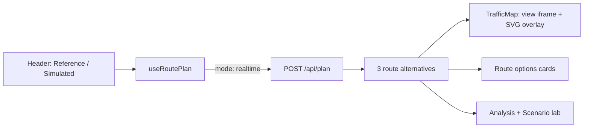
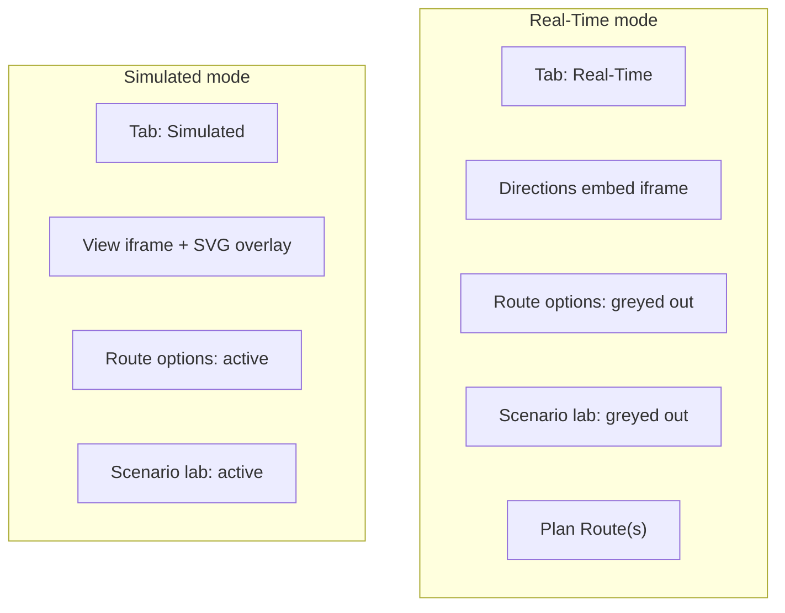

# Real-Time Tab Rework Plan

This document describes the architecture and implementation plan for reworking the Reference (`realtime`) mode into a distinct **Real-Time** experience in TrafficScope.

## Overview

Real-Time mode shows Google's single traffic-aware suggested route via the Maps Embed **directions** widget. Simulated-only controls (route comparison cards and Scenario lab sliders) are greyed out. The mode toggle label changes from **Reference** to **Real-Time**, and the submit button reads **Plan Route(s)**.

---

## Current State

Today, Reference and Simulated share the same three-column layout and differ only by backend `mode`:



| Layer | File | Role |
|-------|------|------|
| Tab label | `TrafficSImulation/src/components/Header.tsx` | `"Reference"` maps to `mode === "realtime"` |
| Map | `TrafficSImulation/src/components/TrafficMap.tsx` | `view` embed + `RouteOverlay` |
| Route list | `TrafficSImulation/src/components/RouteOptions.tsx` | Always interactive |
| Scenario sliders | `TrafficSImulation/src/components/Analysis.tsx` | Always interactive when a route exists |
| Submit button | `TrafficSImulation/src/components/RoutePlanner.tsx` | `"Plan routes"` |
| Backend | `TrafficSImulation/app/api/routes.py`, `google_routes.py` | Realtime returns up to 3 alternatives |

---

## Target State



| Change | Real-Time (`realtime`) | Simulated (`simulated`) |
|--------|------------------------|-------------------------|
| Tab label | **Real-Time** | Simulated |
| Map widget | **Directions embed** — single Google route with traffic | View embed + SVG overlay |
| Route options sidebar | **Greyed out** | Active |
| Scenario lab | **Greyed out** | Active |
| Submit button | **Plan Route(s)** | **Plan Route(s)** |
| Routes returned | **1** | 3 alternatives |

Analysis panels outside Scenario lab (selected route summary, pricing, road detail) remain visible in Real-Time mode.

---

## Implementation

### 1. Rename Reference → Real-Time

- `Header.tsx`: label `"Real-Time"` when `value === "realtime"`.
- `Analysis.tsx`: accept `mode` prop; badge shows **Real-Time** when `mode === "realtime"`.
- `routes.py`: update `_plan_notice()` copy for realtime.

Internal `Mode` type stays `"realtime" | "simulated"`.

### 2. Directions embed widget

**Backend — `google_embed.py`**

```python
DIRECTIONS_BASE_URL = "https://www.google.com/maps/embed/v1/directions"

def build_directions_embed_url(origin: str, destination: str) -> str | None:
    # params: key, origin, destination, mode=driving
```

**Backend — `google_routes.py`**

- When `use_traffic=True`, set `computeAlternativeRoutes: False`.
- Safety fallback: `routes[:1]`.

**Backend — `routes.py`**

- When `mode == "realtime"`, attach `directions_embed_url` to the plan response.

**Frontend — `TrafficMap.tsx`**

- If `data.mode === "realtime"` and `directions_embed_url` is set, render directions iframe only (no overlay, no View all).
- Realtime iframe uses `pointer-events: auto`.

**Types — `types.ts`**

```typescript
directions_embed_url?: string | null;
```

### 3. Grey out Route options

- Pass `mode` from `App.tsx` to `RouteOptions.tsx`.
- When `mode === "realtime"`, apply `.panel-disabled`, disable cards, show helper text.

### 4. Grey out Scenario lab

- Pass `mode` to `Analysis.tsx`.
- Disable sliders and Reset when `mode === "realtime"`.
- In `useRoutePlan.ts`, skip scenario debounced recalc when `mode === "realtime"`.

### 5. Button label

- `RoutePlanner.tsx`: `"Plan Route(s)"` (both modes).

### 6. CSS

```css
.panel-disabled { opacity: 0.45; pointer-events: none; }
.map-shell.realtime iframe { pointer-events: auto; }
```

---

## API Response (Real-Time)

```json
{
  "mode": "realtime",
  "directions_embed_url": "https://www.google.com/maps/embed/v1/directions?key=...&origin=...&destination=...&mode=driving",
  "routes": [{ "id": "route-1", "name": "Fastest", "...": "..." }],
  "notice": "Route geometry and travel times from Google Maps with traffic-aware routing."
}
```

Simulated responses omit `directions_embed_url` and include three routes with polylines for the SVG overlay.

---

## Files Touched

| File | Change |
|------|--------|
| `Header.tsx` | Real-Time label |
| `RoutePlanner.tsx` | Plan Route(s) |
| `RouteOptions.tsx` | Disabled state in realtime |
| `Analysis.tsx` | Disabled Scenario lab + Real-Time badge |
| `TrafficMap.tsx` | Directions embed branch |
| `App.tsx` | Pass `mode` to child components |
| `types.ts` | `directions_embed_url` on `PlanResult` |
| `useRoutePlan.ts` | Skip scenario recalc in realtime |
| `styles.css` | `.panel-disabled`, realtime iframe override |
| `google_embed.py` | `build_directions_embed_url()` |
| `google_routes.py` | Single route when `use_traffic` |
| `routes.py` | Attach `directions_embed_url` |

**Unchanged:** `RouteOverlay.tsx`, simulated map path, `POST /api/map/embed`.

---

## Verification Checklist

1. Simulated mode: 3 routes, overlay map, active sliders, **Plan Route(s)** button.
2. Real-Time mode: directions embed, one route, greyed Route options and Scenario lab.
3. Switching modes re-enables/disables controls correctly.
4. `python -m pytest` and `npm test` pass.
