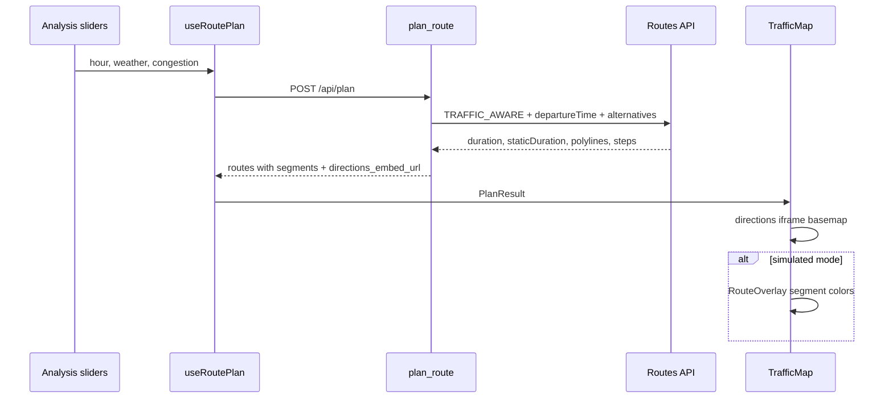

# Simulated Mode Traffic + Segment Overlay Plan

This document describes the architecture and implementation plan for reworking **simulated** mode: Google traffic anchoring via `departureTime`, weather-only multipliers, demand removal, directions embed basemap, and segment-colored route overlays.

---

## Goal

Transform **simulated** mode so time-of-day traffic comes from Google (`departureTime` + `duration`/`staticDuration`), weather is the only scenario multiplier on top of that baseline, demand is removed, the map iframe uses **directions** embed, and the SVG overlay colors route **segments** by congestion/traffic/weather instead of one flat `route.color`.

Realtime mode stays largely unchanged (single route, directions embed). **The SVG route overlay (segment-colored polylines and View all) is simulated-only** — realtime shows the Google directions iframe alone.

---

## Map visibility by mode

| Mode | Map iframe | SVG overlay | Scenario lab sliders |
|------|------------|-------------|----------------------|
| **simulated** | `embed/v1/directions` | **Yes** — segment-colored polylines + View all | **Visible** (hour, weather, congestion) |
| **realtime** | `embed/v1/directions` | **No** — Google widget only | **Hidden** (section not rendered) |

This preserves today's realtime map behavior (`TrafficSImulation/src/components/TrafficMap.tsx` L87–103 early-returns without `RouteOverlay`). The Scenario lab is currently disabled-but-visible in realtime; the target is to **omit the entire card**.

---

## Current vs Target (Simulated)

```mermaid
flowchart TB
  subgraph current [Current Simulated]
    A1["TRAFFIC_UNAWARE, no departureTime"] --> A2["3 alternatives"]
    A2 --> A3["base_eta = staticDuration"]
    A3 --> A4["adjusted = staticDuration × weather × time_of_day"]
    A4 --> A5["view embed + single-color polyline"]
  end
  subgraph target [Target Simulated]
    B1["TRAFFIC_AWARE + departureTime from hour slider"] --> B2["3 alternatives"]
    B2 --> B3["base_eta = staticDuration"]
    B3 --> B4["adjusted = duration × weather.time_multiplier"]
    B4 --> B5["directions embed + segment-colored overlay"]
  end
```



| Area | Current | Target |
|------|---------|--------|
| Google Routes (simulated) | `TRAFFIC_UNAWARE`, no `departureTime` | `TRAFFIC_AWARE` + `departureTime`, `computeAlternativeRoutes: true` |
| Base ETA | `staticDuration` | `staticDuration` (unchanged display) |
| Adjusted ETA | `staticDuration × weather × time_of_day_factor` | `(duration / 60) × weather.time_multiplier` |
| Pricing multipliers | demand + congestion + weather + time_of_day | congestion + weather only (simulated) |
| Scenario sliders | hour, weather, congestion, **demand** | hour, weather, congestion |
| Map iframe | `embed/v1/view` | `embed/v1/directions?origin=…&destination=…&mode=driving` |
| Route overlay | one `<path>` per route using `route.color` (simulated only) | multiple `<path>`s per route, colored by segment metrics (**simulated only**) |

**Key constraint:** Google rejects `departureTime` with `TRAFFIC_UNAWARE` (`TrafficSImulation/app/map/google_routes.py` L141–143). Simulated mode must switch to traffic-aware routing. Google docs support alternative routes with traffic-aware requests; if a live API call fails with `computeAlternativeRoutes` + traffic, fall back to a two-call enrich strategy (geometry pass, then per-route traffic duration query).

---

## Backend Changes

### 1. Google Routes — traffic-anchored simulated fetch

**File:** `TrafficSImulation/app/map/google_routes.py`

- Change simulated wiring in `service.py` / `routes.py`: pass `use_traffic=True` (or explicit `anchor_departure=True`) for **both** modes; keep `computeAlternativeRoutes: True` for simulated, `False` for realtime.
- Always attach `departureTime` (built from `hour` slider — already implemented L123–130) when traffic-aware.
- Extend `GOOGLE_ROUTES_FIELD_MASK` in `config/__init__.py` with step-level traffic + geometry:

```
routes.legs.steps.duration,
routes.legs.steps.polyline.encodedPolyline
```

(step `staticDuration` already requested)

- In `_build_route_option`, compute and store:
  - `traffic_ratio = duration / staticDuration` (route level, guard divide-by-zero)
  - per-step traffic ratios for segment coloring

### 2. ETA + pricing orchestration

**File:** `TrafficSImulation/app/api/routes.py`

Update `_adjusted_eta_minutes` for simulated:

```python
# simulated + google data
base_minutes = google_static / 60
adjusted_raw = (google_duration / 60) * weather["time_multiplier"]
```

- Drop `time_of_day_factor(hour)` from simulated ETA/pricing — `departureTime` replaces it.
- Keep BPR segment generation for the analysis table, but **do not** use BPR sum as ETA when Google durations exist.
- Remove `demand` parsing; stop overriding demand in realtime (only weather/congestion overrides remain if desired).

**File:** `TrafficSImulation/app/pricing/model.py`

- Remove `demand` parameter; set `demand_multiplier = 1.0` (or remove from returned factors).
- Simulated pricing: `subtotal × congestion_multiplier × weather.price_multiplier` (no time_factor).

**File:** `TrafficSImulation/app/config/__init__.py`

- Redistribute `ROUTE_SCORE_WEIGHTS["demand"]` (0.15) across time/distance/congestion.
- Remove demand from scoring in `plan_route` (L107).

### 3. Segment geometry for overlay

**File:** `TrafficSImulation/app/simulation/traffic.py`

Extend `RoadSegment` / segment builder:

- Add `polyline: list[{lat, lng}]` per segment (decode from step encoded polyline when available; else proportional slice of route polyline by step `distanceMeters`).
- Add `traffic_ratio: float` per segment (`step duration / step staticDuration`, default 1.0).
- Keep existing `congestion` (0–1) from user slider for local BPR display.

**Files:** `TrafficSImulation/app/api/models.py`, `TrafficSImulation/src/types.ts` — add `polyline` + `traffic_ratio` to `Segment`/`RoadSegment`; remove `demand` from `PlanRequest`/`Scenario`/`PlanResult`.

### 4. Directions embed for simulated mode

**File:** `TrafficSImulation/app/map/google_embed.py`

- Reuse existing `build_directions_embed_url(origin, destination)`.

**File:** `TrafficSImulation/app/api/routes.py`

- Attach `directions_embed_url` for **simulated** responses (same as realtime today).
- Keep per-route `map_view` for SVG projection math (overlay still needs center/zoom).
- Update `_plan_notice()` copy: simulated now uses Google traffic at selected departure hour; weather adjusts estimates.

**Alignment note:** Directions iframe controls its own camera; the SVG overlay will continue using polyline-fit projection (`TrafficSImulation/src/utils/mapProjection.ts`). Expect approximate (not pixel-perfect) alignment — same class of limitation documented in `map-widget-and-routes-integration.md`. Directions iframe stays non-interactive (`pointer-events: none`) so overlay remains the source of route highlighting.

---

## Frontend Changes

### 1. Remove demand slider + hide Scenario lab in realtime

**Files:**

- `TrafficSImulation/src/components/Analysis.tsx`
  - Remove demand control (L103).
  - **Hide the entire Scenario lab card when `mode === "realtime"`** — do not render the section at all (remove disabled sliders, Reset button, and "Scenario controls are available in Simulated mode" note).
  - Simulated mode renders hour, weather, and congestion sliders as today.

```tsx
{mode === "simulated" && (
  <section className="card scenario">
    {/* hour, weather, congestion sliders + Reset */}
  </section>
)}
```

- `TrafficSImulation/src/constants/scenario.ts`
- `TrafficSImulation/src/types.ts`
- `TrafficSImulation/src/hooks/useRoutePlan.ts` — no logic change needed (spreads scenario); existing guard that skips scenario debounced recalc in realtime remains.

Optionally show `Base ETA` tooltip explaining it is Google's free-flow (`staticDuration`) and adjusted ETA includes departure-hour traffic × weather.

### 2. Directions embed + simulated-only overlay gating

**File:** `TrafficSImulation/src/components/TrafficMap.tsx`

Refactor into two explicit branches keyed on `data.mode`:

**Realtime (`mode === "realtime"`):**

- Render directions iframe only (existing early-return pattern).
- Do **not** mount `RouteOverlay`, View all, or map projection/zoom logic.
- Iframe remains interactive (`pointer-events: auto`, `.map-shell.realtime`).

**Simulated (`mode === "simulated"`):**

- Render directions iframe as basemap (`directions_embed_url`).
- Mount `RouteOverlay` (segment-colored) and View all on top.
- Keep `map_view` state from polyline fit for overlay projection.
- Stop calling `POST /api/map/embed` (directions URL is origin/dest-based, not zoom-based).
- Directions iframe stays non-interactive (`pointer-events: none`) so overlay is the highlight layer.

```tsx
if (isRealtime && directionsUrl) {
  return (/* directions iframe only — no overlay */);
}

return (
  <section className="map-shell">
    <iframe src={directionsUrl} ... />
    <RouteOverlay ... />   {/* simulated only */}
    {routes.length > 1 && <button>View all</button>}
  </section>
);
```

### 3. Segment-colored route overlay

**File:** `TrafficSImulation/src/components/RouteOverlay.tsx`

Replace single `<path stroke={route.color}>` with per-segment rendering:

```tsx
// For selected route (or all routes at reduced opacity):
route.segments.map((segment) => (
  <path
    key={`${route.id}-${segment.name}`}
    d={polylineToPath(segment.polyline, mapView, width, height)}
    stroke={segmentColor(segment.congestion, segment.traffic_ratio, weatherSeverity)}
    strokeWidth={active ? 5 : 3}
    ...
  />
))
```

**New utility:** `TrafficSImulation/src/utils/segmentColor.ts`

- Map combined severity to a green → yellow → red ramp.
- Combine: user congestion (0–1), Google `traffic_ratio`, weather severity (0–3).
- Example: `severity = 0.5 * congestion + 0.3 * (trafficRatio - 1) + 0.2 * (weather / 3)`.

**Keep `route.color`** in `RouteOptions.tsx` for card selection accent (`--route` CSS var) — only the map overlay stops using it.

Pass `weatherSeverity` from `PlanResult.weather.severity` into `RouteOverlay` via `App.tsx` / `TrafficMap`.

### 4. CSS

**File:** `TrafficSImulation/src/styles.css`

- Apply `pointer-events: none` to simulated directions iframe (same as view iframe today).
- Optional legend under map explaining segment color scale (congestion / traffic / weather).

---

## Tests + Docs

| File | Updates |
|------|---------|
| `TrafficSImulation/tests/test_backend.py` | Simulated payload includes `departureTime` + `TRAFFIC_AWARE`; ETA uses duration × weather; pricing omits demand |
| `TrafficSImulation/tests/test_api.py` | Simulated response includes `directions_embed_url`; drop demand from request body |
| `TrafficSImulation/tests/google_mocks.py` | Mock `duration` + `staticDuration`; segment polylines |
| `TrafficSImulation/src/App.test.tsx` | Simulated: directions URL + overlay SVG + Scenario lab visible; realtime: directions iframe only, no `.route-overlay`, no Scenario lab section |
| New `TrafficSImulation/src/utils/segmentColor.test.ts` | Color ramp boundaries |
| `docs/agent-quickstart.md` | Update modes table, API body (no demand), simulated traffic behavior |

Run from `TrafficSImulation/`:

- `python -m pytest`
- `npm test`
- `npm run build`

---

## Data Flow (Target)



---

## Implementation Checklist

- [ ] Switch simulated Google Routes to `TRAFFIC_AWARE` + `departureTime` + alternatives; extend field mask for step duration/polyline
- [ ] Update ETA/pricing orchestration (duration/staticDuration baseline, weather-only multiplier); remove demand from API/models/scoring/pricing
- [ ] Add per-segment polyline + `traffic_ratio` to `RoadSegment` builder and shared types
- [ ] Attach `directions_embed_url` for simulated mode; update `TrafficMap` with directions basemap (simulated) and directions-only map (realtime, no overlay)
- [ ] Refactor `RouteOverlay` to render segment-colored paths; add `segmentColor` utility
- [ ] Remove demand slider; hide entire Scenario lab section in realtime (show only in simulated)
- [ ] Update backend/frontend tests and `agent-quickstart.md`

---

## Risks and Mitigations

1. **Alternative routes + TRAFFIC_AWARE may fail** for some O/D pairs — catch API error, retry without alternatives or use two-call enrich; surface notice in response.
2. **Directions vs overlay camera mismatch** — documented limitation; segment colors remain useful even with slight drift.
3. **Extra API latency/cost** — traffic-aware + 3 routes is one call (preferred); monitor in dev with real key.

---

## Related Docs

| Doc | When to read |
|-----|--------------|
| `map-widget-and-routes-integration.md` | Map iframe + SVG overlay architecture |
| `realtime-tab-rework.md` | Realtime mode directions embed and panel disabling |
| `googleMapsEmbeddedWidget.md` | Google embed URL parameters |
| `../agent-quickstart.md` | Repo orientation and file lookup |
